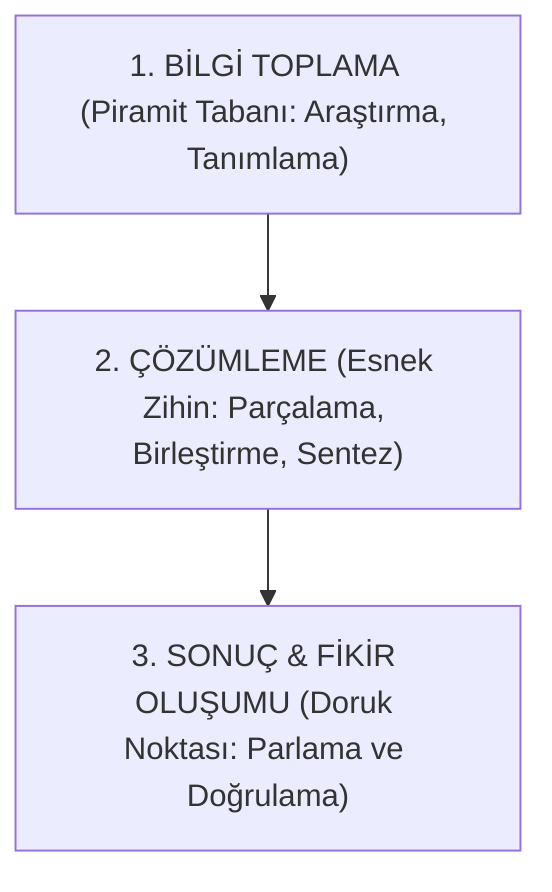

# 📖 Yaratıcılık: Yalın Özüne Dönüş, Zihin Modelleri ve Teknikleri
> **Yazar:** Onur Yanık  
> **Yayın Tarihi & Yeri:** İstanbul, 2007  
> **Notasyon:** Eksiksiz Metin & Obsidian Bilgi Bankası Kütüphanesi

---

## 📑 İçindekiler
1. [[#Önsöz]]
2. [[#BİRİNCİ BÖLÜM: YARATICILIĞA GİRİŞ]]
   - [[#I. Yaratıcılığın Önemi]]
     - [[#a. Hayal Toplumu ve Yaratıcılık]]
     - [[#b. Neden Yaratıcılık?]]
   - [[#II. Yaratıcılık Tanımlanabilir mi?]]
     - [[#a. Yaratıcılık Kavramı ve Düşün Yaşamındaki Kullanımı]]
     - [[#b. Beyin: Kapasite ve Kaleydoskop Mimarisi]]
     - [[#c. Sağ Beyin ve Sol Beyin]]
     - [[#d. Yaratıcı Düşüncenin Aşamaları]]
   - [[#III. Yaratıcı Birey ve Yaratıcılık Eğitimi]]
     - [[#a. Yaratıcı Bireyin Kişilik Özellikleri]]
     - [[#b. Yaratıcılık Eğitimi]]
     - [[#c. Sağ Beyinli Bir Öğrenci (Barometre Vakası)]]
3. [[#İKİNCİ BÖLÜM: YARATICILIĞIN ÖNÜNDEKİ ENGELLER]]
   - [[#I. Neden Daha Yaratıcı Değiliz?]]
   - [[#II. Tescilli Önyargılar ve Düş Katili Yorumlar]]
   - [[#III. Yaratıcılığın Paketlendiği Dokuz Kutu]]
4. [[#ÜÇÜNCÜ BÖLÜM: YARATICILIĞI HAREKETE GEÇİRMEK]]
   - [[#I. Yaratıcılığa Atılan İlk Adımlar]]
     - [[#a. İçinizdeki Çocuk]]
     - [[#b. Yaratıcı Bakış Açısı]]
     - [[#c. Kişisel Sınırlamalardan Kurtulmak]]
     - [[#d. Daha Hızlı ve Çok Hata Yapmak]]
     - [[#e. Başarıya Giden Yol (Sally ve Mucize Hikayesi)]]
     - [[#f. Kutudan Çıkan Yaratıcılık: 9 Kutuyu Kırma Kılavuzu]]
   - [[#II. Işığı Fark Etmek]]
     - [[#a. Yaratıcı Bir Ortam]]
     - [[#b. Yaratıcılık Tekniklerinin Kapsamı (Bentley'in 9 Yöntemi & Rawlinson'ın Pratik Eylemleri)]]
     - [[#c. Bilimsel Yaratıcı Düşünme Teknikleri]]
5. [[#Kaynakça]]

---

## Önsöz

Yaratıcılığın kitabını yazmak, açık denizde rotasız yol almaya benzer. Kavramı tüm yönleri ile ele alan ve inceleyen yeterli sayıda kaynağın bulunmayışı bu yolculuğu belirsiz kılan temel nedendir. Diğer yandan yaratıcılık seferinin yönsüzlüğü kompleks bir yapıya sahiptir; birçok farklı sebep içerir.

Her şeyden önce, pek çok yaratıcılık tartışması yanlış ya da eksik bilgiler ekseninde döner. Nosyona yüklenen değerlerin çoğu, güçlü duruşlarına rağmen ciddi hatalar içerir. Bu noktada yaratıcılık üzerine bir anlam karmaşası çöker. Bu metodik çalışmanın esas amacı, yaratıcılık konusundaki başlıca teorileri ve bunlardaki değişimleri analiz ederken hatalı savları ortadan kaldırmak; **kavramı yalın özüne döndürmektir.**

Çalışma özetle, yaratıcılığın sanat ya da reklamcılık gibi sadece birkaç faaliyet alanına ait bir özellik olmadığını; aksine **insan hayatının her alanında kullanılması gereken**, yeniyi ve farklıyı oluşturmak için bireyin ufkunu açan bir unsur olduğunu anlatır. Yaratma potansiyelinin herkeste var olan ve **geliştirilebilir bir bakış açısı** olduğunu vurgular.

Çalışma boyunca bu ana fikri somutlaştırabilmek amacıyla çeşitli zihin egzersizlerine yer verilmiştir. Bu özel alıştırmalar yaratıcılığı yıllarca araştırmış ve konu üzerine eğitimler vermiş uzmanların önerilerinden derlenmiştir.

En büyük yaratıcı Tanrı, insanoğluna kendi gücünden bir parça sunmuştur. Bu güç, **düşünme, hayal kurma ve düşlerin peşinden koşabilme** yetisidir. İnsanoğlu bu dünyada olumlu bir şeyler yapabilmek ve başarıya ulaşabilmek için bu niteliklerinin farkına varmak ve yaratıcılığın önemini kavramak zorundadır:

- Yaratıcı bir iş adamı / kadını ya da doktor…
- Yaratıcı bir müzisyen ya da bilim adamı…
- Yaratıcı bir mimar ya da aşçı…

Yaratıcılık sınırları olmayan bir öğretidir; **bilim ve meslekler üstü** bir kurguya sahiptir. Duyguların ve sezgilerin, doğru bilgi ve motivasyonla birleşmesi anlamına gelen bu kavram, hayatın her anında ve her yerdedir. Çünkü insanın doğası yaratıcı olmayı gerektirir.

Karmaşık yapısına rağmen yaratıcılık aslında olağan bir düşünme yöntemidir. Kişiyi belli bir amaca ulaşmaya sürükleyen bir davranış eğilimidir. Yaratıcılığın özünde basit bir güdülenme ve yönlendirilmiş fikir süreci yatar. Bu süreç kişiyi hedefine götürür; başarıya hatta mutluluğa ulaştırır.

Hepsinden önemlisi, bu **öğrenilebilir ve geliştirilebilir bir hareket şeklidir.**  
Yaratıcı olmak kişinin avucunun içindedir. Önemli olan onu sıkı sıkı kavrayabilmektir.

*Onur Yanık, İstanbul 2007*

---

# BİRİNCİ BÖLÜM: YARATICILIĞA GİRİŞ

## I. Yaratıcılığın Önemi

### a. Hayal Toplumu ve Yaratıcılık

> *"Yıl 2019... Ofistesiniz ve çok eğleniyorsunuz. İşler başınızdan aşkın ancak biliyorsunuz ki istediğiniz zaman her şeyin üstesinden gelebilirsiniz. Saat 11.30’da 'Davranış Müdürü'nüz gelip kendinizi nasıl hissettiğinizi sordu. Güzel... Onun bunu sorması daha da güzel.  
> Önünüzdeki birkaç saati hayal kurarak geçireceksiniz. Zaten sizin işiniz de bu. Bir 'Hayal Müdürü' olarak yapmanız gereken kendinize vakit ayırmak. Saat 4’te bir arkadaşınız aradı ve akşam için bir şeyler yapmayı önerdi. Ancak siz zaten planınızı yapmıştınız. Sessiz bir akşam geçirmeyi, duygusal egzersiz yapmayı planlıyorsunuz. Bunu arkadaşınıza söyleyince size saygı gösteriyor. Çünkü O, EQ’su yani duygusal zekası 310 değerinde bir insan."*

Bu hikaye bir bilimkurgu kitabından ya da filminden alıntı değildir. Anlatılanlar yalnızca materyalist bir toplumdan, manevi değerlerin, duyguların ve yaratıcılığın öne çıktığı bir düş toplumunun hayat bulmasıdır.

Danimarkalı düşünür ve yazar **Ralf Jensen**’in "Hayal Toplumu" olarak çevrilebilen kitabı *Dream Society*’de, hızla değişen dünyada toplumun yakın zamanda geçireceği evrim sonucu, hayalgücünün ve yaratıcılığın bir insanın değerlendirilmesinde en önemli unsurlar olacağı anlatılır (*Duyguları Harekete Geçirin*, 1999).

Gelecek uzmanı Jensen’in teorisine göre, kısa bir zaman sonra bilgi çağı sona erecek ve **hayal çağı** yaşanacak; bilginin yerine hayalgücünün öne çıkacağı bir **düş toplumu** oluşacaktır. Düş toplumunda insan yaşamının her alanı değişikliğe uğrayacaktır.

Jensen kitabında yeni düzende insan işlerinin dönüşümünü şöyle açıklar:
> *"İş yaşamı motive edici, yaratıcı ve duygusal tatmin sağlayacak bir eğlence olacak. Hukuk, tıp, mühendislik gibi meslekler insanlar için önemini yitirecek. Çünkü bu görevleri düşünme yetisine sahip bilgisayarlar devralacak. İnsan gücüne ihtiyaç duyulan birçok işi de programlanmış makineler gerçekleştirecek. Böylece düş kurmasını bilen, yaratıcı insanlar ön plana çıkacak. İnsanlar yaratıcılığın en önemli kriter olduğu sektörlerde çalışacak."*

İngiltere Birmingham'daki Hay Management Consultants başkanı **Prof. Dr. Steve Watson**, Jensen’in öngörülerini destekler:
> *"Yaratıcılık sadece iş hayatında ya da sanatta değil, yeni ekonomiden spora, siyasetten sivil toplum kuruluşlarına kadar her alanda önem kazanacak olan insan özelliklerinin en başında geliyor."*

Hayal çağına bir adım kala, başarılı olmak için sadece hızlı, kararlı ve zeki olmak yetmez. Başarıyı yakalayabilmek için:
- Hırslı ama aynı zamanda tutarlı,
- Rekabeti seven ama yardımlaşmayı bilen,
- Risk alabilecek kadar cesur ama dengeli,
- Profesyonel, öngörülü ve yaratıcı bireyler olmak gerekir.

---

### b. Neden Yaratıcılık?

Yaratıcılık çoğu insan tarafından sihir, deha veya doğuştan gelen mistik bir yetenek gibi algılanır. Oysa geniş çerçevede yaratıcılık:
> **Sorunlara, bozukluklara, bilgi eksikliğine, kayıp öğelere ve uyumsuzluğa karşı duyarlı olma; çözüm arama, tahminlerde bulunma ya da eksikliklere ilişkin denenceleri değiştirme veya yeniden sınama, daha sonra da sonucu başkalarına iletme sürecidir.**

Yaratıcı olmak için doğuştan gelen sihirli güçlere ihtiyaç yoktur; çünkü **öğrenilebilir ve geliştirilebilir bir zihinsel tutumdur.**

- **Edward de Bono (1992):** Yaratıcılık, var olan değerlerden katma değer elde etmenin en ucuz ve en iyi yoludur. Yaratıcılığını kullanmayan insan, bilgi birikimi ve deneyimiyle elde ettiği potansiyelin büyük kısmını çöpe atar.
- **Dr. Murat Toktamışoğlu (1999):** Yaratıcılığı 21. yüzyılda hayatta kalmanın tek koşulu sayar:
  > *"Yaratıcı olan insanların hepsi birer **düş mühendisidir**. Zaman herkesin düş mühendisi olma zamanıdır."*
- **Trevor Bentley (1999):** Değişen rekabet ortamında aynı şeyleri daha iyi yapmak artık yetmemektedir. Yeni problemler farklı çözüm teknikleri ve risk alma cesareti gerektirir. Değişime direnmek ve yaratıcılıktan saklanmak mantık dışıdır.

---

## II. Yaratıcılık Tanımlanabilir mi?

### a. Yaratıcılık Kavramı ve Düşün Yaşamındaki Kullanımı

- **Jacques Seguela:** *"Hiçbir şey, yaratmayı açıklamaya kalkışmak kadar yaratıcılıktan uzak değildir."*
- **Etimoloji:** Latince *"Creare"* kökünden gelir: Yaratmak, doğurmak, meydana getirmek, bulmak, keşfetmek, yenilik getirmek.
- **Mike Vance (Disney):** *"Yaratıcılık, yeninin hazırlanması ve eskinin elden geçirilmesidir."*

#### Bilimsel Süreç Modelleri

##### 1. Graham Wallas Modeli (1926) - 4 Evre
1. **Hazırlık (Preparation):** Sorunun tespiti ve veri toplama.
2. **Tasarım / Kuluçka (Incubation):** Bilinçaltının sorunu dinlendirmesi.
3. **Düşünce Geliştirilmesi / Aydınlanma (Illumination):** Fikrin aniden kıvılcımlanması.
4. **Gerçeklik / Denetim (Verification):** Çözümün test edilip doğrulanması.

##### 2. Harris Modeli (Rouquette, 1994) - 6 Zaman Dilimi
1. Gereksinmeyi gerçekleştirme
2. Bilgi toplama
3. Etraflıca düşünme
4. Çözümler hayal etme
5. Gerçekliğini tespit etme
6. Düşünceleri işleme çevirme

##### 3. Hadamard Modeli (Busse, 1977) - 4 İşlem Adımı
1. **Hazırlık Safhası:** Bilinçli analiz ve bilgi yığma.
2. **Kuluçkalama Dönemi:** Bilinçli kontrolün kalktığı, unsurların serbestçe sentezlendiği dönem.
3. **Aydınlanma:** Sonucun zihinde ansızın belirmesi.
4. **Sonuçların Doğrulanması:** Aksaklıkların mantıkla giderildiği bilinçli denetim dönemi.

#### Temel Teorik Yaklaşımlar & Formüller
- **Lowenfeld:** *Potansiyel Yaratıcılık* (herkeste var olan gizil güç) vs *Aktüel Yaratıcılık* (bu gücü eyleme dökebilme biçimi).
- **Dr. Min Basadur:**
  $$\text{Yaratıcılık} = \text{Bilgi} \times \text{Hayalgücü}$$
  *(Bilgi tek başına statiktir; onu katlayan faktör hayalgücüdür.)*
- **Barlett:** "Ana yoldan ayrılma, denemeye açık olma, kalıplardan kurtulma."
- **Read:** "Önceden biçimi ve hiçbir yüzü olmayan bir şeyin varlık kazanması."
- **Landau:** "Farklı kavramlar arasında daha önce kurulmamış ilişkiler üretebilme becerisi."
- **Feridun Hürel Formülü (2002):**
  > **Yaratıcılık Parametreleri:** $\text{Yeni Olma} + \text{Yararlı Olma} + \text{Uygulanabilir Olma}$  
  > Bu üç unsuru taşımayan hiçbir fikir gerçek bir yaratıcılık ürünü sayılamaz.

---

### b. Beyin: Kapasite ve Kaleydoskop Mimarisi

İnsan beyni yaklaşık 1.5 kg ağırlığında devasa bir bilgi işlem merkezidir:
- **Kayıt Kapasitesi:** Saniyede 600 birim bilgi işleme.
- **Zaman Çizelgesi:** Dakikada 3.600 bit $\rightarrow$ Saatte 2.160.000 bit $\rightarrow$ **Günde 51.840.000 bit**.
- **Kullanım Oranı Yanılgısı:** Eskiden beynin %10'unun kullanıldığı iddia edilirdi; güncel nörolojik tahminler günlük ortalama kullanımın **%2 ile %3** civarında olduğunu göstermektedir.

> [!note] Kaleydoskop (Çiçek Dürbünü) Metaforu
> Yaratıcı düşünme süreci, beynin sonsuz sayıda düşünce ve kombinasyon bağlantısı kurmasıyla gerçekleşir. Beyin tıpkı bir kaleydoskop gibi parçaları sürekli döndürür, desenler yaratır, işler ve kaynaştırır. Ortaya çıkan her yeni desen bir fikirdir.

---

### c. Sağ Beyin ve Sol Beyin

James Asher'a göre iki yarım küre arasındaki ilişki:
- **Sol Beyin (Bekçi / Kapı Nöbetçisi):** Denenmiş ve güvenli olanı korur. "Bu yapılamaz, vazgeçsen iyi olur!" der. Statükocudur.
- **Sağ Beyin (Kaşif):** Yeni olasılıklara açıktır. Çılgınca da olsa "Yapabilirsin!" dürtüsüyle sıradışı çözümler fısıldar.
- **Hedef:** Sol beyni susturmak değil; sağ ve sol beyin arasında akılcı bir alışveriş ve köprü kurmaktır.

> [!example] Egzersiz 1: Beynin Her İki Yarısını Da Kullanmak
> Aşağıdaki cümleleri sırayla okuyup zihninizde beliren resmi izleyin:
> 1. *Yeşil, motorlu araç uzun yol boyunca ilerledi.*
> 2. *Büyük, yeşil spor araba uzun yol boyunca hızla ilerledi.*
> 3. *Büyük, yeşil spor araba, üç şeritli uzun cadde boyunca, büyük eve doğru hızla ilerledi.*
> 4. *Büyük, yeşil, üstü açık spor araba, şoförün uzun sarı saçları rüzgarda dalgalanarak, üç şeritli uzun cadde boyunca büyük, sarı eve doğru hızla ilerledi.*  
> *(Sol beyin kelime sembollerini aktardıkça, sağ beyin resmi anbean yeniden render eder.)*

#### Tablo 1: Sol ve Sağ Beyin Karşılaştırması

| Sol Beyin (Sözel ve Eleştirel) | Sağ Beyin (Model Arayıcı) |
| :--- | :--- |
| 1. Analitik düşünür | 1. Yaratıcı düşünür |
| 2. Kuşkucudur | 2. Açıktır |
| 3. Kusurlara duyarlıdır, eleştirir | 3. Yargılamaktan kaçınır |
| 4. Savunma durumundadır | 4. Görsel, işitsel imgelerle düşünür |
| 5. Yeniye ve denenmemişe direnç gösterir | 5. Her şeyin mümkün olduğuna inanır |
| 6. Bekçidir | 6. Güvenilirdir |
| 7. Mantığı ön plana çıkarır ve değerlendirir | 7. Duygular ön plandadır, değerlendirmekten kaçınır |

#### Tablo 2: Düşünmenin İki Biçimi (Rawlinson, 1995)

| Analitik Düşünme (Dikey) | Yaratıcı Düşünme (Yatay) |
| :--- | :--- |
| **Mantık** eksenli | **Hayalgücü** eksenli |
| Tek ya da az sayıda kesin yanıt | Pek çok muhtemel yanıt veya hipotez |
| **Kesişen** (Convergent) | **Ayrışan** (Divergent) |
| **Dikey** (Dar ve derinlemesine) | **Yatay** (Geniş yelpaze, ilgisiz unsurları birleştirme) |

> [!tip] Vaka Analizi: Sony Walkman ve Jacuzzi Kardeşler
> - **Sony Walkman:** Sony kurucusu Masaru Ibuka, minyatür kasetçaların kayıt yapamayan başarısız bir prototipini çöpe atmak yerine kulaklık taktırdı ve dünyayı değiştirdi. Analitik zihin başarısızlığı görürken, yaratıcı zihin devrimi gördü.
> - **Jacuzzi Kardeşler:** Artrit hastası kuzenlerinin eklemlerini rahatlatmak için tasarladıkları medikal hidroterapi pompasını, 15 yıl sonra lüks tüketim banyolarının vazgeçilmez simgesine dönüştürdüler.

---

### d. Yaratıcı Düşüncenin Aşamaları

Trevor Bentley (1999) süreci 5 aşamada modeller:
1. **İhtiyacın Belirlenmesi:** Kazalar, hatalar (Post-it, Penisilin, tost makinesinden doğan waffle tabanlı Nike ayakkabı) veya açık gereksinimler.
2. **Eldeki Bilgilerin Gözden Geçirilmesi:** Detaylı veri madenciliği, sınırları zorlama.
3. **Bilginin Sindirilmesi:** Mayalama, dinlendirme ve kuluçka safhası.
4. **Parıltının Sezilmesi:** Anlık şimşekler ve içgörü kıvılcımları.
5. **Ortaya Çıkanların İşe Yarar Hale Getirilmesi:** Sağlam bir **YARGI** mekanizması:
   - İyi yönleri tartmak,
   - En kötü senaryoyu öngörmek,
   - Reddetmekte acele etmemek,
   - Israrcı ve kararlı olmak.

*Şekil: Stephen Baker Yaratıcı Düşünce Piramidi*

---

## III. Yaratıcı Birey ve Yaratıcılık Eğitimi

### a. Yaratıcı Bireyin Kişilik Özellikleri

> [!quote] Arşimed ve Siraküza Tacı
> Kral Hiero'nun tacına gümüş katılıp katılmadığını anlamak için altının ve gümüşün özgül ağırlıklarını bilen Arşimed, hamamda kurnaya girdiğinde taşan suyun hacmiyle kendi bedeninin hacmi arasındaki bağı fark ettiğinde "Eureka!" (Buldum!) diyerek sokaklara fırlamıştı. Çözüm, bilgi ile anlık bağdaştırmanın kesişiminde yatar.

#### Arthur Koestler: Yaratıcılığın Üç Alanı
| Alan | Tepki / Nida | Nitelik |
| :--- | :--- | :--- |
| **Mizah** | *HAHA!* | Beklenmedik bağlantı, tezatlık ve gerilimin kahkahayla boşalması |
| **Buluş** | *AHA!* | Gerilimin aniden çözüme kavuşması, entelektüel aydınlanma |
| **Sanat** | *AH!* | Estetik hayranlık, aşkınlık ve duygu tatmini |

#### 4 Yaratıcılık Sınıfı (Esra Aslan, 1989)
1. **Ortaya Çıkan Ürün / Verim Açısından Yaratıcılık:** Rasyonellik, kamu ve toplum yararı odaklıdır.
2. **Buluşçu Yaratıcılık:** Önceden kazanılan deneyimlerin yeni ve orijinal biçimde kullanımı (örneğin bir terzinin özgün dikiş metodu).
3. **Yenilikçi Yaratıcılık:** Yüksek soyutlama kapasitesi gerektirir (örneğin bir pandomim sanatçısının spontan gösterisi).
4. **Açığa Çıkmış Yaratıcılık:** Tamamen yeni ilkelerin inşası. Salvador Dali’nin sürrealist tekniği veya Orhan Veli’nin geleneksel kalıpları kırıp şiiri sokağa indirmesi.

#### Yaratıcı İnsanın Karakter Haritası
- **Sema Atılgan (1999):** Statüko savaşçısı, meraklı, risk alan, mücadeleci, esnek, belirsizliğe tahammüllü, zor işlerden haz alan meydan okuyucu.
- **Dr. Paul Torrance (Zıt Kutuplar Dengesi):** Meraklı ama çekingen; kuralları bozan ama bağımsız; karmaşık fikirleri seven, az konuşan, çok gözlemleyen, mizah duygusu yüksek.
- **Trevor Bentley:** Kurallara uymayan, ani tepkiler veren, beş duyusu son derece hassas, eyleme dönük, fazlasıyla özgüvenli.

---

### b. Yaratıcılık Eğitimi

> "Mozart eğitim almasaydı, nota okumayı ve çalgıları kullanmayı öğrenmeseydi o besteleri yapabilir miydi?"

Bülent Fidan'a göre yaratıcılığın temeli **malzeme bilgisidir**. Malzeme birer göstergedir; yaratıcılık eğitimi bu malzemeleri yeni dizinler halinde birleştirme yeteneğini ve kişiye özgü **"tarzı"** inşa eder. Bu eğitim okulda bitmez, ömür boyu sürer.

#### Tablo 4: Klasik Eğitim ve Yaratıcı Eğitimin Karşılaştırması

| Klasik Eğitim | Yaratıcı Eğitim |
| :--- | :--- |
| Var olan bilgiyi ezberletip aktarmayı hedefler | Bilgiyi yeni üretimler için bir araç olarak kullanır |
| Öğretmen kural koyucu ve tek disiplin amiridir | Sınıf disiplininden ve düzenden her birey sorumludur |
| Öğretmen mutlak otoritedir | Öğretmen ilham veren bir lider ve kolaylaştırıcıdır |
| Tek doğruya götüren **analitik/dikey** düşünceyi zorlar | Birden fazla çözüme izin veren **ayrışan/yatay** düşünceyi besler |
| Sertifika, diploma, unvan gibi etiketler belirleyicidir | Ortaya çıkan özgün yapıt ve somut çözüm değerlidir |
| Dıştan denetimli, pasif bireyler yetiştirir | Kendi vizyonunu yöneten, içten denetimli bireyler yetiştirir |

---

### c. Sağ Beyinli Bir Öğrenci (Barometre Vakası)

Fizik sınavında sorulan soru: *"Bir gökdelenin yüksekliğini barometre yardımıyla nasıl bulursunuz?"*

Öğrencinin ilk yanıtı:  
> *"Barometrenin ucuna uzun bir ip bağlar, çatıdan caddeye sarkıtırız. Sonra ipi çeker ve ipin boyunu metreyle ölçeriz."*

Öğretmen sıfır verir. Tarafsız hakem çağrılır. Öğrenciye fizik bilgisini sergilemesi için 6 dakika tanınır. 5 dakika bekledikten sonra öğrenci ikinci yanıtını verir:
> *"Barometreyi çatıdan aşağı bırakır, kronometreyle düşüş süresini ($t$) ölçeriz. $S = \frac{1}{2}at^2$ serbest düşme formülüyle binanın boyunu tam hesaplarız."*

Tam puanı alan öğrenciye hakem başka yöntemleri olup olmadığını sorar. Öğrenci sıralar:
1. **Gölge Oranı:** Güneşli bir günde barometrenin boyu ile gölgesini, ardından binanın gölgesini ölçüp basit oran-orantı kurarız.
2. **Merdiven Adımlama:** Merdivenleri çıkarken duvara barometre boyu kadar işaretler koyar, işaret sayısını barometrenin santimetresiyle çarparız.
3. **Sarkaç Yöntemi:** Barometreyi iple sarkaç yapıp zemin ve çatıda salınım periyodunu ($g$ yerçekimi farkını) ölçerek irtifayı hesaplarız.
4. **Pragmatik/Sosyal Çözüm:** *"Barometreyi alır, alt kattaki kapıcının odasına giderim: 'Eğer bana bu binanın yüksekliğini söylersen bu şık barometreyi sana hediye ederim' derim!"*

---

# İKİNCİ BÖLÜM: YARATICILIĞIN ÖNÜNDEKİ ENGELLER

## I. Neden Daha Yaratıcı Değiliz?

İnsanlar günlük hayatı idame ettirmek için rutinlere sığınır. Rutinler zihni rahatlatır ancak yaratıcılığı kutular.

> [!warning] Türkiye İstatistikleri (Atılgan, 1999)
> - 60 şirket yöneticisi ve çalışanının **%83'ü** yaratıcılığın kurum için hayati olduğunu kabul etmektedir.
> - Ancak çalışanların yalnızca **%21'i** yeni ve cesur fikirlerini korkusuzca ifade edebildiğini söylemektedir.
> - Yorumlarını önyargısız tartışabilenlerin oranı yalnızca **%20**'dir.
> - 1.300 kişilik geniş ankette sadece **138 kişi (%10.6)** kendini yaratıcı görmektedir.

### Engellerin Üç Katmanı
1. **Bireysel Engeller:** Özgüvensizlik, alay edilme korkusu, hata yapma kaygısı, aşırı mükemmeliyetçilik, odaklanamama, aşikarı sorgulayamama.
2. **Toplumsal Engeller:** Katı normlar, hayal kurmayı "zaman kaybı" veya çocukluk addetme, her sorunun sadece parayla çözüleceğine inanma.
3. **Kurumsal Engeller:** Otoriter yönetim, statükoyu koruma refleksi, üstlerin astlara güvensizliği, eski modellerin kutsanması.

---

## II. Tescilli Önyargılar ve Düş Katili Yorumlar

Tarihin en saygın otoriteleri bile önyargı kurbanı olmuştur:
- *"Bu telefonun iletişim açısından hiçbir değeri yoktur."* — Western Union, 1876
- *"Havadan daha ağır makinelerin uçması fiziksel olarak imkansızdır."* — Lord Kelvin, 1895
- *"Uçaklar ilginç askeri oyuncaklardır ama hiçbir savaş değeri taşımazlar."* — Mareşal Foch
- *"Güzel ama bu ne işe yarayacak?"* — IBM mühendisinin mikroçip hakkındaki yorumu
- *"Dünya pazarında en fazla 5 bilgisayara yer vardır."* — Thomas Watson (IBM Başkanı), 1943
- *"İnsanların evlerine bilgisayar sokmaları için tek bir mantıklı neden göremiyorum."* — Ken Olson (DEC Başkanı), 1977
- *"Atom bombası asla patlamayacaktır. Bunu bir patlayıcı uzmanı olarak söylüyorum."* — Amiral Leahy (Truman'a raporu)
- *"Atomun parçalanmasından elde edilecek enerji tamamen işe yaramaz bir düştür."* — Lord Rutherford, 1933
- *"İnsan Ay'a gitse bile asla geri dönemez."* — Kraliyet Başastronomu Jones, 1957

### Günlük Hayattaki 17 Düş Katili Kalıp
1. *Bu da nereden çıktı şimdi?*
2. *Buna daha hazır değiliz.*
3. *Bizim için çok erken!*
4. *Şimdi bunun sırası mı?*
5. *Bu sistem bize uymaz!*
6. *Eski köye yeni adet mi getiriyorsun?*
7. *İcat mı çıkarıyorsun?*
8. *Saçmalama!*
9. *Senin başka işin yok mu?*
10. *Biz ciddi bir kuruluşuz.*
11. *Bunu daha önce denedik, olmadı.*
12. *Daha önce hiç bunu yapan olmuş mu?*
13. *Değişiklik bir sürü yeni sorun açar.*
14. *Biz böyle de iyiyiz.*
15. *Çok güzel bir fikir ama...*
16. *Fakat...*
17. *Piyasası yok!*

---

## III. Yaratıcılığın Paketlendiği Dokuz Kutu

1. **Zaman Kısıtlaması:** *"Vaktim yok!"* sığınağı. Yaratıcı fikirler masa başında değil; gevşeme anlarında filizlenir.
2. **Çevredeki Bulanıklık:** Gürültü, bölünmeler, ofis dedikodusu ve toksik yönetim baskısı.
3. **Risk İçeren Alanlar:** Bilinmeyenden ve güvenlik çemberini terk etmekten duyulan biyolojik korku.
4. **Mükemmeliyetçilik:** İlk denemede kusursuz olma takıntısı yüzünden eyleme geçememe felci (*Analysis Paralysis*).
5. **Durgun Sular:** *"Tekneyi sallamayın"* sendromu. Farklı fikri tehdit olarak algılayan statüko bekçiliği.
6. **Doğru ya da Yanlış Saplantısı:** Dünyayı siyah/beyaz kutuplarda algılama; hayatın gri bölgelerindeki zenginliği reddetme.
7. **Kendimize Dair Kehanetler:** *"Ben yaratıcı biri değilim"* inancı.  
   > *Henry Ford: "Bir şeyi yapabileceğinizi ya da yapamayacağınızı düşünüyorsanız, her iki durumda da haklısınız."*
8. **Tek Doğru Cevap:** Bulunan ilk makul çözümde tatmin olup arayışı durdurmak; alternatif yolları körleştirmek.
9. **Hesap Çizgisi:** Her adımı anlık finansal bilançoya ve kısa vadeli kâra kurban etmek.

> [!caution] Arthur Pedrick Vakası (162 Patent, Sıfır Satış)
> Arthur Pedrick 1962-1977 arasında karada ve suda giden bisiklet, arkadan sürülen otomobil gibi 162 patent aldı ancak tek bir ürün bile satamadı. Çünkü Feridun Hürel'in 3 temel ilkesinden **"Uygulanabilir ve Yararlı Olma"** ayağını ihmal etti. Yaratıcılık salt marjinallik değil, gerçek probleme değer katan çözümdür.

---

# ÜÇÜNCÜ BÖLÜM: YARATICILIĞI HAREKETE GEÇİRMEK

## I. Yaratıcılığa Atılan İlk Adımlar

### a. İçinizdeki Çocuk
John Holt'a göre yetişkinler adımlayarak yürürken çocuklar tırmanır, koşar, engellerin etrafından fırlar. Sorgulayan, yargılamayan, hata yapmaktan zerre kadar utanmayan o çocuksu zihin, inovasyonun yakıtıdır.

> [!example] Egzersiz 3: Bir Yiyecek Olmak
> Kendinizi en sevdiğiniz yiyecekle özdeşleştirin. Nasıl kokuyorsunuz, dokunuz nasıl, damağa dokunduğunuzda ne hissettiriyorsunuz? Nesnelerle empati kurma becerisi tasarımın çekirdeğidir.

### b. Kişisel Sınırlamalardan Kurtulmak
- **Thomas Edison:** 10 yaşında "öğrenme özürlü" denilerek okuldan atıldı.
- **Louis Pasteur:** Üniversitede vasat bir kimya öğrencisi olarak hor görüldü.
- **Walt Disney:** Gazete editörü tarafından "hayalgücü ve iyi fikirleri olmadığı" gerekçesiyle kovuldu.
- **Winston Churchill:** İlkokulda başarısız ve yeteneksiz yaftası yedi.

### c. Daha Hızlı ve Çok Hata Yapmak
Aksaçlı bilge ustaya sorarlar:
- *Başarınızın sırrı nedir?*  
  — **Doğru kararlar.**
- *Doğru kararların sırrı nedir?*  
  — **Deneyim.**
- *Deneyimin sırrı nedir?*  
  — **Yanlış kararlar!**

Hata yapmaktan korkmak gelişimi felç eder. Hata kaçınılmazdır; onu değere çevirmek için:
1. Hatayı inkâr etmeden kabullenmek,
2. Bu deneyimden ne öğrenildiğini çıkarmak,
3. Bir sonraki denemede parametreleri değiştirmek.

> [!example] Egzersiz 4 & 5: Hataları Başarıya Dönüştürmek
> Geçmişte canınızı yakan iki büyük hatanızı yazın. Kendinize sorun:  
> 1. *Bu tecrübe bana daha önce bilmediğim neyi öğretti?*  
> 2. *Bugünkü aklımla bu süreci nasıl avantaja çevirirdim?*

### d. Başarıya Giden Yol ve Sally’nin Mucizesi
> 8 yaşındaki Sally, kardeşi George'un ölümcül hastalığı için ailesinin çaresizliğini duyar: *"Onu ancak bir mucize kurtarabilir."* Kumbarasındaki tüm parasını (1 dolar 11 sent) alıp eczaneye koşar ve *"Bir mucize almak istiyorum"* der. Orada bulunan saygın beyefendi, küçük kızın bu sarsılmaz inancından etkilenerek kardeşini ameliyat eden dünyaca ünlü beyin cerrahı Dr. Carlton Armstrong çıkar. Ameliyat başarıyla biter. Sally için mucizenin bedeli tam olarak 1 dolar 11 senttir!

---

## II. Dokuz Kutudan Çıkış Yolları

1. **Kısıtlı Zaman Kutusu:** Yaratıcılık için takvimde boşluk aranmaz; duşta, yürüyüşte, antrenmanda gelen fikirler anında not defterine kaydedilir.
2. **Risk Alabilmek:** Hayatta kalma içgüdüsünü törpüleyin. Unutmayın: **"En büyük risk, hiçbir zaman risk almamaktır."**
3. **Mükemmeliyetçilik Tuzağı:** "Yeterince iyi"yi sahaya sürün, geribildirimle mükemmelleştirin.
4. **Gri Alanları Keşfetmek:** Siyah ve beyaz kutuplardan çıkıp çelişkilerin bir arada barındığı sentez zeminine yerleşin.
5. **Kendine Dair Kehanetleri Yıkmak (Basketbol Deneyi):**  
   - 1. Grup: 2 hafta hiç topa dokunmadı $\rightarrow$ Başarı değişmedi (%0).  
   - 2. Grup: Her gün 20 dk serbest atış idmanı yaptı $\rightarrow$ Başarı %24 arttı.  
   - 3. Grup: Topa hiç dokunmadı, sadece zihninde kusursuz atış yaptığını hayal etti $\rightarrow$ **Başarı %23 arttı!**  
   *(Zihin kurguladığı senaryoyu nörolojik gerçeklik gibi işler.)*
6. **Hesap Çizgisini Esnetmek:** Kısa vadeli maliyet tablosu Ar-Ge vizyonunun celladı olmamalıdır.
7. **Çevresel Bulanıklığı Dağıtmak:** Dış şartları suçlamak yerine kendi iç odaklanma kalenizi inşa edin.
8. **Çoklu Doğru:** Bulduğunuz ilk harika çözümden sonra kendinize şu soruyu sorun: *"Başka hangi 3 farklı yolla yapılabilir?"*
9. **Durgun Suları Dalgalandırmak:** Kuralları sorgulayın, köhneleşmiş prosedürleri çöpe atın.

---

## III. Işığı Fark Etmek

### a. Dahilerin Çalışma Ritüelleri
- **Mozart:** Besteye oturmadan önce tempolu beden egzersizi yapardı.
- **Dr. Samuel Johnson:** Masasında mutlaka mırlayan bir kedi, portakal kabukları ve özel çayı olurdu.
- **Immanuel Kant:** Yatağında battaniyeleri geometrik bir düzenle katlayarak düşünürdü.
- **Hart:** Son ses caz müziği eşliğinde üretirdi.
- **Schiller:** Masasının çekmecesine çürük elmalar koyarak kokusunun zihnini açtığına inanırdı.
- **Samuel Cray (Süper Bilgisayar Mimarı):** Zihni tıkandığında evinin bahçesine inip metrelerce tünel kazardı.

---

### b. Trevor Bentley’in 9 Yaratıcı Yöntemi

1. **Cisimleri ve Kavramları Rastgele Kullanmak:** Richard Bach tekniği; bir kitap açın, rastgele bir kelime seçin ve o kelimeyi çözmeye çalıştığınız mühendislik problemiyle zorla ilişkilendirin.
2. **Etrafta Dolaşmak, Farklı Yerlere Gitmek:** Alışılmış mekanları terk edin (müze, şantiye, doğa yürüyüşü).
3. **Afacan Olmak (İçindeki Çocuğu Çağırmak):** Edward de Bono endüstri devlerinin çözemediği lojistik ve mekanik krizleri çocuklara sormuş; çocukların filtresiz bakış açısı milyar dolarlık tasarruf sağlamıştır.
4. **Dönüşüm Yoluyla Bakış Açısını Değiştirmek:** "Bu problemi Roma ordusu nasıl çözerdi?" ya da "Çalışanlarımı daha verimli kılmak yerine onları nasıl tamamen sabote edebilirdim?" (Ters yüz etme tekniği).
5. **İlişkilendirmek, Karşılaştırmak ve Birleştirmek (Gutenberg Prensibi):**  
   - Şarap Presi + Patates Baskısı = **Matbaa Devrimi**  
   - Buzdolabı + Tren Vagonu = **Soğuk Hava Taşımacılığı**
6. **Verileri Sindirmeyi Öğrenmek:** Kuluçka süresine saygı duyun. Yoğun bilgi yüklemesinden sonra zihni başka alana çekin.
7. **"İyi Tarafı Nedir?" ve "Peki Ya Şöyle Olsa?" Soruları:** DuPont şirketi *"Daha az hammadde aldığımız tedarikçiye bilerek daha çok ödeseydik ne olurdu?"* sorusunu sorarak yıllık 600.000 USD tasarruf elde etti.
8. **Tasarı Yeteneğiyle Genişletmek ya da Daraltmak:** Problemi devasa bir gezegen boyutuna büyütün ya da mikroskobik ölçeğe küçültün.
9. **Olayların Sırasını Bozmak:** Prudential Sigorta, ölüm sigortasını vefat sonrasından kanser teşhisi konulan ana (tedavi sürecine) çekerek cirosunu üçe katladı.

---

### c. Bilimsel Yaratıcı Düşünme Teknikleri Kataloğu

1. **Osborn Beyin Fırtınası:** Yargılamanın kesinlikle yasak olduğu, niceliğin nitelikten önce geldiği oturumlar. "En Akla Gelinmeyecek Düşünce" ve "Varış Noktasından Geriye Yürüme" türevleri.
2. **Sinektik (Synectics - Gordon):** Bilineni yabancılaştırma, yabancı olanı tanıdık kılma. Biyolojik analojiler (biyomimikri) kullanma.
3. **Karakteristik Özelliklerin Sıralanması (Attribute Listing):** Ürünün tüm fiziksel, kimyasal ve işlevsel özelliklerini tek tek listelemek ve her birini ayrı ayrı modifiye etmek.
4. **Morfolojik Analiz (Fritz Zwicky):** Problemin tüm parametrelerini bir matrise dizip kesişim kümelerinden binlerce yeni kombinasyon üretmek.
5. **Yatay Düşünme ve PO (Edward de Bono):** Dikey mantığın "Evet/Hayır" kutupluluğunu kırıp "PO" (Provocation Operation - Kışkırtma) kavramıyla mantıksız görünen ara durakları sıçrama tahtası yapmak.
6. **Kontrol Listeleri (SCAMPER):**
   - **S**ubstitute (Yerine koy)
   - **C**ombine (Birleştir)
   - **A**dapt (Uyarla)
   - **M**odify / Magnify (Değiştir / Büyüt)
   - **P**ut to other uses (Başka amaçla kullan)
   - **E**liminate (Yok et / Sadeleştir)
   - **R**everse (Tersine çevir)
7. **Analojik Metot:** Problemi doğadaki ya da başka bir endüstrideki benzer süreçlerle eşleştirmek.

---

## Kaynakça

- Ağakay, Ali Mehmet (1969), *Türkçe Sözlük*, Türk Dil Kurumu Yayınları, Ankara.
- Aslan, Esra (1989), *Yaratıcı Düşünce Yeteneğine Sahip Ergenlere Danışmanlığa İhtiyaç Duydukları Problem Alanları Üzerine Bir Araştırma*, Yayınlanmamış Yüksek Lisans Tezi, Marmara Üniversitesi Sosyal Bilimler Enstitüsü, İstanbul.
- Atılgan, Sema (1999), "Düş Mühendisliği", *Tempo Dergisi*, Sayı 608.
- Bentley, Trevor (1999), *Takımınızın Yeteneklerini Geliştirmede Yaratıcılık*, Çeviren: Onur Yıldırım, Hayat Yayıncılık, İstanbul.
- Bessis, P. – Jaquie, H. (1963), *Yaratıcılık Nedir?*, Çeviren: Av. Dr. Süheyl Gürbaşkan, İstanbul Reklam Yayınları, İstanbul.
- Busse, Thomas V. – Mansfield, Richard S. (1977), "Theories of the Creative Process", *Journal of Creative Behavior*, Sayı 11, ss. 105-108.
- De Bono, Edward (1992), *Six Thinking Hats (Altı Düşünce Şapkası)*, Little, Brown & Company, New York.
- *İşte İnsan Gazetesi* (12 Aralık 1999), "Duyguları Harekete Geçirin".
- Haensley, Patricia A. – Reynolds, Cecil R. (1989), "Creativity and Intelligence", *Handbook of Creativity*, Plenum Press, New York & London, ss. 111-145.
- *MediaCat* (Şubat 2002), Pazarlama İletişimi Dergisi, Sayı 85.
- *MediaCat* (Mayıs 2002), Pazarlama İletişimi Dergisi, Sayı 88.
- Rawlinson, J. G. (1995), *Yaratıcı Düşünme ve Beyin Fırtınası*, Çeviren: Osman Değirmen, Rota Yayın Yapım Tanıtım, İstanbul.
- Razon, Norma (1990), "Yaratıcılığı Geliştirici Eğitim", *Çağdaş Eğitim Dergisi*, Cem Yayınevi, İstanbul, ss. 213-221.
- Rouquette, Michel-Louis (1994), *Yaratıcılık*, İkinci Basım, Çeviren: Işın Gürbüz, İletişim Yayınları, İstanbul.
- Tekfidan, Nilgün (1999), "Yaratıcılık = Bilgi x Hayal Gücü", *Hürriyet Gazetesi*.
- Yavuzer, Halide S. (1996), *Yaratıcılık*, Üçüncü Basım, Boğaziçi Üniversitesi Yayınları, İstanbul.
- Zeynep Çuhacı Ayaz – Dr. James Asher Söyleşisi (12 Aralık 1999), *İşte İnsan Gazetesi*.
- Web Kaynakları: `www.fontayne.com`, `www.dsgnsunlmtd.com`.
