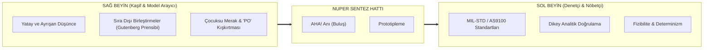
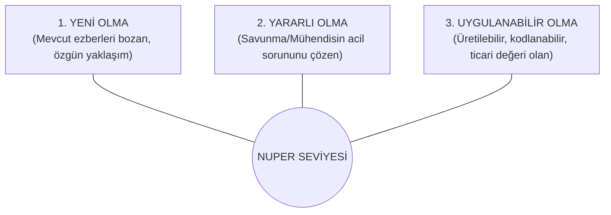

# 🛡️ Nuper Industries: Marka Rehberi & Yaratıcılık Manifestosu
> *"Yaratıcı olan insanların hepsi birer düş mühendisidir. Zaman, savunma ve yüksek teknolojide düş mühendisi olma zamanıdır."*  
> *(Kaynak ve İlham: [[Kitap - Yaratıcılık - Onur Yanık]])*

---

## 🧭 1. Marka Özü ve Temel Felsefe

### 1.1. Varoluş Sebebi: Hayal Toplumunda Derin Mühendislik
Ralf Jensen'in öngördüğü gibi; tekdüze hesaplamaların, standart kod satırlarının ve rutin mühendislik görevlerinin yapay zekaya devredildiği bir çağdayız. Salt veri işlemek artık rekabet avantajı sağlamaz.

**Nuper**, bilginin değil; **hayalgücünün, cesaretin ve sınırları aşan yaratıcılığın** fiziksel dünyayı dönüştürdüğü noktada kurulmuştur. Hantal kurumsal devlerin çöktüğü ve devletlerin teknolojik tekelleri zaptedemediği bu yeni çağda; işini dünyada en iyi yapan, yapay zekayla güçlenmiş bağımsız ve atılgan azınlıkların egemenliğini temsil ediyoruz. Biz şişirilmiş fonlara köle olmadan, kendi yatırımlarımızla kavrularak, her gün kod yazıp sektördeki "çorabın söküğünü" arayan düş mühendislerinin sarsılmaz inadıyla büyüyoruz.

$$\mathbf{Nuper\ Değeri} = \mathbf{Hassas\ Askeri\ Bilgi} \times \mathbf{Ayrışan\ Hayalgücü}$$
*(Dr. Min Basadur formülünün savunma ve mühendislik doktrinine uyarlanması)*

### 1.2. Marka Sloganı (Tagline)
- **Ana Slogan:** *"Dream Engineered, Mission Verified."* (Düşlerle Tasarlandı, Görevle Doğrulandı.)
- **Türkçe Konumlandırma:** *"Savunma ve Yüksek Teknolojide Yeni Nesil Düş Mühendisliği."*

---

## 🧠 2. Zihinsel Çift-Çekirdek: Sol Beyin & Sağ Beyin Simbiyozu

Geleneksel savunma sanayii ve mühendislik firmaları aşırı **sol beyin odaklıdır**: Kuşkucu, tutucu, hata aramaya şartlanmış, dikey ve tek bir doğru cevaba kilitlidir. Bu yaklaşım güvenilirlik getirse de yıkıcı inovasyonu öldürür. 

Nuper Industries, beynin iki lobunu **aynı anda tam kapasiteyle çalıştıran** kurumsal bir işletim sistemine sahiptir:



### Temel Zihin Kurallarımız:
1. **Fikir Üretiminde Sol Beyin Susturulur:** İlk fikir ve konsept aşamasında hiçbir kısıtlama kabul edilmez. "Bu üretilemez", "Şartnameye uymaz" gibi sol beyin bekçileri kapının dışında bekletilir.
2. **İmalatta ve Doğrulamada Sol Beyin Tavizsizdir:** Sağ beynin ürettiği sıra dışı fikirler, sahaya ve koda dökülürken askeri havacılık standartlarında analitik süzgeçten geçirilir.
3. **Barometre Prensibi (Çoklu Çözüm Doktrini):** Mühendislerimiz karşılaştıkları her zorlu problem için tek bir doğruya saplanıp kalamaz. Barometre vakasında olduğu gibi, en az **3 farklı çözüm ekseni** (analitik, fiziksel, dolaylı/sosyal) masaya konulmalıdır.

---

## 📐 3. Nuper Ürün Filtresi (Feridun Hürel Üçgeni)

Nuper bünyesinde geliştirilen her mikro-SaaS, savunma aracı veya yapay zeka ajanı şu üç parametrenin kesişim kümesinde yer almak zorundadır:



> [!danger] Arthur Pedrick Tuzağına Düşmeme İlkesi
> 162 patent alıp hiçbirini ticarileştiremeyen Arthur Pedrick gibi "marjinal ama işlevsiz" oyuncaklar üretmiyoruz. Bir fikir sırf enteresan diye inşa edilmez. Yararlı ve sahada doğrudan uygulanabilir olmalıdır.

---

## 🚫 4. Nuper "9 Kutu Kalkanı" (Anti-Dogma İlkeleri)

Kurumsal dünyayı felç eden ve yaratıcılığı kutulayan 9 tuzağa karşı Nuper kalkanı:

| # | Kurumsal Tuzak Kutusu | Nuper Karşı-Doktrini |
| :-: | :--- | :--- |
| **1** | **Zaman Kısıtlaması ("Vaktim yok!")** | İnovasyon masa başında değil, serbest salınım anlarında (kuluçkada) doğar. Ar-Ge mühendislerimize düşünme ve dinlenme alanı açılır. |
| **2** | **Çevredeki Bulanıklık (Gürültü & Kesinti)** | Asenkron, derin odaklanma (*Deep Work*) kültürü esastır. Önemsiz toplantılar ve kurumsal bürokrasi filtrelenir. |
| **3** | **Risk Korkusu** | **"En büyük risk, hiçbir risk almamaktır."** Savunma sanayiinde statükoyu korumak en büyük stratejik zafiyettir. |
| **4** | **Mükemmeliyetçilik Felci** | İlk sürüm sahada test edilir. Geri besleme döngüsüyle kusursuzlaştırılır (*Human-in-the-Loop*). |
| **5** | **Durgun Sular ("Tekneyi sallama")** | Nuper fırtınayı arar. Sektördeki modası geçmiş tabuları bilerek ve isteyerek dalgalandırırız. |
| **6** | **Siyah-Beyaz Doğruculuk** | En büyük icatlar mantığın gri bölgelerinde, çelişkilerin çarpıştığı yerlerde gizlidir. |
| **7** | **Kendine Dair Olumsuz Kehanetler** | *"Biz bunu yapamayız"* kelimesi Nuper lugatından çıkarılmıştır. İmkansız sadece henüz denenmemiş algoritmadır. |
| **8** | **Tek Doğru Cevap Saplantısı** | İlk bulduğumuz cevaba aşık olmayız. Her zaman alternatif bir "Plan B ve C" kurgularız. |
| **9** | **Hesap Çizgisi Baskısı** | Kısa vadeli maliyet muhasebesi, uzun vadeli yıkıcı savunma teknolojilerinin celladı yapılamaz. |

---

## 🔇 5. Nuper Ofisinde Yasaklanan "Düş Katili Yorumlar"

Aşağıdaki 17 ifade Nuper Industries bünyesindeki Ar-Ge toplantılarında, kod incelemelerinde ve beyin fırtınalarında **kırmızı kart sebebidir**:

> [!caution] Kara Listedeki İfadeler
> 1. *"Bu da nereden çıktı şimdi?"*  
> 2. *"Buna daha hazır değiliz."*  
> 3. *"Bizim için çok erken!"*  
> 4. *"Şimdi bunun sırası mı?"*  
> 5. *"Bu sistem bize uymaz!"*  
> 6. *"Eski köye yeni adet mi getiriyorsun?"*  
> 7. *"İcat mı çıkarıyorsun?"*  
> 8. *"Saçmalama!"*  
> 9. *"Senin başka işin yok mu?"*  
> 10. *"Biz ciddi bir savunma kuruluşuyuz."*  
> 11. *"Bunu daha önce denedik, olmadı."*  
> 12. *"Daha önce hiç bunu yapan olmuş mu?"*  
> 13. *"Değişiklik başımıza iş açar."*  
> 14. *"Biz böyle de iyiyiz."*  
> 15. *"Çok güzel fikir ama..."*  
> 16. *"Fakat..."*  
> 17. *"Piyasası yok!"*

---

## 🎭 6. Koestler Triadı: Nuper Ürün Deneyimi

Her Nuper ürünü kullanıcısında şu üç duygusal rezonansı tetiklemelidir:

```
[HAHA!] Cesur, ezber bozan kışkırtma ("Bunu gerçekten yapmışlar!")
    ↓
[AHA!] Zekice mühendislik çözümü ("Tam aradığımız algoritma bu!")
    ↓
[AH!]  Estetik, endüstriyel hayranlık ve kusursuz UX güveni
```

---

## 🎨 7. Görsel Kimlik & Tasarım Sistemi (Aesthetics)

Nuper Industries görsel dili; **savunma sanayiinin gizemli ciddiyeti ile uzay araştırmalarının zarafetini** birleştirir. Sıradan kurumsal renkler (standart açık mavi, kırmızı, beyaz) kesinlikle kullanılmaz.

### 7.1. Renk Paleti (Color Tokens)

| Token Adı | HEX Kodu | Anlam ve Kullanım Alanı |
| :--- | :--- | :--- |
| **Obsidian Void** | `#080b11` | Ana arka plan; sonsuz uzay derinliği, askeri gizlilik. |
| **Titanium Steel** | `#161f30` | Kart ve panel zeminleri, dayanıklılık hissi. |
| **Aero Blue** | `#38bdf8` | Birincil vurgu; yüksek teknoloji, HUD ve telemetri parıltısı. |
| **Tactical Amber** | `#f59e0b` | İkincil vurgu; kritik uyarılar, askeri radar sinyalleri. |
| **Stealth Muted** | `#64748b` | İkincil metinler, teknik veri parametreleri. |
| **Pure Signal** | `#f8fafc` | Başlıklar ve odak metinleri; keskin kontrast. |

### 7.2. Tipografi Hiyerarşisi
- **Display & Başlıklar:** `Orbitron` / `Outfit` / `Inter` (Endüstriyel, köşeli, modern, kendinden emin duruş).
- **Gövde Metinleri:** `Inter` (Okunabilirliği en üst düzeyde olan nötr sans-serif).
- **Teknik Veri, Kod & Telemetri:** `JetBrains Mono` / `Fira Code` (Mühendislik ve askeri koordinat hassasiyeti).

### 7.3. UI Bileşen Karakteri
- **Glassmorphism & Frosted Glass:** Arka planı hafif buzlu gösteren cam paneller (`backdrop-blur-md bg-slate-900/60 border border-slate-700/50`).
- **HUD & Telemetri Çizgileri:** İnce, teknik 1px grid çizgileri, radar noktaları, canlı nabız (pulsing) göstergeleri.
- **Mikro-Animasyonlar:** Tıklamalarda askeri sistem başlatma hissi veren yumuşak geçişler, yükleme sırasında parlayan lazer/neon hatlar.

---

## 🚀 8. Şirket İçi İnovasyon Kültürü & Çalışma Ritüelleri

1. **Hata Yapma Lisansı:** Mühendislerin yeni modeller ve mimariler denerken hata yapmaları teşvik edilir. Aksaçlı ustanın kuralı geçerlidir: *Doğru Karar $\leftarrow$ Deneyim $\leftarrow$ Yanlış Karar*. Hata yapmayan mühendis, sınırları zorlamıyor demektir.
2. **Kavram Çarpıştırma Seansları (Sinektik & Gutenberg Seansları):** İki haftada bir, savunma sanayii ile tamamen alakasız iki sektör (örneğin: biyoloji + roket gövdesi, çocuk oyuncağı + İHA kontrol mekanizması) zorla birleştirilerek yeni ürün hipotezleri türetilir.
3. **Zihinsel Simülasyon Kültürü:** Tıpkı basketbol deneyinde zihninde atış yapanların başarısını %23 artırması gibi; mimariler kodlanmadan önce zihinde baştan sona simüle edilir ve senaryolaştırılır.
4. **Second Brain & Altın Veri:** Kurucunun ve ekibin tüm okumaları, patent analizleri ve arXiv araştırmaları [[innovationEnginePlan]] uyarınca sistemli bir şekilde arşivlenir ve şirketin kolektif yapay zekasına beslenir.

---

*Bu rehber, Nuper Industries bünyesinde üretilen tüm kodların, arayüzlerin, donanım tasarımlarının ve stratejik kararların omurgasını oluşturur.*
