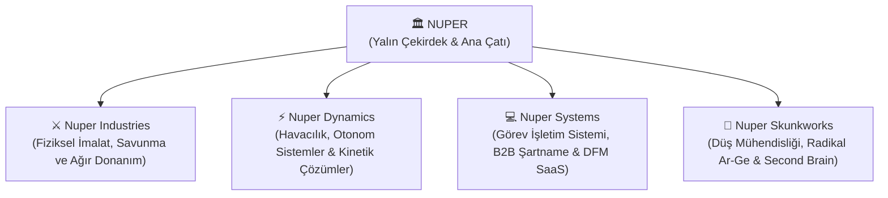
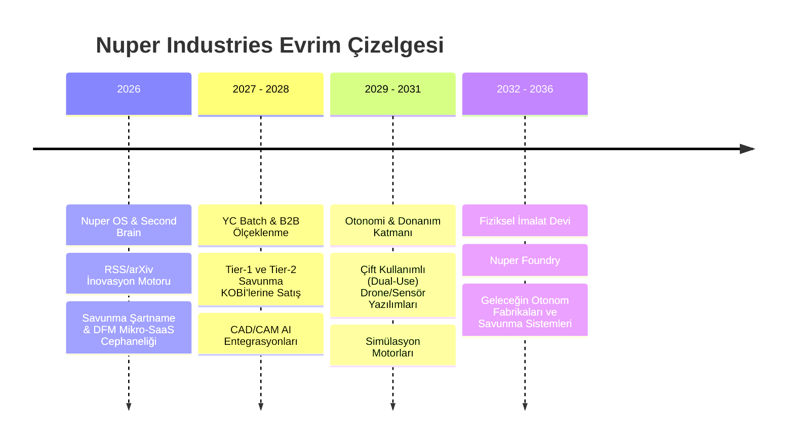
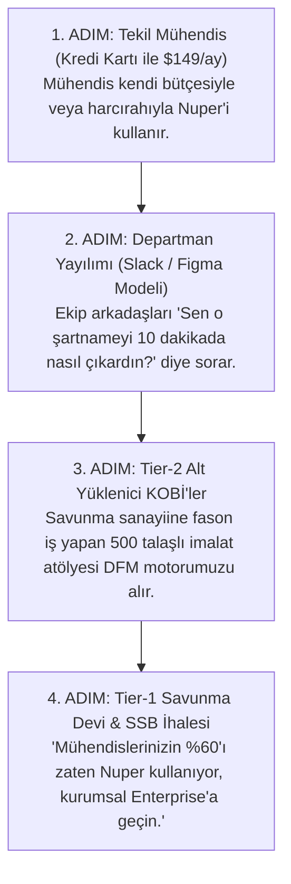

# 🏛️ Nuper Stratejik Marka Mimarisi & Gelecek Tasarımı
> *"Tarih, 'olmaz' diyen uzmanların enkazı üzerinde, 'ya olursa?' diyen düş mühendislerinin zaferleriyle yazılmıştır."*  
> *(Kaynak ve Dayanak: [[Kitap - Yaratıcılık - Onur Yanık]])*

---

## 📑 Belge Haritası
0. [[#0. Nuper Kurucu Doktrini: "Egemen Azınlıklar Çağı ve Çorabın Söküğü"]]
1. [[#1. İsim Analizi ve Radikal Dönüşüm: "Sadece NUPER"den Ekosisteme]]
2. [[#2. Marka Konumlandırması: Hayal Toplumunda "Düş Mühendisliği"]]
3. [[#3. Zihinsel İşletim Sistemi: Çift-Beyinli (Bicameral) Mühendislik]]
4. [[#4. Ürün Portföyü Stratejisi: Rastgele SaaS'tan "Modüler Cephaneliğe"]]
5. [[#5. Kurumsal Bağışıklık: 9 Kutu Kalkanı ve Anti-Dogma Protokolü]]
6. [[#6. Ürün Deneyiminde Arthur Koestler Triadı (Haha! -> Aha! -> Ah!)]]
7. [[#7. Görsel Dil, Tasarım Felsefesi ve Psikolojik Algı]]
8. [[#8. YC (Y Combinator) & Savunma Sanayii 10 Yıllık Yol Haritası]]
9. [[#9. 12 Zihin Egzersizinin Savunma Mühendisliği Çalıştaylarına Dönüşümü]]
10. [[#10. "Modüler Cephanelik" Teknik & Finansal Ürün Spesifikasyonları]]
11. [[#11. Savunma Satış Doktrini (GTM) ve 18 Aylık Döngüyü Kıran "Truva Atı" Stratejisi]]
12. [[#12. Güvenlik, ITAR ve Air-Gapped / Sıfır-Bilgi (Zero-Knowledge) Mimarisi]]
13. [[#13. YC Partner Mülakatı Simülasyonu: Garry Tan Karşısında Nuper]]

---

## 0. Nuper Kurucu Doktrini: "Egemen Azınlıklar Çağı ve Çorabın Söküğü"

Bu bölüm, Nuper'in varoluş sebebini ve kurucusunun zihinsel çekirdeğini oluşturan büyük tarihsel tezi kayıt altına alır:

### 0.1. Büyük Tarihsel Kırılma: Hantal Devlerin Çöküşü & Egemen Azınlıklar
Dünya kritik bir jeopolitik ve endüstriyel makas değişimindedir:
1. **Hantal Devlerin Sonu:** Yüz binlerce bürokratik çalışana sahip eski nesil devler (Boeing, Intel, eski savunma baronları) artık inovasyon yapamamakta, kendi ağırlıkları altında ezilmektedir.
2. **Devletlerin Güç Kaybı & Teknoloji Egemenliği:** Ulus-devletler küresel teknoloji tekellerini kontrol etmekte zorlanmaktadır. Savaşların, ticaretin ve bilgi akışının kaderini devlet ordularının ağır tankları değil; uydu ağları, otonom yapay zeka algoritmaları ve çip fabrikaları belirlemektedir.
3. **Hiper-Kaldıraçlı Azınlıklar (The Sovereign Few):** Gelecek; kalabalık orduların değil, **işini dünyada en iyi yapan, yapay zeka ile 100 kat kaldıraç kazanmış çevik ve odaklanmış azınlıkların** olacaktır. Nuper, bu egemen azınlığın savunma ve derin teknoloji cephesidir.

### 0.2. Bağımsızlık ve Öz-Sermaye Doktrini (Sovereign Bootstrap)
Nuper, fonlara ve risk sermayesine (VC) bağımlı bir balon olarak değil; **kendi yatırımlarıyla kavrulan, ilk günden itibaren karlı, organik olarak büyüyen bağımsız bir teknoloji kalesi** olarak tasarlanmıştır. Dışarıdan sermaye ancak şirketin egemenliğini pekiştirecek stratejik anlarda bir hızlandırıcı olarak kabul edilebilir; asla bir yaşam destek ünitesi olamaz.

### 0.3. "Çorabın Söküğü" Felsefesi ve Düş Mühendisinin Günlük Savaşı
> *"Daha çorabın söküğünü yakalayamadım. O yüzden her gün yazılımda kendimi geliştiriyorum. Düş mühendisliği yapıyorum."*

Bu itiraf ve adanmışlık, Nuper'in en saf yakıtıdır.
- **Ekosistemler tek hamlede inşa edilmez:** Hiçbir devasa sistem bir gecede kurulmamıştır. Bill Bowerman Nike'ı kurarken küresel bir ayakkabı imparatorluğu değil, mutfaktaki tost makinesinde bir ayakkabı tabanı (waffle sole) arıyordu.
- **Söküğü Aramak:** Çorabın söküğü; savunma veya makine sanayiinde çalışan bir mühendisin her gün canını sıkan, zamanını çalan, kimsenin çözmeye tenezzül etmediği **küçük, ağrılı ve spesifik bir problemdir.**
- **Günlük Zanaat ve İnat:** Her gün bir satır kod yazmak, her gün hata yapmak ve aksaçlı bilge ustanın kuralını hatırlamak:  
  $$\text{Doğru Karar} \longleftarrow \text{Deneyim} \longleftarrow \text{Yanlış Kararlar}$$
  Düş mühendisliği soyut bir hayalperestlik değil; o hayali her gün yazılımla, matematikle ve ısrarla gerçeğe indirme disiplinidir. O sökük yakalandığı anda, tüm ekosistem arkasından çözülecektir.

---

## 1. İsim Analizi ve Radikal Dönüşüm: "Sadece NUPER"den Ekosisteme

Bir markanın ismi, onun kaderini belirleyen ilk zihinsel kodlamadır. Bu analizi kurucu doktrini doğrultusunda netleştiriyoruz:

### 1.1. "Nuper" Kelimesinin Saklı Hazinesi
Pek çok insanın bilmediği muazzam bir etimolojik gerçek vardır: **"Nuper"**, doğrudan **Latince** bir sözcüktür:
- **Anlamı:** *Yeni, taze, yakın zamanda meydana gelmiş, az önce doğmuş, genç.*
- **Kökü:** Latince *"novus"* (yeni) kökünden türemiştir.
- Kitabımızın 4. sayfasında geçen yaratıcılığın kökeni Latince **"Creare"** (yaratmak, doğurmak, meydana getirmek) nosyonu ile **"Nuper"** mükemmel bir tarihsel ve felsefi kardeşliğe sahiptir.
- **Karar:** **"NUPER" ismi kesinlikle korunmalıdır.** Kısa, fonetik olarak sert, küresel dillerde kolay telaffuz edilen, gizemli ve endüstriyel bir ağırlığa sahip bir kelimedir.

### 1.2. "Innovation" Kelimesinin Zayıflığı ve Neden Bırakıldığı
"Innovation" kelimesi günümüz dünyasında şu sorunları taşır:
1. **İçi Boşaltılmış bir Buzzword:** Bankaların halkla ilişkiler departmanları, reklam ajansları ve kahve zincirleri bile tabelalarına "Innovation" yazmaktadır. 
2. **Eylemsizlik Hissi (Talk vs. Action):** "Innovation", konuşan ama donanım üretmeyen, seminer veren ama füze fırlatmayan danışmanlık firmalarını çağrıştırır.
3. **Savunma Sanayii Ciddiyetiyle Uyuşmazlık:** Pentagon, Savunma Sanayii Başkanlığı (SSB) veya Y Combinator, "Innovation" isimli bir firmaya donanım veya kritik yazılım ihalesi verirken tereddüt eder. Onlar güç, dayanıklılık, ölçek ve endüstri isterler.

### 1.3. Büyüme Mimarisi: "Önce NUPER, Sonra Ekosistem"
- **Bugün ve Çıkış Aşaması:** **Sadece NUPER** (Yalın, bağımsız, atılgan, tek bir kurucunun zekası ve saf yazılım gücü).
- **Yarın (Organik Genişleme):** Kendi yağımızla kavrulup büyüdükçe NUPER kökünden filizlenecek alt şirketler ve bölümler:



- **Şirket Adı:** **Nuper Industries** (Anduril Industries gibi zamansız, endüstriyel ve heybetli).
- **Yazılım & SaaS Platformu Adı:** **Nuper Dynamics** ya da **Nuper Systems**.
- **İnovasyon Çekirdeği:** **Nuper Skunkworks** (Lockheed Martin'in efsanevi gizli Ar-Ge merkezine selam duran iç inovasyon departmanımız).

---

## 2. Marka Konumlandırması: Hayal Toplumunda "Düş Mühendisliği"

Kitabın 2. ve 3. sayfalarında Danimarkalı gelecek bilimci **Ralf Jensen**'in *Hayal Toplumu (Dream Society)* teorisi ve Dr. Murat Toktamışoğlu'nun manifestosu yer alır:
> *"Bilgi çağı sona erdi; hayal çağı başladı. Hukuk, standart tıp ve klasik mühendislik gibi meslekler yapay zekaya ve makinelere devredilecek. Ayakta kalacak olanlar sadece 'Düş Mühendisleri'dir."*

### Nuper'in Konumlandırma Paradigması:
Geleneksel savunma şirketleri (Lockheed, Boeing, ASELSAN, Roketsan) mühendisliği **statik formüller, 1000 sayfalık bürokrasi ve yavaş tedarik zincirleri** olarak görür. 

Nuper Industries ise mühendisliği bir **"Düş Mühendisliği"** disiplini olarak tanımlar:
- **Vizyon:** *"Fizik kurallarının izin verdiği ama insan aklının imkansız sandığı teknolojileri tasarlamak."*
- **Formülümüz:**
  $$\mathbf{Nuper\ Katma\ Değeri} = \mathbf{Hassas\ Askeri\ Bilgi} \times \mathbf{Ayrışan\ Hayalgücü}$$
  Bilgiye herkes erişebilir; LLM'ler tüm kitapları ezberledi. Nuper'i YC sahnesinde ve savunma pazarında milyar dolarlık yapacak olan çarpan, **hayalgücüdür**.

---

## 3. Zihinsel İşletim Sistemi: Çift-Beyinli (Bicameral) Mühendislik

Kitabın en çarpıcı bölümlerinden biri (Sayfa 7-9), James Asher ve J.G. Rawlinson'ın **Sol Beyin (Dikey/Analitik)** ve **Sağ Beyin (Yatay/Yaratıcı)** analizidir.

### 3.1. Sektörel Felç Teşhisi
- **Mevcut Savunma Sanayii:** %100 Sol Beyin esaretindedir. Kuşkucudur, savunma pozisyonundadır, denenmemişe direnç gösterir, tek bir doğru cevap peşinde koşar ve 5 yılda bir cıvata değiştirir.
- **Geleneksel Yazılım Dünyası:** Aşırı sağ beyin savurganlığı yaşar. Fikir çoktur ama fiziksel dünyadan, askeri toleranslardan (MIL-STD) ve uygulanabilirlikten habersizdir (Arthur Pedrick Sendromu).

### 3.2. Nuper'in "Bicameral" Çalışma Protokolü

| Aşama | Hakim Lob | Zihinsel Mod & Kitaptaki Araç | Çıktı |
| :--- | :---: | :--- | :--- |
| **1. Kuluçka & Keşif** | **Sağ Beyin** | *Yatay Düşünce, PO (Kışkırtma), Sinektik, Çocuk Zihni* | Tabuları yıkan, deli saçması gibi görünen 50 radikal fikir. |
| **2. Filitreleme & Sentez** | **Köprü** | *Gutenberg Birleştirmesi, Walkman & Jacuzzi Prensibi* | Çılgın fikirlerin pratik birer sektörel çözüme dönüştürülmesi. |
| **3. Doğrulama & İmalat** | **Sol Beyin** | *Dikey Mantık, Sayısal Analiz, Hata Avcılığı, MIL-STD* | Hatasız kod, AS9100 toleransı, deterministik aviyonik yazılım. |

### 3.3. Barometre Doktrini (Kurumsal Çözüm Çeşitliliği)
Kitabın 17. ve 18. sayfalarındaki meşhur **"Barometre ile gökdelen boyu ölçme"** vakası Nuper'in şirket içi problem çözme anayasasıdır:
- Bir askeri radar, otonom İHA veya SaaS optimizasyon probleminde bir mühendis ekibe tek bir çözümle gelirse toplantı ertelenir.
- Ekip şu 3 farklı yaklaşımı aynı anda sunmak zorundadır:
  1. *Doğrudan/Analitik Yol:* Standart formül çözümü (Klasik yaklaşım).
  2. *Fiziksel/Deneysel Yol:* Malzemeyi, sensörü, geometriyi değiştirerek bulunan pratik yol.
  3. *Dolaylı/Asimetrik Yol (Kapıcıya barometreyi rüşvet verme mantığı):* Problemi kökten kaldıran veya sistemi baypas eden zekice yazılım/iş modeli hilesi.

---

## 4. Ürün Portföyü Stratejisi: Rastgele SaaS'tan "Modüler Cephaneliğe"

İlk sorunuzdaki *"Websiteyi ufak SaaS projelerimle donatsam, hangisi satarsa satsın mantığı nasıl olur?"* ikilemine kitabın ışığında nihai stratejik cevabı veriyoruz:

### 4.1. "Bit Pazarı" Tuzağından "Entegre Cephanelik" Modeline
Siteyi birbiriyle alakasız mikro araçlarla doldurmak, markayı değersizleştirir ve güveni yok eder. Ancak bu fikir **"Savunma Mühendisinin Modüler Cephaneliği" (Modular Arsenal)** kurgusuna dönüştürülürse bir dünya devi doğar:

```
[ Geleneksel Hatalı Yaklaşım ]
- PDF Sıkıştırıcı + Halı Saha Takvimi + Resim Arka Plan Silici = (Güvensiz, ucuz, marka kimliği yok)

[ Nuper "Modüler Cephanelik" Yaklaşımı ]
- Nuper Spec Engine (Askeri Şartname RAG)
- Nuper DFM Copilot (CAD'den Talaşlı İmalat Maliyet Analizi)
- Nuper Intel/Radar (Savunma Patent & arXiv Literatür İstihbaratı)
- Nuper Telemetry Hub (Drone ve Robotik Veri Analiz Motoru)
```

Her bir araç bağımsız bir mikro-SaaS olarak fatura keser ($50-$500/ay), ancak hepsi **tek bir merkezi Nuper Kimliği (SSO) ve tek bir endüstriyel arayüz dili** ile birbirine kenetlenir. Kullanıcı bir aracı kullandığında diğer üçünün de gücünü hisseder.

### 4.2. Gutenberg Prensibi ile Ürün Geliştirme (Zorunlu Çaprazlama)
Kitabın 34. sayfasında anlatıldığı gibi:  
*Şarap Presi + Patates Baskısı = Matbaa Makinesi*  
*Buzdolabı + Tren Vagonu = Soğuk Hava Taşımacılığı*

Nuper Ar-Ge ekibi savunma araçlarını üretirken sektörler arası zoraki evlilikler (Sinektik) yaptırır:
- **Oyun Motoru (Unreal Engine) + Askeri Şartnameler** $\rightarrow$ Sentetik sensör simülasyon SaaS'ı.
- **Fintech Algoritmaları + CNC İşleme Tezgahları** $\rightarrow$ Anlık parça üretim maliyeti borsa motoru.
- **Sosyal Ağ Grafikleri + Savunma Tedarik Zinciri** $\rightarrow$ Kritik hammadde darboğaz dedektörü.

### 4.3. Feridun Hürel Üçgeni (Nuper Gatekeeper)
Bir fikrin Nuper platformunda kodlanması için 3 barajı geçmesi zorunludur:
1. **YENİ mi?** (Mevcut piyasa yazılımlarının bir kopyası mı, yoksa oyunu değiştiren asimetrik bir hamle mi?)
2. **YARARLI mı?** (Mühendisin mesaisini saatlerce kısaltıyor veya bir savunma sisteminin arıza riskini düşürüyor mu?)
3. **UYGULANABİLİR mi?** (Bugünün teknolojisi ve sunucu maliyetleriyle karlı bir şekilde ayağa kaldırılabiliyor mu?)

---

## 5. Kurumsal Bağışıklık: 9 Kutu Kalkanı ve Anti-Dogma Protokolü

Kitabın 21-23. sayfalarında özetlenen **"Yaratıcılığın Paketlendiği Dokuz Kutu"** ve **"Tescilli Önyargılar"**, Nuper şirket kültürünün anti-virüs yazılımıdır:

### 5.1. Düş Katili 17 Kalıba Karşı "Sıfır Tolerans"
Nuper kanallarında, Slack mesajlarında veya toplantılarda şu cümleleri kurmak **kültürel ihlal** sayılır:
- *"Bunu daha önce denedik, olmadı."* (Teknoloji değişti, parametreler değişti, bugün tekrar deneyeceğiz!)
- *"Biz ciddi bir savunma kuruluşuyuz."* (Ciddiyet sıkıcılık veya korkaklık demek değildir; gerçek ciddiyet üstün sonuç üretmektir.)
- *"Eski köye yeni adet mi getiriyorsun?"* (Nuper tam olarak eski köyleri yıkıp yeni adetler kurmak için kuruldu.)
- *"Piyasası yok!"* (Ken Olson da 1977'de ev bilgisayarlarının piyasası yok diyordu.)

### 5.2. Hata Kültürü: "Aksaçlı Usta Protokolü"
Kitabın 26. sayfasındaki aksaçlı ustanın dersi:  
$$\text{Doğru Kararlar} \longleftarrow \text{Deneyim} \longleftarrow \text{Yanlış Kararlar}$$

- Nuper bünyesinde hızlı hata yapmak ve bunu bir an önce veriye dökmek bir erdemdir. 
- Bir mühendis 1 ay boyunca hiç hata yapmamışsa, yeterince sınırda çalışmıyor demektir.
- Her başarısız deney, [[Kitap - Yaratıcılık - Onur Yanık]] sayfa 26'daki **"Egzersiz 5: Neler Daha Farklı Olabilirdi?"** formatında şirket içi ikinci beyne (knowledge base) bir zafer dersi olarak işlenir.

### 5.3. Zihinsel Basketbol Ritüeli (Nörolojik Simülasyon)
Kitabın 29. ve 30. sayfalarında kanıtlanan deney: Zihninde serbest atış yaptığını hayal eden sporcuların atış yüzdesi %23 artmıştır.
- Nuper mühendisleri bir sistemi (Next.js mimarisi, PostgreSQL şeması, AI ajanı zinciri) kodlamadan önce 48 saat boyunca sistemi uçtan uca zihinlerinde çalıştırır, sınır durumları (edge-cases) hayal eder ve simüle eder. Kod yazmak sadece bu zihinsel zaferin yazıya dökülmesidir.

---

## 6. Ürün Deneyiminde Arthur Koestler Triadı (Haha! -> Aha! -> Ah!)

Kitabın 12. sayfasında yer alan Arthur Koestler'in yaratıcılık sınıflaması, Nuper ürünlerinin kullanıcı deneyimi (UX/UI) kılavuzudur:

```
[ HAHA! - Beklenmedik Kışkırtma ]
Kullanıcı platforma girdiğinde savunma sanayiinin o hantal, gri, kasvetli ve 1995'ten kalma
devlet yazılımlarını beklerken; karşısında bilimkurgu filmlerinden fırlamış, akıcı,
ışıldayan bir arayüz görür. Şaşırır ve tebessüm eder.

        ↓

[ AHA! - Entelektüel Buluş Anı ]
Kullanıcı 800 sayfalık bir NATO standardını veya karmaşık bir STEP dosyasını yükler.
Sistem 3 saniye içinde parçanın talaşlı imalat zaaflarını ve tolerans hatalarını döker.
Kullanıcı masaya vurup bağırır: "İşte aradığım şey buydu!"

        ↓

[ AH! - Estetik ve Mühendislik Aşkınlığı ]
Sistemin ürettiği teknik raporu, telemetri grafiklerini ve kusursuz tipografiyi
incelediğinde derin bir estetik hayranlık ve güven duygusu hisseder.
```

---

## 7. Görsel Dil, Tasarım Felsefesi ve Psikolojik Algı

### 7.1. Renklerin Stratejik Anlamı
- **Obsidian Space (`#05070B` - `#0A0E17`):** Sonsuz uzay, havacılık boşluğu, gizlilik dereceli operasyonlar. Kullanıcıya sıradan bir web sitesinde değil, bir savunma komuta merkezinde olduğu hissini verir.
- **Titanium Slate (`#1E293B` - `#334155`):** Zırh çeliği ve titanyum gövde hissi veren paneller.
- **Electric Cyan / Aero Blue (`#00E5FF` / `#38BDF8`):** HUD telemetri parıltısı, yapay zeka sinir ağları, keskin hassasiyet.
- **Tactical Safety Amber (`#F59E0B`):** Kritik radar uyarıları, askeri sınıf sınır göstergeleri.

### 7.2. Arayüz Fiziği
- Asla sıradan Bootstrap/Tailwind şablonu gibi görünmeyecek.
- Mikro grid çizgileri ($1\text{px}$ teknik ızgaralar).
- Koordinat göstergeleri, canlı nabız (pulsing) atan durum LED'leri.
- Monospace veri alanları (JetBrains Mono / Space Grotesk).

---

## 8. YC (Y Combinator) & Savunma Sanayii 10 Yıllık Yol Haritası

Nuper Industries, 10 yıllık büyük bir yürüyüşün adıdır:



### YC Başvuru Cümlemiz:
> *"Biz Nuper Industries. Savunma sanayii ve havacılık mühendislerinin iş akışlarını 10 kat hızlandıran, bürokrasiyi ortadan kaldıran ve fiziksel üretimi yapay zeka ile buluşturan yeni nesil Düş Mühendisliği işletim sistemini kuruyoruz."*

---

## 9. 12 Zihin Egzersizinin Savunma Mühendisliği Çalıştaylarına Dönüşümü

Onur Yanık'ın eserindeki 12 zihin egzersizi, Nuper Ar-Ge departmanında soyut birer oyun olmaktan çıkarılıp **"Nuper Mühendislik Çalıştayı Protokolleri"** haline getirilmiştir:

### 🛠️ Egzersiz Uyarlama Matrisi:

1. **Egzersiz 1 (Çift Lob Senkronizasyonu):** *Cümleden Görsele Geçiş $\rightarrow$ CAD Telemetrisi Sentezi.* Mühendislerimiz karmaşık bir aerodinamik şartnameyi okurken aynı anda zihinlerinde 3 boyutlu mesh ağını görselleştirir.
2. **Egzersiz 2 (Siz Hangi Kutudasınız?):** *Bürokrasi ve Hız Denetimi.* Her sprint başında ekip: *"Bu hafta savunma sanayiinin hangi kutusuna sığındık? Riskten mi kaçtık, yoksa tek doğruya mı saplandık?"* sorgulaması yapar.
3. **Egzersiz 3 (Bir Nesne Olmak):** *Empatik Arıza Analizi (FMEA).* "Ben bir roket nozulu veya İHA iniş takımı olsaydım, Mach 2 hızında en çok nereden çatlamak isterdim?" Malzemenin yerine geçerek stres analizi yapma sezgisi.
4. **Egzersiz 4 & 5 (Hatalardan Ders Çıkarma):** *Post-Mortem Zafer Kayıtları.* Patlayan devre, yanan motor veya çöken algoritma bir ayıp değil; İkinci Beyin'e işlenen "nasıl yapılamayacağının altın bilgisi"dir.
5. **Egzersiz 6 & 7 (Risk ve Siz):** *Statüko Risk Skoru.* Bir kararın riski hesaplanırken, "hiçbir şey yapmamanın ve gecikmenin getirdiği jeopolitik risk" her zaman daha yüksek puanlanır.
6. **Egzersiz 8 (Yaratıcı Ortam İhtiyaçları):** *Fiziksel Lab Mimarisi.* Mühendisler için Kant/Schiller/Cray tarzı derin odaklanma kapsülleri; sıfır gürültülü donanım test odaları.
7. **Egzersiz 9 (Rastgele Kavram Çarpıştırması):** *Teknoloji Çaprazlama Seansları.* Sözlükten veya teknik katalogdan rastgele iki donanım bileşeni çekilir (Örn: Piezo kristali + Paraşüt kordonu) ve 15 dakikada yeni bir sensör fikri türetilir.
8. **Egzersiz 10 (Farklı Yerlere Gitmek):** *Saha ve Atölye Şoku.* Kod yazan yazılımcılar ayda bir gün talaş kokan CNC atölyelerine, atış poligonlarına veya rüzgar tünellerine gönderilir. Gerçek fiziksel sürtünmeyi hissetmeyen yazılımcı savunma yazılımı yapamaz.
9. **Egzersiz 11 (Genişletmek ve Daraltmak):** *Ölçek Sınavı.* "Tasarladığımız bu İHA motoru bir karınca boyutunda olsaydı nasıl çalışırdı? Ya bir kargo uçağı boyutunda olsaydı?" Ölçek sınırlarını zorlayarak fiziksel anomalileri keşfetmek.
10. **Egzersiz 12 (Sırayı Tersine Çevirmek):** *Red Teaming & Anti-Sistem Tasarımı.* "Kendi ürettiğimiz savunma yazılımını en ucuz ve en aptalca yöntemle nasıl sabote edebiliriz?" Tersten düşünerek zafiyetleri önceden kapatmak.

---

## 10. "Modüler Cephanelik" Teknik & Finansal Ürün Spesifikasyonları

Nuper'in mikro-SaaS ürünleri rastgele tüketici araçları değildir; savunma sanayiinin kritik darboğazlarını çözen yüksek marjlı B2B yazılımlardır:

### 10.1. Modül 1: Nuper Spec Engine (Askeri Şartname & Uyum Copilot'ı)
- **Problem:** Bir savunma ihalesinde 1.200 sayfalık MIL-STD-810H, DO-178C ve NATO STANAG şartnamesini okuyup uyumluluk matrisi (Traceability Matrix) çıkarmak 3 mühendisin 4 haftasını alır.
- **Teknik Mimari:** PDF/Word dokümanlarını AST (Abstract Syntax Tree) hiyerarşisinde parçalayan yerel RAG mimarisi. Şartnamedeki gereksinimleri test edilebilir doğrulamalara dönüştüren LLM motoru.
- **Fiyatlandırma:** $299 / mühendis / ay veya $25.000 / kurumsal yıllık lisans.

### 10.2. Modül 2: Nuper DFM Copilot (CAD'den Talaşlı İmalat Maliyet Analizörü)
- **Problem:** Makine mühendisi 3D CAD çizer; parça 5 eksenli CNC tezgaha gider. Usta parçaya bakar: *"Bu iç köşe radyusu freze bıçağının girmesi için imkansız, işleme süresi 4 katına çıkar"* der ve parça geri döner. Haftalar kaybolur.
- **Teknik Mimari:** WebAssembly (WASM) tabanlı OpenCASCADE geometrik çekirdeği. STEP/IGES dosyasını tarayıcıda işler; kesici takım yolu simülasyonunu çalıştırır ve 10 saniyede tolerans ve işleme süresi maliyetini çıkarır.
- **Fiyatlandırma:** $499 / ay (Limitsiz CAD analizi) veya API çağrısı başına $5.

### 10.3. Modül 3: Nuper Intel/Radar (Savunma Ar-Ge İstihbarat Paneli - Second Brain)
- **Problem:** Savunma Ar-Ge direktörleri dünyadaki yeni patentleri, arXiv makalelerini, DARPA çağrılarını ve SSB proje ihtiyaçlarını manuel takip edemez.
- **Teknik Mimari:** Halihazırda kodladığımız [[innovationEnginePlan]] mimarisi! Günlük yüzlerce kaynaktan akademik sinyal yakalayan, gürültüyü eleyen ve doğrudan teknik fizibilite üreten istihbarat motoru.
- **Fiyatlandırma:** $149 / ay (Bireysel araştırmacı) — $1.500 / ay (Kurumsal Ar-Ge Ekipleri).

### 10.4. Modül 4: Nuper Telemetry Hub (Uçuş & Görev Verisi Teşhis İstasyonu)
- **Problem:** İHA ve roket uçuş testlerinden sonra gigabaytlarca binary ROS2/Protobuf telemetri logu çıkar. Veriyi görselleştirip sensör sapmalarını tespit etmek günlerce sürer.
- **Teknik Mimari:** ClickHouse / DuckDB üzerine kurulu ultra hızlı zaman serisi motoru. Anomali tespiti yapan hafif yapay zeka modelleri.
- **Fiyatlandırma:** $799 / ay (Aktif test filosu başına).

---

## 11. Savunma Satış Doktrini (GTM) ve 18 Aylık Döngüyü Kıran "Truva Atı" Stratejisi

Geleneksel savunma girişimleri 18-24 aylık ihale ve lobi süreçlerinde nakitsiz kalarak ölürler. Nuper, YC'nin en sevdiği **"Bottom-up B2B (Tabandan Tavana)"** ve **"Truva Atı"** satış modelini uygular:



Bu model sayesinde Nuper ilk günden itibaren **pozitif nakit akışına (Cash-Flow Positive)** geçer; ihaleleri beklerken aç kalmaz.

---

## 12. Güvenlik, ITAR ve Air-Gapped / Sıfır-Bilgi (Zero-Knowledge) Mimarisi

Savunma şirketleri tasarım dosyalarını OpenAI veya genel bulut API'lerine asla yükleyemezler (ITAR, AS9100 ve Milli Gizli derecelendirme kuralları).

Nuper bu engeli mimari bir silaha dönüştürür:
1. **İstemci Taraflı Çalışma (Client-Side WASM):** CAD dosyaları ve STEP modelleri sunucuya iletilmez; doğrudan mühendisin tarayıcısındaki yerel GPU ve WebAssembly çekirdeğinde işlenir.
2. **Yerel & Air-Gapped Kurulum (On-Premise):** Kurumsal müşteriler için internetsiz çalışan, lokal GPU sunucularında (NVIDIA RTX/H100) koşan özel Llama-3 / DeepSeek podları tek komutla (`docker compose up`) kurulur.
3. **Sıfır Veri Tutma (Zero Data Retention):** Hiçbir savunma çizimi model eğitimi için kullanılmaz; veriler RAM üzerinde işlenir ve oturum kapandığında yok edilir.

---

## 13. YC Partner Mülakatı Simülasyonu: Garry Tan Karşısında Nuper

Y Combinator mülakatına girdiğimizde ortaklar (Garry Tan, Harj Taggar, Michael Seibel) bizi köşeye sıkıştırmaya çalışacak. Kitabımızın sarsılmaz mantığıyla vereceğimiz yanıtlar şimdiden hazırdır:

> **YC Partner:** *"Savunma sanayiinde tedarik süreçleri 2 yıl sürer. Büyük firmalar sizin gibi genç bir şirkete nasıl güvensin?"*  
> **Nuper:** *"Biz generallere veya satın alma komisyonlarına satış yaparak başlamıyoruz. Biz tabandaki 10.000 talaşlı imalat atölyesine ve genç makine mühendislerine kredi kartıyla ayda $299'a satıyoruz. Mühendisler 600 sayfalık NATO şartnamesini okumaktan bıkmış durumda. Biz onların günlük eziyetini çözüyoruz. Büyük devler satın almaya karar verdiğinde, içerideki mühendisleri zaten 1 yıldır Nuper kullanıyor olacak."*

> **YC Partner:** *"Autodesk veya Siemens CAD yazılımlarına bir yapay zeka butonu eklerse sizi nasıl ezmez?"*  
> **Nuper:** *"Autodesk ve Siemens 30 yıllık teknik borç üzerine kurulu, hantal masaüstü yazılımlarıdır. Onlar çizim programı satıyor; biz ise tasarımın askeri sahada nasıl üretileceğini, kaç dolara mal olacağını ve hangi askeri teste gireceğini söyleyen 'fiziksel yapay zekayı' satıyoruz. Onlar sol beyin bekçiliğinde kilitlendiler; biz ise ayrışan mühendislik zekasıyız."*

> **YC Partner:** *"Peki şirketinizin nihai hedefi nedir?"*  
> **Nuper:** *"Biz sadece yazılım satmayacağız. 5 yıl sonra mühendislerin tasarladığı bu parçaları otonom olarak üreten dünyanın en çevik savunma dökümhanesini (Nuper Foundry) kuracağız. Palmer Luckey Anduril ile ne yaptıysa, biz onu otonom imalat ve mühendislik zekasında yapacağız."*

---

*Bu belge, Nuper markasının ruhunu, dilini, varoluş nedenini ve asla taviz vermeyeceği yaratıcılık standartlarını ilan eder.*

