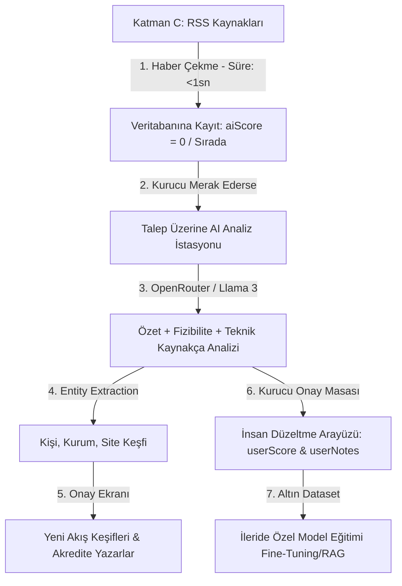

# Nuper Industries İnovasyon Fabrikası & "İkinci Beyin" (Second Brain) Mimarisi

Bu belge, Nuper Industries portalının kurucunun zihinsel süzgecini dijitalleştiren yarı-otonom bir **"İkinci Beyin" (Second Brain)** ve Ar-Ge/İnovasyon takip merkezine dönüştürülmesi planıdır.

---

## 1. Mimari Felsefe: İnsan-Makine Geri Besleme Döngüsü (Human-in-the-Loop)

İnternetteki ham teknolojik gürültüyü süzmek ve doğrudan Nuper Industries Ar-Ge vizyonuna hizmet edecek yapılandırılmış bilgiyi biriktirmek amacıyla sistem **bir fabrikanın üretim ve kalite kontrol hattı** gibi kurgulanmıştır:

---

## 2. Sıfır Maliyetli Haber Eleme ve Otomasyon

Vercel Hobby planındaki 10 saniyelik zaman aşımı (timeout) sınırını aşmamak ve gereksiz yapay zeka token harcamalarını önlemek amacıyla şu kurallar uygulanır:
- **Otomatik Cron AI Tüketimi Sıfırdır:** Arka planda çalışan zamanlanmış cron görevi sadece RSS kaynaklarını tarayıp yeni başlıkları veritabanına kaydeder. Yapay zeka bu aşamada tetiklenmez.
- **On-Demand (Talep Üzerine) Tetikleme:** AI analizleri sadece kurucu Admin panelinde merak ettiği bir habere veya fikre tıklayıp "Şimdi AI ile Analiz Et" butonuna bastığında çalışır. Bu sayede token harcaması %100 kontrol altındadır.

---

## 3. Yapılandırılmış Çıktı ve "Teknik Kaynakça" Odağı

AI analizi yüzeysel pazar analizleri yapmak yerine doğrudan **Ar-Ge dökümantasyonu ve akademik literatür araştırması** üzerine odaklanır:
- **Structured Output (Yapılandırılmış JSON):** AI'dan dönen veriler doğrudan veritabanı şemamıza yazılır.
- **Literatür & Referans Haritalama:** AI, projenin hayata geçirilmesi için kesinlikle okunması gereken **arXiv akademik makalelerini, resmi teknik dökümanları (RFC, API referansları vb.) ve referans GitHub depolarını** bulup rapor içerisine `### 📚 Önerilen Literatür & Kaynakça` başlığı altında ekler.

---

## 4. İnsan Düzeltme Katmanı (Human-in-the-Loop Dataset)

Yapay zekanın kararlarının sizin zihinsel çerçevenize uyması için sistemde bir düzeltme mekanizması bulunur:
- **`userScore` ve `userNotes`:** AI'ın atadığı puanı ezebilir ve kendi vizyon/Ar-Ge notlarınızı ekleyebilirsiniz.
- **`status` (APPROVED | REJECTED):** Haberleri "Sinyal" (Approved) veya "Gürültü" (Rejected) olarak etiketleyebilirsiniz.
- **Model Eğitimi:** Zamanla biriken bu `(Haber -> AI Analizi -> Kurucu Düzeltmesi & Onayı)` çiftleri, ileride kendi açık kaynaklı modelinizi eğittiğinizde (Fine-Tuning/RLHF) kullanılacak olan **altın veri kümesini (gold dataset)** oluşturur.

---

## 5. Vektörel Hafıza (pgvector) ve RAG Yol Haritası

Veri setimiz belirli bir boyuta ulaştığında RAG (Retrieval-Augmented Generation) sistemini aktif etmek için:
- **pgvector:** Supabase PostgreSQL veritabanımız üzerinde pgvector eklentisi aktif edilecek.
- **Embedding Kaydı:** Temiz döküman metinleri sayısal vektörlere çevrilerek kaydedilecek. Böylece kurucu olarak kendi İkinci Beyniniz içinde *"Dünyada yapay zeka ajanları ile ilgili çıkan makalelerden bizim Ar-Ge hedeflerimize en yakın 5 tanesini dökümanlarıyla getir"* şeklinde anlamsal aramalar yapabileceksiniz.
