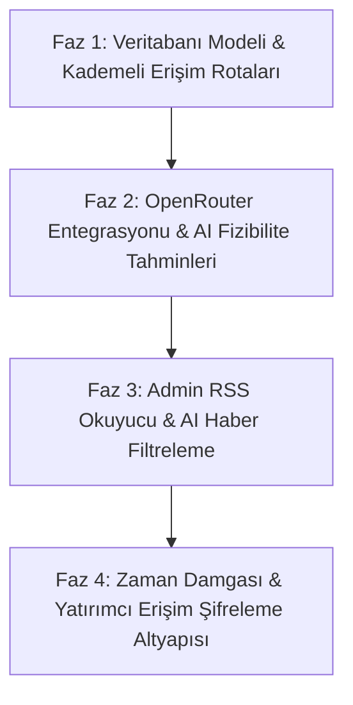

# Nuper Industries İnovasyon Fabrikası & İstihbarat Motoru Planı

Nuper Industries portalının sadece dış dünyaya hitap eden prestijli bir vitrin olmaktan öteye geçerek; kurucunun yeni girişim fikirleri bulmasını, bunları yapay zeka ile analiz etmesini, dış dünyadaki teknolojik gelişmeleri ithal etmesini ve akredite yatırımcılarla buluşturmasını sağlayan bir **"İnovasyon İstasyonu"**na dönüştürülmesi planıdır.

---

## 1. Fikri Mülkiyet (IP) Koruma ve Kademeli Açıklama Modeli

Kullanıcının sorduğu *"Web sitesinde yayınlayınca fikri mülkiyetleri bana ait olur mu?"* sorusu doğrultusunda, fikirlerin çalınmasını önleyen ve kurucunun haklarını koruyan **Kademeli Açıklama (Vectored Disclosure)** modeli uygulanacaktır:

### Hukuki Durum
- **Telif Hakkı (Copyright):** Sitede yayınladığınız kodlar, tasarımlar ve metinler yazıldığı andan itibaren otomatik olarak telif hakkı ile korunur (Fikri Sanat Eserleri Kanunu).
- **Patentler / Fikir Hakları:** Ham fikirler (örn: "yapay fotosentez duvarı") sadece fikir düzeyindeyken patentlenemez. Patentlenebilmesi için teknik bir çözüm, prototip veya detaylı bir algoritma şeması (reduction to practice) gerekir. Fikri tamamen açık bir şekilde yayınlamak, başkalarının bunu kopyalamasına yasal zemin hazırlayabilir.

### Çözümümüz: Kademeli Erişim Katmanları
Veritabanında projeler ve fikirler için 3 farklı gizlilik düzeyi tanımlanacaktır:

1.  **Özel (Private - Konsept):** 
    - Sadece Admin panelinde görünür.
    - AI fizibilite raporları, pazar analizleri, kod mimarisi ve bütçe tahminleri bu katmanda tutulur.
2.  **Kısıtlı (Semi-Public - Pitch Deck):** 
    - Sitede listelenir ancak detaylar şifrelidir. 
    - Sadece kurucunun manuel olarak yetki verdiği (arka planda yüz yüze görüştüğü) akredite yatırımcılar şifre ile girip detaylı iş planını görebilir.
3.  **Açık (Public - Tanıtım):**
    - Ziyaretçilere açık olan kısımdır. Fikrin teknik detayları veya kaynak kodları yerine; çözdüğü problem, yarattığı vizyon ve yüksek seviyeli işlevsel özellikleri sergilenir. Fikri mülkiyet koruması için kurucu, buradaki teknik detayları manuel olarak kırpar veya çok güvendiği projeler için önce gerçek hayatta patent başvurusunu yapar, ardından burada yayınlar.

---

## 2. Sistem A: Yapay Zeka Fizibilite Analizörü (OpenRouter Entegrasyonu)

Admin panelinde yeni bir proje veya fikir girildiğinde, OpenRouter üzerindeki ücretsiz ve güçlü yapay zeka modelleri (örn: Llama 3, Qwen 2.5 veya Mistral) kullanılarak otomatik bir analiz motoru çalışacaktır.

### Çalışma Akışı
1.  Admin proje özetini ve hedeflerini yazar.
2.  **"Fizibilite Analizi Yap"** butonuna basılır.
3.  Sistem OpenRouter API'sine özel tasarlanmış bir prompt gönderir.
4.  AI şu çıktıları JSON formatında üretir ve veritabanına kaydeder:
    - **Tahmini Bütçe Gereksinimi ($):** Projenin hayata geçirilmesi için gereken sunucu, API, lisans ve operasyon bütçesi.
    - **Tahmini Süre & Zaman Planı:** MVP (Minimum Uygulanabilir Ürün) ve lansman süreleri.
    - **Gereken Ekip Rolleri:** (Örn: 1 Cloud Engineer, 1 AI/Data Scientist, 1 UI Designer).
    - **Teknik Zorluk & Risk Skoru:** 1-100 arası zorluk puanı ve teknik risk analizi.
    - **Benzer Pazar Örnekleri:** Dünyadaki mevcut rakipler veya benzer modeller.

---

## 3. Sistem B: Admin Haber & RSS İthalat Akışı (Trend Intelligence)

Dış dünyadaki teknoloji trendlerini, yeni ürün lansmanlarını ve Ar-Ge gelişmelerini takip etmek amacıyla admin panelinde gizli bir **Haber İthalat Merkezi (RSS Reader)** kurulacaktır.

### Mimari Yapı
- **Veri Toplama (RSS & Scraper):** Belirlenen teknoloji portallarından (TechCrunch, Hacker News, Product Hunt, Wired vb.) gelen RSS akışları veya API verileri arka planda taranır.
- **Yapay Zeka Yorumlama ve Filtreleme:**
  - Gelen haberler AI tarafından taranır: *"Bu gelişme Türkiye pazarında veya Nuper Industries bünyesinde yeni bir projeye dönüştürülebilir mi?"* sorusuna cevap aranır.
  - AI haberleri önem sırasına göre puanlar (1-100).
- **Uygulanabilirlik Skoru (Feasibility Score):** AI, yurtdışındaki fikrin Nuper bünyesinde uygulanabilirliğini (mümkün olabilirliğini) ve pazar boşluğunu raporlar.
- **"Projeye Dönüştür" Arayüzü:** Admin, beğendiği bir teknoloji haberini tek tıklamayla kendi **Özel Fikirler (Private Ideas)** veritabanına aktararak üzerinde çalışmaya başlayabilir.

---

## 4. Uzun Vadeli Yol Haritası (İnovasyon Fabrikası Geliştirme Fazları)

