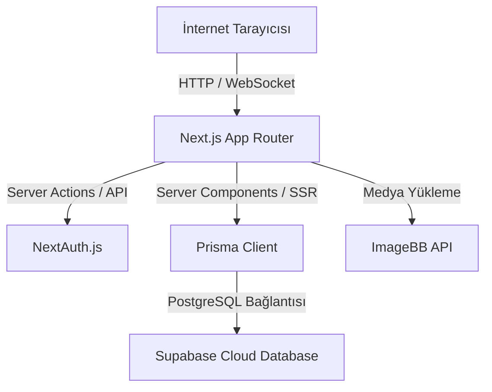

# System Patterns: Nuper Industries İnovasyon Portalı

Bu belgede uygulamanın mimarisi, kodlama kalıpları ve veri segmentasyonu kuralları açıklanmıştır.

## Mimari Yapı

Uygulama, Next.js (App Router) mimarisi üzerine kurulmuştur ve veri yönetimi için Prisma ORM aracılığıyla PostgreSQL veritabanını kullanır.



## Veri Kalıpları ve Segmentasyon

### Proje ve Fikir Ayrımı
Veritabanında ayrı bir `Idea` modeli tanımlanmamıştır. Bunun yerine Prisma'daki `Project` modeli kullanılır. Sistem bu iki kavramı `status` alanına göre ayrıştırır:

- **Fikirler (Ideas):**
  - Koşul: `status === "IDEA"`
  - Sayfa: `/ideas` üzerinden listelenir.
  - Veritabanı sorgusu: `prisma.project.findMany({ where: { status: 'IDEA' } })`

- **Projeler (Projects):**
  - Koşul: `status !== "IDEA"` (Örn: `COMPLETED`, `ONGOING`, `SUBMITTED`)
  - Sayfa: `/projects` üzerinden listelenir.
  - Veritabanı sorgusu: `prisma.project.findMany({ where: { NOT: { status: 'IDEA' } } })`

## Klasör Yapısı ve Rotalar

```
src/
├── app/
│   ├── (public)/         # Ziyaretçilere açık sayfalar (Tema: Koyu/Derin Uzay)
│   │   ├── about/        # Kurumsal ve Vizyon bilgisi
│   │   ├── projects/     # Proje vitrini
│   │   ├── ideas/        # Ar-Ge fikirleri vitrini
│   │   ├── bulletins/    # Bültenler
│   │   └── events/       # Etkinlikler
│   ├── (admin)/          # Yönetici sayfaları (Rol tabanlı kısıtlamalı)
│   │   └── admin/        # Proje/Fikir/Etkinlik ekleme ve yönetme alanı
│   └── api/              # API rotaları (Upload, Verify-Email, Cron vb.)
│       └── cron/         # Otomatik ayakta tutma (keep-alive) API uçları
├── components/           # Reusable UI bileşenleri
└── lib/                  # Veritabanı ve yardımcı fonksiyonlar (Prisma client)
```

## Kritik Tercihler
- **Otomatik Ayakta Tutma (Cron Keep-Alive):** Supabase ücretsiz veritabanının duraklatılmasını engellemek için `/api/cron/keep-alive` adında bir API ucu oluşturulmuş ve `vercel.json` üzerinde haftada iki kez otomatik tetiklenecek şekilde konfigüre edilmiştir. Bu uç `CRON_SECRET` çevresel değişkeni ile korunmaktadır.
- **Dinamik Sunucu Tarafı Render (SSR):** Veritabanı bağlantısı derleme (build) sırasında hazır olmayabileceği veya veriler anlık güncellenebileceği için projenin tamamı root layout düzeyinde `export const dynamic = 'force-dynamic'` ile zorunlu olarak SSR (Dynamic) moduna geçirilmiştir.
- **Güvenli Admin Yetkilendirmesi:** Girişler NextAuth ile yönetilir. Giriş yapmış kullanıcının `User.role === "ADMIN"` olması koşuluyla `(admin)` altındaki rotalara erişimine izin verilir.
