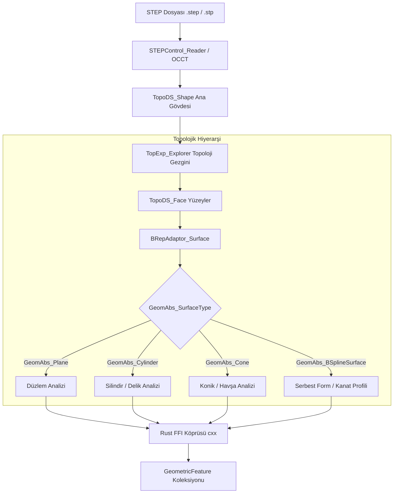

# 📐 02. Geometri Motoru ve B-Rep Ayrıştırma (CAD Engine)

> **"STEP dosyasını mikron düzeyinde analitik B-Rep topolojisine dönüştürerek; yüzey tiplerini, ters normal vektörlerini, delik eksenlerini ve et kalınlıklarını deterministik olarak çıkaran Rust + OpenCASCADE çekirdeği."**

---

## 📌 1. STEP Dosyası Ayrıştırma Mimarisi

CMM teftiş kodunun hatasız üretilebilmesi için CAD modelinin bir üçgen ağı (mesh/STL) değil, kesin matematiksel fonksiyonlardan oluşan bir **Sınır Temsili (Boundary Representation - B-Rep)** ağacı olarak okunması şarttır. STL modellerinde deliklerin silindirik ekseni ve yarıçapı kaybolur; STEP (ISO 10303-21 / AP214 ya da AP242) formatı ise tam analitik geometrik veriyi saklar.

AutoMetrol, geometri çekirdeğinde **OpenCASCADE Technology (OCCT)** kütüphanesini **Rust C++ FFI (`cxx`)** köprüsü ile entegre eder:



---

## 🔬 2. Topolojik Hiyerarşi ve Analitik Yüzey Tipleri

OpenCASCADE üzerinden model traverse edilirken her yüzey (`TopoDS_Face`) geometrik adaptörle sorgulanır:

### Analitik Yüzey Sınıflandırması:
1. **`GeomAbs_Plane` (Düzlemsel Yüzey):**
   - Düzlemsellik, diklik, paralellik ve referans (Datum) düzlemleri için ayrıştırılır.
   - Düzlemin merkez koordinatı ($X, Y, Z$) ve yüzey birim normal vektörü ($I, J, K$) çıkarılır.
2. **`GeomAbs_Cylinder` (Silindirik Yüzey):**
   - Yüzey normalinin yönüne bakılarak **İç Delik (Internal Hole)** veya **Dış Pim/Şaft (External Boss/Pin)** ayrımı yapılır.
   - Merkez eksen doğrusu ($P_0, \vec{D}$), nominal çap ($\varnothing D$), delik derinliği ($L$) hesaplanır.
3. **`GeomAbs_Cone` (Konik Yüzey):**
   - Havşa delikleri, merkezleme yuvaları veya valf oturma konikleri için yarı tepe açısı ($\alpha$) ve eksen doğrultusu tespit edilir.
4. **`GeomAbs_BSplineSurface` (Serbest Form Yüzey):**
   - Havacılık türbin kanatları veya otomotiv kalıp yüzeyleri; UV parametrik grid üzerinden normal vektör matrisi üretilir.

---

## 🦀 3. Rust Tarafındaki Geometrik Veri Yapıları

Rust çekirdeği, C++ tarafından gelen ham OCCT verilerini güvenli, bellek sızıntısız ve tip güvenli yapılara dönüştürür:

```rust
use serde::{Deserialize, Serialize};

#[derive(Debug, Clone, Copy, PartialEq, Eq, Serialize, Deserialize)]
pub enum FeatureType {
    Plane,
    InternalCylinder, // Dişi delik (Hole)
    ExternalCylinder, // Erkek pim / mil (Boss)
    Cone,             // Havşa veya konik yuva
    Sphere,           // Kalibrasyon küresi veya bilye yuvası
    Torus,            // O-ring kanalı veya radyus
    FreeformBSpline,  // Kanat profili / Serbest form
}

#[derive(Debug, Clone, Serialize, Deserialize)]
pub struct GeometricFeature {
    pub id: u32,
    pub feature_type: FeatureType,
    pub centroid: [f64; 3],          // Ağırlık merkezi [X, Y, Z] (mm)
    pub normal_vector: [f64; 3],     // Dışa bakan birim normal [I, J, K]
    pub axis_vector: Option<[f64; 3]>,// Silindir/koni için eksen doğrultusu
    pub diameter: Option<f64>,       // Delik veya mil ise çap (mm)
    pub depth_or_length: Option<f64>,// Delik derinliği veya boyu (mm)
    pub boundary_polygon: Vec<[f64; 3]>, // Yüzey sınır poligonu
    pub area: f64,                   // Yüzey alanı (mm^2)
    pub min_wall_thickness: f64,     // En yakın karşı duvara olan et kalınlığı (mm)
    pub is_datum_candidate: bool,    // Primer/Sekonder datum adayı mı?
}

#[derive(Debug, Clone, Serialize, Deserialize)]
pub struct CADModelMetadata {
    pub file_name: String,
    pub total_features: usize,
    pub bounding_box_min: [f64; 3],
    pub bounding_box_max: [f64; 3],
    pub features: Vec<GeometricFeature>,
}
```

---

## ⚙️ 4. Normal Vektörü ve Yönelim (Orientation) Yönetimi

B-Rep modellerinde yüzeylerin iç veya dış yönelimi `TopAbs_Orientation` enum'ı ile belirlenir:
- Eğer `TopoDS_Face` yönelimi `TopAbs_REVERSED` ise, matematiksel yüzey fonksiyonundan gelen normal vektörü $-1$ ile çarpılarak parçanın malzemesinden dışarıya (boşluğa doğru) yönlendirilir.
- CMM probu her zaman malzemeden dışarıya doğru bakan normal vektörün **tam tersi yönünde** yüzeye yaklaşmalıdır:

$$\vec{V}_{\text{approach}} = -\vec{N}_{\text{surface}} = [-I, -J, -K]$$

Deliklerde ise silindirin ekseni boyunca içeri girilir ve prob radyal olarak deliğin iç cidarındaki normal doğrultusunda dokunur.

---

## 🔍 5. Et Kalınlığı Analizi (Wall Thickness Query)

Havacılık braketlerinde ve ince cidarlı işleme parçalarında, probun uyguladığı ölçüm kuvveti parçayı esnetebilir. Bu yüzden geometri motoru her yüzey için karşı duvara olan mesafeyi hesaplar:
1. `BRepClass3d_SolidClassifier` ve yüzeyler arası mesafe sorguları (`BRepExtrema_DistShapeShape`) çalıştırılır.
2. Karşıt yüzeyler arasındaki minimum et kalınlığı tespit edilir:
   - **$t < 2.5\text{ mm}$:** Sistem bu yüzeyi "İnce Cidarlı (Thin Wall)" olarak işaretler.
   - İlerleyen adımlarda prob hızı düşürülür ve operatöre Düşük Kuvvetli (Low Force) prob modülü önerilir.

---

## 📦 6. Sınır Çizgileri ve Dış Zarf (Bounding Box) Çıkarımı

- Her geometrik unsurun sınır eğrileri (`TopoDS_Edge`) taranarak ayrıklaştırılır (`BRepMesh_IncrementalMesh`).
- Parçanın genel sınır kutusu ($X_{\min}, X_{\max}, Y_{\min}, Y_{\max}, Z_{\min}, Z_{\max}$) hesaplanır. Bu koordinatlar, 5. Bölüm'deki **Emniyet Zarfı (Clearance Box)** hesaplamalarının temel referansını oluşturur.
