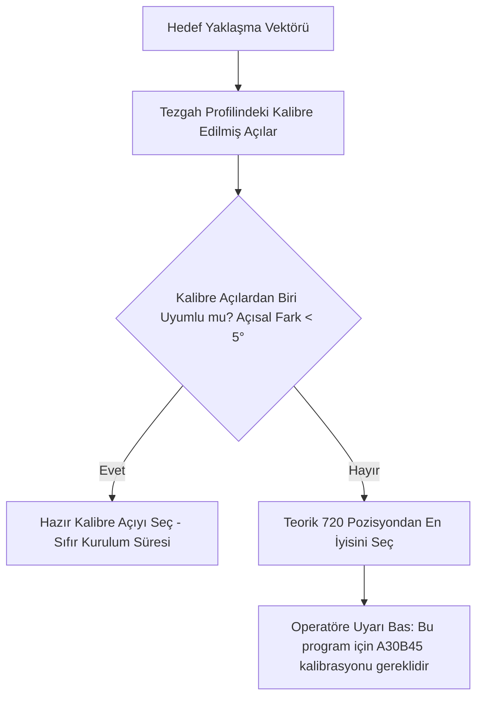

# 🔄 04. Prob Kinematiği ve Açı Optimizasyonu

> **"Motorize kafalar için 720 diskret pozisyon arasından milisaniyeler içinde en dik temas açısını seçen; manuel kafalar için operatör müdahalesini en aza indiren k-means kümelemesi yapan ve kalibre edilmiş açıları önceliklendiren kinematik çözücü."**

---

## 📌 1. CMM Kafa Kinematiğine Giriş

Koordinat Ölçüm Cihazlarında (CMM) probun parçanın farklı yüzeylerine dik yaklaşabilmesi için 2 döner eksenli kafalar (A ve B eksenleri) kullanılır. Temasın mikron hassasiyetinde olabilmesi için prob yöneliminin yüzey normaline mümkün olduğunca dik olması zorunludur.

Piyasada iki ana kafa mimarisi bulunur:
1. **Motorize Kafalar (Renishaw PH10M / PH10T / PH20):** Tezgaha yazılan komutla otonom döner.
2. **Manuel Dizinlemeli Kafalar (Renishaw MH20i):** Operatörün CMM kabinini açıp elle çevirdiği kafalar.

---

## 📐 2. Motorize Kafa (PH10M) Kinematik Projeksiyonu

Renishaw PH10 kafa mimarisi:
- **A Ekseni:** $0^\circ$ ile $105^\circ$ arasında $7.5^\circ$ adımlarla (15 farklı açı).
- **B Ekseni:** $-180^\circ$ ile $+180^\circ$ arasında $7.5^\circ$ adımlarla (48 farklı açı).
- **Toplam Diskret Açı Kombinasyonu:** $15 \times 48 = 720\text{ pozisyon}$.

```
           Z (Kafa Gövdesi)
           ▲
           │
         ( A Açısı: Düşeyden Yatış 0° - 105° )
           │
           └───► ( B Açısı: Yatay Düzlemde Dönüş -180° / +180° )
                 │
                 ▼
          [ Prob Ucu Vektörü V_probe ]
```

### Yönelim Vektörünün Matematiksel Formülü:
Prob kafasının uzaydaki birim yönelim vektörü $\vec{V}_{\text{probe}}(A, B)$ küresel koordinat dönüşümüyle hesaplanır:

$$\vec{V}_{\text{probe}}(A, B) = \begin{bmatrix} \sin(A)\sin(B) \\ -\sin(A)\cos(B) \\ -\cos(A) \end{bmatrix}$$

Hedef yüzeyin dışa bakan birim normali $\vec{N} = [I, J, K]$ olduğunda, probun yaklaşma yönü hedef vektörümüz olur:

$$\vec{V}_{\text{target}} = -\vec{N} = [-I, -J, -K]$$

### Açı Seçim Optimizasyonu:
Kinematik çözücü, 720 diskret kafa konfigürasyonu arasından skaler çarpımı (dot product) maksimum, yani açısal sapması minimum olan kombinasyonu seçer:

$$\theta(A, B) = \arccos\left( \vec{V}_{\text{target}} \cdot \vec{V}_{\text{probe}}(A, B) \right) \to \min$$

- Skaler çarpım $\vec{V}_{\text{target}} \cdot \vec{V}_{\text{probe}} \ge 0.998$ ($\theta \le 3.6^\circ$) olduğunda mükemmel dik yaklaşma sağlanır.

---

## 👥 3. Manuel Kafa (Renishaw MH20i) İçin Kümeleme (Clustering)

Manuel kafalarda her açı değişiminde CMM otonom çalışmayı durdurur, operatör kapıyı açar, pimi çözer, kafayı çevirir ve kilitler. Bu işlem parça başına 10-15 kez tekrarlanırsa 30 dakika vakit kaybedilir.

AutoMetrol, **K-Means / Vektörel Kümeleme** algoritmasıyla açı değişim sayısını en aza indirir:
1. Parçadaki 40-50 farklı ölçüm unsurunun yaklaşma vektörleri taranır.
2. Normaller uzayda kümelenir. Örneğin:
   - Deliklerin ve düzlemlerin %65'i üstten: $\text{Küme 1} \to (A0^\circ, B0^\circ)$
   - Kalan %35'i yan yüzeylerden: $\text{Küme 2} \to (A90^\circ, B0^\circ)$
3. Sistem tüm ölçüm planını sadece bu 2 kafa pozisyonunda bitirecek şekilde gruplar.
4. **Yıldız Prob (Star Probe) Önerisi:** Eğer parçada tek bir eğimli yüzey ($5^\circ - 15^\circ$) yüzünden 3. bir manuel açı gerekiyorsa, sistem kafa açısı değiştirmek yerine operatöre arayüzde bildirim basar:
   > *"Yüzey #12 için manuel kafa açısı eklemek yerine 5 yollu yıldız prob (Star Stylus) ucu kullanılması önerilir."*

---

## 🎯 4. Kalibre Edilmiş Açı Önceliği (Qualified Angles Verification)

Saha Gerçeği: CMM kontrol ünitesinde (PC-DMIS vb.) bir prob açısının otonom çalışabilmesi için o açının daha önce **Referans Kalibrasyon Küresinde (Qualification Sphere)** kalibre edilmiş olması şarttır. Aksi takdirde tezgah durur ve *"Probe angle not calibrated"* hatası verir.

AutoMetrol çözücüsünün karar hiyerarşisi:


Bu mekanizma, operatörün her yeni parçada kalibrasyon küresiyle 20 dakika vakit kaybetmesini önler; tezgahta halihazırda geçerli olan açılara öncelik verir.

---

## 🛡️ 5. Kafa Rotasyon Hacmi ve Güvenli Park Koordinatı

Prob kafası A ve B eksenlerinde dönerken yalnızca kendi ekseni etrafında dönmez; prob uzatması (50 - 200 mm) ile birlikte havada **$150\text{ mm} - 300\text{ mm}$ yarıçapında küresel bir hacim** tarar.

### Kritik Güvenlik Kuralı:
- Kafa dönüşleri asla parçanın hemen üzerinde veya dar ceplerde tetiklenemez.
- Rota planlayıcı, kafa açısını değiştirmeden önce probu mutlaka parçanın en üst sınırının $+50\text{ mm}$ üzerindeki **Güvenli Rotasyon Koordinatına (Clearance Origin)** çıkarır:

$$Z_{\text{rotate}} \ge Z_{\max} + \text{Clearance Offset } (+50\text{ mm})$$

Kafa dönüşü boş uzayda tamamlandıktan sonra yeni hedef yüzeye dikey dalış başlatılır.
