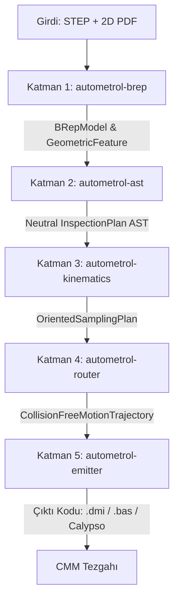

# 🏗️ AutoMetrol Kodlama Planlaması: Derleyici Mimarisi (Compiler Architecture)

> **"AutoMetrol bir basit script veya görsel araç değil; ham CAD ve teknik resim girdisini ara temsile (IR / AST) çeviren, üzerinde kinematik ve emniyet optimizasyonları yapan ve hedef tezgahın assembly'sine (DMIS/PC-DMIS) derleyen endüstriyel bir derleyicidir."**

---

## 📌 1. Derleyici Perspektifi (Compiler Analogy)

Geleneksel bir yazılım derleyicisi (örneğin `rustc` veya `clang`) ile AutoMetrol'ün çalışma prensibi birebir örtüşür:

```
GELENEKSEL DERLEYİCİ:
[ Kaynak Kod (.rs / .cpp) ] ──► [ Lexer / AST ] ──► [ LLVM IR & Optimizasyon ] ──► [ Makine Kodu / Assembly ]

AUTOMETROL DERLEYİCİSİ:
[ STEP (CAD) + 2D PDF ]    ──► [ B-Rep Parser ] ──► [ Metroloji Nötr AST (IR) ] ──► [ DMIS / PC-DMIS Kodu ]
                                                            │
                                         ┌──────────────────┴──────────────────┐
                                         ▼                                     ▼
                              [ Kinematik & Örnekleme ]            [ Emniyet & Çarpışma Rotası ]
```

---

## 🧭 2. 5 Temel Kodlama Katmanı ve Veri Sözleşmeleri (Data Contracts)

Her katman bir sonrakine kesin olarak tanımlanmış, tip güvenli (type-safe) bir Rust veri yapısı aktarır:



### Katmanlar ve Sorumluluk Matrisi:
1. **Katman 1 (`autometrol-brep`):** STEP dosyasını ayrıştırır, analitik yüzey tiplerini (`Plane`, `Cylinder`, `Cone`) ve yüzey normal vektörlerini ($I, J, K$) çıkarır.
2. **Katman 2 (`autometrol-ast`):** Donanımdan ve CMM markalarından bağımsız, saf **Nötr Metroloji Ara Temsili (Inspection AST / IR)** kurar. Toleransları ve 3-2-1 Datum hiyerarşisini standardize eder.
3. **Katman 3 (`autometrol-kinematics`):** AST üzerindeki geometrik hedefleri; prob kafasının $A/B$ diskret açılarına (PH10 için 720 açı, MH20i için k-means kümeleri) ve standartlara uygun ayrık temas noktalarına (Gauss/Chebyshev) dönüştürür.
4. **Katman 4 (`autometrol-router`):** $+50\text{ mm}$ emniyet kutusu (Clearance Box), pabuç/fikstür yasaklı alanları (Keep-Out Zones) ve prob şaftı sürtünme kontrolleriyle çarpışmasız hareket graflarını oluşturur.
5. **Katman 5 (`autometrol-emitter`):** Eldeki nihai hareket ve ölçüm grafını hedef tezgahın lehçesine (PC-DMIS, ANSI DMIS 5.3, Zeiss) derleyen şablon motorudur.

---

## 📂 3. Planlama Modülleri Dizini

Bu klasördeki planlama notları, kod tabanının (Rust Crate Workspace) mimarisini adım adım belirler:

| Belge | Kapsam | İlgili Rust Modülü |
|---|---|---|
| [[01_Katman_1_Ingestion_ve_BRep_Plani\|01. Katman 1: Ingestion & B-Rep]] | STEP okuma, OpenCASCADE FFI, analitik yüzey tespiti. | `autometrol-brep` |
| [[02_Katman_2_Metrology_AST_Ara_Temsil_Plani\|02. Katman 2: Metrology AST]] | Nötr ara temsil (IR), Datum zinciri, tolerans düğümleri. | `autometrol-ast` |
| [[03_Katman_3_Kinematics_ve_Sampling_Plani\|03. Katman 3: Kinematics & Sampling]] | PH10 $A/B$ çözücü, MH20i kümeleme, Gauss/Chebyshev nokta üretici. | `autometrol-kinematics` |
| [[04_Katman_4_Collision_ve_Routing_Plani\|04. Katman 4: Collision & Routing]] | Clearance Box, pabuç kaçınma, şaft/gövde çarpışma kontrolü. | `autometrol-router` |
| [[05_Katman_5_Post_Processor_Emitter_Plani\|05. Katman 5: Post-Processor Emitter]] | Tera/Jinja şablonları, DMIS 5.3, PC-DMIS, `MODE/MAN` enjeksiyonu. | `autometrol-emitter` |
| [[06_Gelistirme_Ortami_ve_Crate_Mimarisi\|06. Geliştirme Ortamı ve Crate Mimarisi]] | Cargo workspace hiyerarşisi, bağımlılıklar, PTB test koşucusu. | `Cargo.toml (Workspace)` |

---

## 🎯 4. Temel Tasarım İlkesi: "Decoupled Pipelines" (Ayrık Hatlar)

Bu derleyici mimarisinin en büyük avantajı **tam izolasyondur**:
- OpenCASCADE kütüphanesi güncellendiğinde veya başka bir CAD çekirdeğine geçildiğinde prob kinematiği bundan **etkilenmez**.
- Portföye yeni bir CMM markası (örneğin Wenzel veya Mitutoyo) eklendiğinde sistemin geometri veya emniyet motoruna dokunulmaz; **sadece Katman 5'e yeni bir metin şablonu (Emitter Template)** eklenir.
