# 🔄 06. Uçtan Uca Veri Akış Şeması

Nuper Citadel, bir savunma mühendisinin iş akışını 7 net aşamada otomatikleştirir:

```mermaid
sequenceDiagram
    autonumber
    actor Engineer as Mühendis
    participant UI as Tauri Desktop UI
    participant Core as FastAPI Backend
    participant OCC as pythonocc (OpenCASCADE)
    participant Rule as Rule Engine (SQLite)
    participant LLM as Local LLM (Ollama)
    participant DB as Telemetry DB (DPO)

    Engineer->>UI: STEP Sürükle-Bırak + Platform Seçimi
    UI->>Core: POST /api/cad/parse (File + Malzeme)
    Core->>OCC: Topolojik Analiz Yap
    OCC-->>Core: Kütle (0.385kg), CoG, Delikler, BBox JSON
    Core->>Rule: Standart Kurallarını Çek (MIL-STD-810H Cat 14)
    Rule-->>Core: Breakpoint'ler (20-2000Hz), 7.7 Grms, Eksen/Süre
    Core-->>UI: 3D Sahne + PSD Önizleme + Simülasyon Yönergesi
    
    Engineer->>UI: "Simülasyon Paketini İndir"
    UI->>Core: GET /api/fea/export-psd (Simcenter NX / ANSYS CSV)
    Core-->>Engineer: "mil810h_vibration_profile.csv" İndirildi
    
    rect rgb(20, 30, 45)
        Note over Engineer: Mühendis FEA Çözümünü Yapar (ANSYS/NX)<br/>1. Mod: 340 Hz, 3-Sigma: 142 MPa
    end

    Engineer->>UI: FEA Sonuçlarını Gir (Modal Frekans & Gerilme)
    UI->>Core: POST /api/analysis/verify
    Core->>Core: Rezonans Marjı & Güvenlik Katsayısı (SF=1.93)
    Core->>LLM: JSON Context ile ETP Dokümanını Yazdır
    LLM-->>Core: Resmi ETP Markdown Taslağı
    Core-->>UI: Canlı Doküman Editöründe Göster
    
    Engineer->>UI: Paragraf Düzenleme & Onay
    UI->>DB: DPO Kaydı: prompt, rejected, chosen
    UI-->>Engineer: Resmi ETP (PDF/A4) + Kabul Paketi
```



---

## 2. Uçtan Uca Veri Akış Şeması (Data Flow Pipeline)

```
(1) STEP Yükleme
    Mühendis "payload_bracket.step" dosyasını sürükler.
         │
         ▼
(2) Geometri Analizi (pythonocc)
    Kütle: 0.385 kg | Montaj: 4x M4 | CoG: [60, 42.5, 22.5] mm
         │
         ▼
(3) Standart Eşleme (rule_engine)
    Girdi: Taktik İHA Kanat Altı ──► Çıktı: MIL-STD-810H Metot 514.8 Cat 14
    Frekans: 20-2000 Hz, 7.7 gRMS, Eksen: X/Y/Z, Süre: 1 sa/eksen
         │
         ├───► [Dışa Aktar]: "mil810h_vibration_profile.csv" (Simcenter NX / ANSYS)
         │
         ▼
(4) Dokümantasyon Sentezi (Yerel LLM)
    JSON verileri -> Askeri Şartname Rapor Şablonu
    - Fikstür rijitlik isterleri
    - Kritik rezonans arama yönergesi
    - Test öncesi/sonrası boyutsal ve görsel kabul kriterleri
         │
         ▼
(5) Analiz Mühendisi Doğrulaması (İki Yönlü Geri Besleme)
    Mühendis Simcenter NX'te analizi çözer:
    "1. Doğal Frekans: 340 Hz | 3-Sigma RMS Gerilme: 142 MPa"
         │
         ▼
(6) Nihai Kalifikasyon Onayı
    Nuper Citadel: "Akma dayanımı (275 MPa) altında, emniyet katsayısı: 1.93. Rezonans riski yok."
         │
         ▼
(7) Çıktı Paketi
    Resmi Test Planı (PDF) + Kabul Raporu + Arıza Modu Kontrol Listesi
```

---

## 3. Aşama Aşama Veri Dönüşümü Detayları

### 1. Giriş Verisi (Input Ingestion)
- **Kullanıcı Girdisi:** `payload_bracket.step`
- **Görev Tanımı:** Taktik İHA Kanat Altı Pod Aksamı
- **Malzeme:** Alüminyum 6061-T6 ($\rho = 2700\text{ kg/m}^3, \sigma_y = 275\text{ MPa}$)

### 2. Geometrik Analiz (OpenCASCADE)
- Geometri topolojik olarak taranır; hacim integralinden kütle ($0.3848\text{ kg}$) ve devrilme yüksekliği ($h_{cg} = 22.5\text{ mm}$) çıkarılır. 4 adet M4 montaj deliğinin merkezleri doğrulanır.

### 3. Standart Eşleme (Deterministik Kural Motoru)
- Platform `MIL-STD-810H Metot 514.8 Kategori 14 (External Stores)` ile eşleştirilir.
- Kırılma frekansları: 20 Hz, 150 Hz, 1000 Hz, 2000 Hz.
- Logaritmik integral ile $g_{\text{rms}} = 7.70\text{ g}$ doğrulanır. Eksen başına test süresi: 60 dakika.

### 4. Simülasyon Ön-İşlemcisi ve PSD Dışa Aktarma
- 20 Hz - 2000 Hz arasında log-log enterpole edilmiş 120 satırlı `.csv` dosyası oluşturulur.
- Montaj deliklerine Fixed kısıtı verilmesi ve en az %85 efektif kütle katılımı için $0-2500\text{ Hz}$ aralığında modal çözüm önerilir.

### 5. Analiz Mühendisi Doğrulaması (Çift Yönlü Döngü)
- Mühendis ANSYS veya NX'te analizi çözer:
  - Birinci doğal frekans: $f_1 = 340\text{ Hz}$
  - Maksimum 3-Sigma von Mises gerilmesi: $\sigma_{3\sigma} = 142\text{ MPa}$
- Sistem kontrol eder:
  - $f_1 > 200\text{ Hz} \rightarrow$ İHA kanat altı titreşim pik bölgesinin ($20-150\text{ Hz}$) dışında, rezonans riski minimum.
  - Güvenlik Marjı: $MS = (275 / (142 \times 1.25)) - 1 = +0.55 > 0 \rightarrow$ Güvenli.

### 6. Dokümantasyon Sentezi (Yerel LLM)
- Doğrulanmış veriler Qwen 2.5 Coder 14B modeline gönderilir.
- Model akredite test merkezine (TÜBİTAK SAGE / TRTEST) sunulacak A4 formatında Çevresel Test Planı (ETP) metnini oluşturur.

### 7. Adaptif Öğrenme ve Çıktı Paketi
- Mühendis arayüzde bir maddeyi güncellerse bu revizyon yerel `telemetry.db` içine işlenir.
- Sistem son çıktı olarak:
  1. `mil810h_vibration_profile.csv` (FEA için)
  2. `payload_bracket_ETP.pdf` (Resmi Test Planı)
  3. `qualification_summary.json` (Denetim izi / Audit trail) üretir.

---
Bağlantılı Notlar:
- [[04_FEA_Bridge_PreProcessor|04. FEA Ön-İşlemci Jeneratörü]]
- [[05_Local_LLM_DPO_Pipeline|05. Yerel LLM ve Adaptif Öğrenme]]
- [[00_Nuper_Citadel_MOC|Master MOC]]
