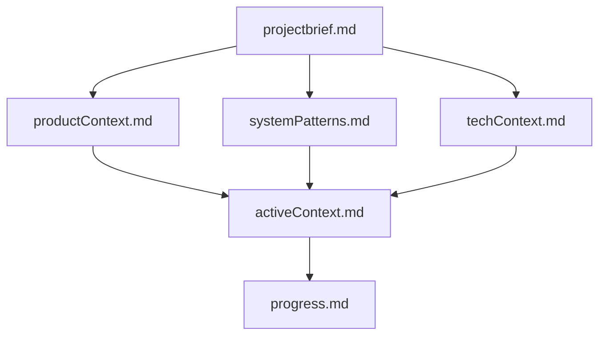
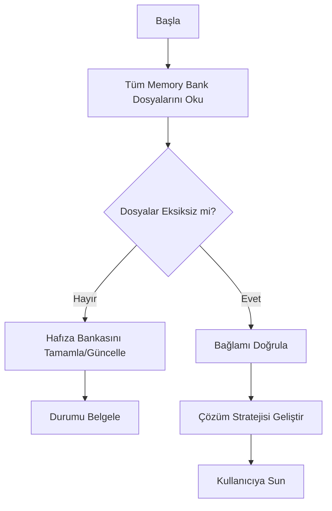
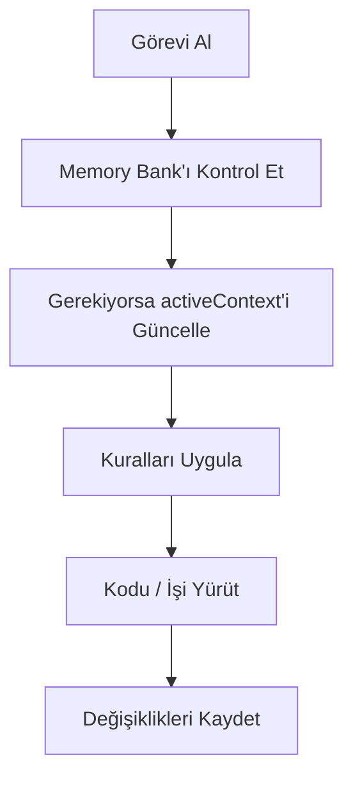
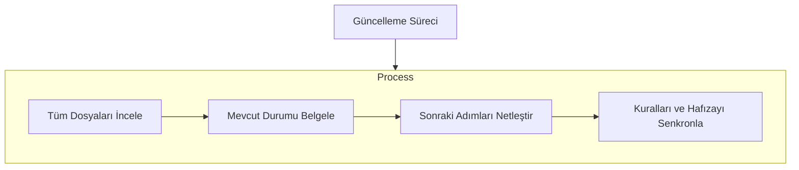

# Memory Bank Mimarisi ve Yönetim Protokolü

Bu doküman, **Nuper Citadel** projesinin hafıza durumunu (state) oturumlar, mühendisler ve yapay zekâ asistanları arasında kesintisiz aktarmak için kullanılan **Memory Bank (Hafıza Bankası)** sisteminin çalışma kılavuzudur.

---

## 1. Mimari Hiyerarşi

Memory Bank, zorunlu 6 çekirdek dosya ve isteğe bağlı bağlam dokümanlarından oluşur:

### Çekirdek Dosyalar (Core Files)

1. **`projectbrief.md`**
   - Tüm diğer dosyaları şekillendiren temel doküman.
   - Çekirdek gereksinimleri, vizyonu ve hedefleri tanımlar.
   - Proje kapsamının mutlak referans kaynağıdır.

2. **`productContext.md`**
   - Bu projenin neden var olduğunu açıklar.
   - Çözülen sektörel problemleri ve engelleri listeler.
   - Sistemin nasıl çalışması gerektiğini ve kullanıcı deneyimi (UX) hedeflerini belirtir.

3. **`activeContext.md`**
   - Anlık odaklanılan çalışma konusu.
   - En son yapılan değişiklikler.
   - Sıradaki adımlar ve aktif mimari kararlar / değerlendirmeler.

4. **`systemPatterns.md`**
   - Sistem mimarisi ve çekirdek tasarım kalıpları.
   - Temel teknik kararlar ve bileşen ilişkileri.
   - Deterministik mühendislik ile yerel yapay zekâ sınırları.

5. **`techContext.md`**
   - Kullanılan teknolojiler, kütüphaneler ve sürümler.
   - Geliştirme ortamı ve donanım gereksinimleri.
   - Dışa aktarma formatları (Simcenter NX, ANSYS, Abaqus).

6. **`progress.md`**
   - Neler tamamlandı / ne çalışıyor?
   - İnşa edilecek kalan özellikler.
   - Mevcut aşama ve bilinen riskler/azaltma planları.

---

## 2. Çalışma Modları (Workflows)

### A. Plan Modu (Plan Mode)

### B. Eylem Modu (Act Mode)

---

## 3. Güncelleme Protokolü ("Update Memory Bank")

Memory Bank şu durumlarda güncellenir:
1. Yeni bir mimari kalıp veya karar keşfedildiğinde.
2. Anlamlı bir kod veya yapı değişikliği tamamlandığında.
3. Kullanıcı **"update memory bank"** veya **"hafıza bankasını güncelle"** dediğinde:
   - İstisnasız TÜM dosyalar (`projectbrief`, `productContext`, `activeContext`, `systemPatterns`, `techContext`, `progress`) gözden geçirilir.
   - Özellikle **`activeContext.md`** ve **`progress.md`** anlık durumu yansıtacak şekilde senkronize edilir.

