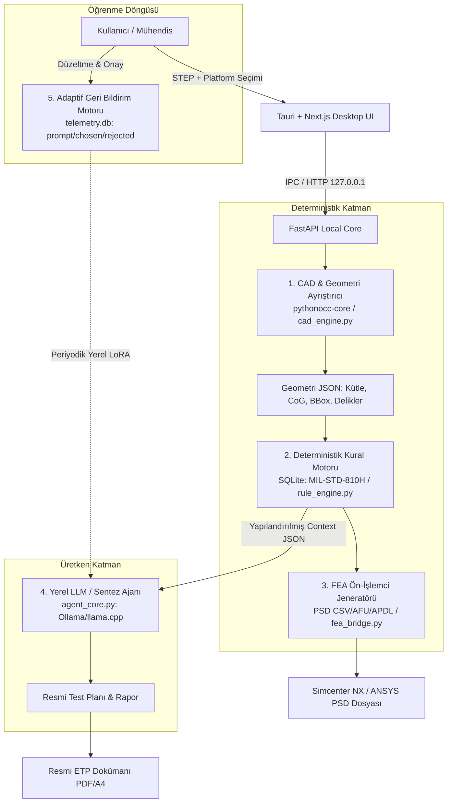
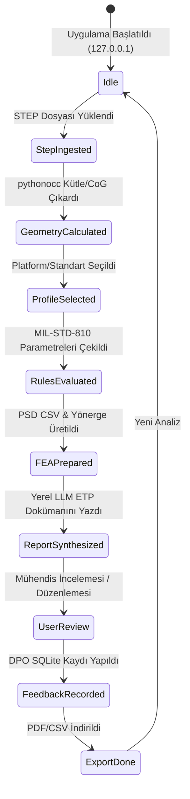

# System Patterns: Nuper Citadel

## 1. Mimari Felsefe: "Deterministik Çekirdek + Ayrık Üretken Ajan"
Nuper Citadel, savunma mühendisliğinin sıfır tolerans gereksinimini karşılamak için **iki katmanlı bir ayrım (Strict Separation of Concerns)** uygular:
1. **Deterministik Mühendislik Katmanı:** Geometri hesapları (kütle, atalet, CoG), standart eşleme kuralları, kırılma frekansları ve PSD tabloları **asla yapay zekâya bırakılmaz**. C++ tabanlı OpenCASCADE (`pythonocc-core`) ve ilişkisel veri tabanı (`SQLite`) ile matematiksel olarak çözülür.
2. **Üretken Yerel Zekâ Katmanı:** LLM (Qwen 2.5 Coder / Llama 3.3), deterministik katmanın ürettiği yapılandırılmış JSON verisini girdi alarak yalnızca metin sentezi, askeri ETP şablonu oluşturma ve arıza modu açıklamalarını derleme görevini üstlenir.

```
┌────────────────────────────────────────────────────────────────────────────────────────┐
│                                 KULLANICI ARAYÜZÜ                                      │
│                (Tauri / Next.js Desktop Shell - 127.0.0.1:Port)                        │
│   - STEP/STP Drag & Drop           - Standart & Görev Profili Seçimi                   │
│   - 3D Geometri Önizleme           - FEA Geri Besleme & Düzenleme Arayüzü              │
└───────────────────────────────────────────┬────────────────────────────────────────────┘
                                            │ IPC / Yerel HTTP REST
                                            ▼
┌────────────────────────────────────────────────────────────────────────────────────────┐
│                               FASTAPI YEREL ÇEKİRDEK                                  │
│                                                                                        │
│  ┌───────────────────────┐   ┌────────────────────────┐   ┌─────────────────────────┐  │
│  │ 1. CAD & GEOMETRİ     │   │ 2. DETERMINİSTİK KURAL │   │ 3. FEA ÖN-İŞLEMCİ       │  │
│  │    AYRIŞTIRICI        │   │    MOTORU (STANDART DB)│   │    JENERATÖRÜ           │  │
│  │  - pythonocc-core     │──►│  - SQLite Standart Matrisi│──►│  - PSD CSV/AFU Dışa     │  │
│  │  - OpenCASCADE        │   │  - MIL-STD-810H Metot 514 │   │    Aktarma              │  │
│  │  - Kütle, BBox, CoG,  │   │  - Sıcaklık Metot 501/502  │   │  - NX/ANSYS Yük         │  │
│  │    Delik Taraması     │   │  - Analitik Karar Ağacı│   │    Yönergesi            │  │
│  └───────────────────────┘   └───────────┬────────────┘   └─────────────────────────┘  │
│                                          │                                             │
│                                          ▼ Context Enjeksiyonu                         │
│  ┌──────────────────────────────────────────────────────────────────────────────────┐  │
│  │ 4. YEREL AJAN & SENTEZ KATMANI                                                   │  │
│  │  - LLM Runtime: Ollama / llama.cpp (Qwen 2.5 Coder 14B / Llama 3.3 8B Quantized) │  │
│  │  - Görev: Yapılandırılmış JSON verisini resmi ETP/Analiz Doğrulama Raporuna dökme │  │
│  └───────────────────────────────────────┬──────────────────────────────────────────┘  │
│                                          │                                             │
│                                          ▼ Doğrulama / Diff                            │
│  ┌──────────────────────────────────────────────────────────────────────────────────┐  │
│  │ 5. ADAPTİF GERİ BİLDİRİM & ÖĞRENME MOTORU (Local LoRA Pipeline)                  │  │
│  │  - Mühendisin onay/düzeltme logları (SQLite: prompt, chosen, rejected)          │  │
│  │  - Periyodik yerel LoRA/DPO veri seti derleyici                                 │  │
│  └──────────────────────────────────────────────────────────────────────────────────┘  │
└───────────────────────────────────────────┬────────────────────────────────────────────┘
                                            │ Çıktı Üretimi
                                            ▼
┌────────────────────────────────────────────────────────────────────────────────────────┐
│                                     ÇIKTI MODÜLÜ                                       │
│   - Simcenter NX / ANSYS Uyumlu PSD Spektrum Tablosu (.csv / .txt)                     │
│   - Resmi Çevresel Test Planı (ETP - PDF / A4 Şablon)                                  │
│   - FEA Sonrası Standart Uygunluk & Risk Raporu                                       │
└────────────────────────────────────────────────────────────────────────────────────────┘
```



---

## 2. Bileşen İlişkileri ve Modül Mimarisi

### Modül 1: STEP/CAD Ayrıştırıcı (`cad_parser.py`)
- **Görev:** Katı model geometrisini topolojik ve fiziksel olarak ayrıştırma.
- **Teknoloji:** `pythonocc-core` (`BRepGProp`, `Bnd_Box`, `TopExp_Explorer`).
- **Türetilen Değerler:**
  - Net Hacim ($V$, $\text{mm}^3$)
  - Malzeme yoğunluğuna göre Kütle ($m$, $\text{kg}$)
  - Bounding Box ($L \times W \times H$, $\text{mm}$)
  - Kütle Merkezi ($CoG: x, y, z$, $\text{mm}$)
  - Montaj Delikleri (Adet, çap, yayılım açıklığı, montaj tabanı - $h_{cg}$ devrilme kolu)

### Modül 2: Deterministik Kural Motoru (`rule_engine.py`)
- **Görev:** Seçilen askeri platforma karşılık gelen standart sınır şartlarını deterministik tablolardan çekmek.
- **Teknoloji:** SQLite ilişkisel şema + kural doğrulama zinciri.
- **Standart Kapsamı:**
  - MIL-STD-810H Metot 514.8 Titreşim (Cat 4, Cat 14, Cat 20 vb.)
  - MIL-STD-810H Metot 501.7 / 502.7 Sıcaklık (A1, C1 profilleri)
  - MIL-STD-810H Metot 516.8 Şok (Fonksiyonel / Çarpışma Şoku)

### Modül 3: FEA Ön-İşlemci Jeneratörü (`fea_exporter.py`)
- **Görev:** Standart kırılma noktalarını (break points) sonlu elemanlar yazılımlarının doğrudan içe aktarabileceği formatlara çevirmek.
- **Formatlar:**
  - Simcenter NX: Response Simulation `.csv` ve `.afu`
  - ANSYS: Random Vibration APDL / PSD `.csv`
  - Nastran: `TABDMP1` / `RANDPS` / `TABLED1` kartları
- **Yönerge Üretimi:** Montaj deliklerine uygulanacak serbestlik derecesi (DOF) sınırları, minimum %85 efektif modal kütle katılımı için frekans çözünürlük önerisi.

### Modül 4: Yerel LLM ve Doğrulama Katmanı (`local_client.py` & `prompts.py`)
- **Görev:** Salt mühendislik JSON girdisi ile resmi kabul dokümantasyonunu üretmek.
- **Çalışma Prensibi:** Sıfır serbest sohbet; strict JSON in -> strict Markdown/PDF out.
- **Kullanılan Modeller:** Qwen 2.5 Coder 14B Q4_K_M veya Llama 3.3 8B Quantized.

### Modül 5: Adaptif Geri Bildirim ve Yerel Öğrenme (`feedback_engine.py`)
- **Görev:** Mühendisin arayüz üzerinde yaptığı düzeltmeleri DPO (Direct Preference Optimization) formatında saklamak.
- **Şema:**
  - `prompt`: Standart ve geometri bağlamı.
  - `rejected`: Modelin ilk önerdiği taslak metin.
  - `chosen`: Mühendisin onaylayıp kaydettiği nihai revizyon.

---

## 3. Veri Akış Durum Makinesi (State Machine)



---

## 4. Kalifikasyon Kalkanı Katmanları (Citadel Shield)

Nuper Citadel, pasif bir hesap makinesi olmaktan çıkıp kalifikasyon sürecini koruyan 5 ileri katmana sahiptir:
1. **Fikstür Tasarım İsterleri & Rezonans Zarfı (`fixture_engine.py`):** Shaker $50\times 50\text{ mm}$ gridi ile delik desenini eşler, fikstür rezonansını $>2400\text{ Hz}$'e taşıyacak $t_{\text{min}}$ kalınlığını ve Alumec 89/7075-T6 malzeme zarfını çıkarır.
2. **İmalat Toleransı & CMM Doğrulama (`gdt_bridge.py`):** CMM ölçüm sapmalarını (ör. $-0.15\text{ mm}$) FEA rijitlik matrisine işleyip %14 yorulma ömrü düşüşü uyarısı verir.
3. **Çoklu Çevresel Koşullar (Termo-Mekanik):** $-40^\circ\text{C}$ ve $+85^\circ\text{C}$ sıcaklıkta Al/Çelik $\Delta \alpha$ genleşme farkının cıvata ön yükü ve gevşeme üzerindeki dinamik etkisini modeller.
4. **Palmgren-Miner S-N Yorulma Motoru (`fatigue_engine.py`):** Gauss $1\sigma, 2\sigma, 3\sigma$ döngülerini Wöhler eğrisiyle eşleyerek kümülatif hasar ($D < 0.20$) ve güvenli uçuş saati ömrü hesaplar.
5. **Askeri İhale ve Savunma İtiraz Motoru (`objection_agent.py`):** Shaker ivmeölçer piklerinde ($\pm 3\text{ dB}$) MIL-STD-810H Bölüm 4.2.2 tolerans dayanağıyla otonom itiraz dilekçesi yazar ve TDP şartname denetimi yapar.
