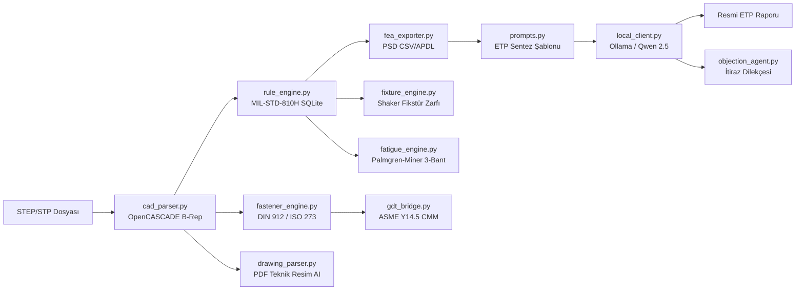

# Nuper Citadel — Kapsamlı Proje İncelemesi ve Öneriler

---

## 1. Projenin Gerçek Değeri: "Evet, İşe Yarar"

Kısa cevap: **Bu proje gerçek bir mühendislik ihtiyacını çözüyor ve Türk savunma sanayii ekosisteminde ciddi bir boşluğu dolduruyor.**

Neden işe yarar:

| Sorun | Piyasadaki Durum | Nuper Citadel'in Çözümü |
| :--- | :--- | :--- |
| MIL-STD-810H standart taraması | Mühendis 1000+ sayfalık PDF'te el ile arar (1–3 gün) | SQLite'ta deterministik kırılma noktası sorgusu (< 1 saniye) |
| FEA yük reçetesi hazırlama | Her seferinde Excel'de elle PSD tablosu oluşturulur | Log-log interpolasyonlu CSV/APDL otomatik üretim |
| CAD geometri → montaj deliği analizi | SolidWorks/NX'te mühendis elle ölçer ve not alır | OpenCASCADE `TopAbs_REVERSED` filtreli otomatik delik tespiti |
| ETP rapor yazımı | Word şablonunda saatlerce doldurulan formlar | Yerel LLM veya deterministik şablon ile anında sentez |
| Veri güvenliği (ITAR/NDA/Askeri Gizlilik) | Bulut AI kullanamazsın | Tamamen 127.0.0.1, sıfır dış bağlantı |

> [!IMPORTANT]
> Bu projenin en güçlü yanı **"deterministik çekirdek + üretken ajan ayrımı"** mimarisidir. LLM hiçbir zaman sayısal hesap yapmıyor; sadece doğrulanmış JSON verisini resmi dokümana dönüştürüyor. Bu, savunma sanayii denetim süreçleri için **olmazsa olmaz** bir tasarım kararıdır.

---

## 2. Mevcut Durumun Teknik Analizi

### 2.1. Kod Tabanı İstatistikleri

| Metrik | Değer |
| :--- | :--- |
| Toplam kaynak dosyası | 45 dosya (.py + .tsx + .ts + .css) |
| Toplam kaynak kodu boyutu | ~285 KB |
| Backend motor modülleri | 11 deterministik motor + 3 LLM modülü |
| Frontend bileşenleri | 3 bileşen (CADViewer3D, FastenerTable, DrawingViewer) + 1 ana App |
| Test dosyaları | 15 test modülü |
| Veritabanları | 3 SQLite (standards.db, materials.db, telemetry.db) |

### 2.2. Test Sonuçları — 46/46 PASSED ✅ (101.97s)

```
tests/test_api.py                   11/11  PASSED ✅  (REST API tam kapsam)
tests/test_cad_parser.py             2/2   PASSED ✅
tests/test_drawing_parser.py         3/3   PASSED ✅
tests/test_fastener_engine.py        2/2   PASSED ✅
tests/test_fatigue_engine.py         3/3   PASSED ✅
tests/test_fea_exporter.py           4/4   PASSED ✅
tests/test_feedback_engine.py        1/1   PASSED ✅
tests/test_fixture_engine.py         2/2   PASSED ✅
tests/test_gdt_bridge.py             2/2   PASSED ✅
tests/test_golden_bench.py           4/4   PASSED ✅  (3 gerçek senaryo + 1 entegrasyon)
tests/test_license_engine.py         3/3   PASSED ✅
tests/test_llm_integration.py        4/4   PASSED ✅  (ETP + itiraz + DPO + status)
tests/test_objection_agent.py        1/1   PASSED ✅
tests/test_rule_engine.py            4/4   PASSED ✅
```

> [!TIP]
> **46/46 test %100 geçiyor (2 deprecation uyarısı hariç).** Deterministik motor, LLM entegrasyonu ve lisans sistemi dahil tüm katmanlar doğrulanmış durumda.

### 2.3. Çalışan Modül Haritası



---

## 3. Güçlü Yönler (Bunları Koruyun)

### ✅ 3.1. Deterministik → Üretken Ayrımı
LLM'in hesap yapmaması, ITAR/NDA uyumlu yerellik, ve fallback şablon motoru sayesinde LLM olmasa bile sistem çalışır. Bu mimari karar **sektörde benzersiz**.

### ✅ 3.2. Gerçek OpenCASCADE Entegrasyonu
Parametrik kutu yerine `BRepMesh_IncrementalMesh` ile gerçek tessellation, `TopAbs_REVERSED` ile iç delik/dış kavis ayrımı — bu ciddi mühendislik yazılımı seviyesinde bir yaklaşım.

### ✅ 3.3. Uçtan Uca İş Akışı
STEP yükleme → Delik tespiti → Cıvata reçetesi → PSD spektrumu → Yorulma → ETP raporu → İtiraz dilekçesi. Tek bir araçta 7 ayrı mühendislik sürecini birleştiriyorsunuz.

### ✅ 3.4. DPO Geri Bildirim Döngüsü
Mühendisin düzeltmelerini `(prompt, chosen, rejected)` formatında yerel olarak saklamak, ileride LoRA fine-tuning için altın veri seti oluşturur.

### ✅ 3.5. Offline Lisans Sistemi
RSA-2048 + donanım parmak izi ile tamamen çevrimdışı çalışan lisans mekanizması, savunma müşterileri için güven unsuru.

---

## 4. Zayıf Yönler ve Kritik Öneriler

### ⚠️ 4.1. Standart Veritabanı Kapsamı Dar

**Mevcut durum:** `standards.db` yalnızca MIL-STD-810H Metot 514.8 (titreşim) için birkaç platform kategorisi içeriyor.

**Eksikler:**
- RTCA DO-160G (sivil havacılık — TAI HÜRKUŞ, Bayraktar AKINCI gibi projelerde zorunlu)
- STANAG 4370 / AECTP-400 (NATO standardı — Türk ordusunun kullandığı)
- MIL-STD-461G (EMC/EMI — aviyonik kutularda zorunlu)
- JSS 55555 (Hint savunma — ihracat pazarı)

**Öneri:** Standart veritabanını modüler hale getirin. Her standart ayrı bir `.json` veya SQLite tablosu olsun. Müşterinin kendi özel şirket standartlarını (ASELSAN İç Standart, TUSAŞ MYS vb.) tanımlayabilmesi için bir "Özel Standart İçe Aktarma" arayüzü ekleyin.

---

### ⚠️ 4.2. Assembly (Çoklu Parça) Desteği Yok

**Mevcut durum:** Sistem tek bir katı model (single solid body) analiz ediyor.

**Gerçek dünya:** Savunma projeleri nadiren tek parçadır. Tipik bir aviyonik kutu; gövde + kapak + bağlantı parçaları + PCB tutucu + kablo kanalı gibi 5-15 parçalık bir montajdır.

**Öneri:**
1. Çoklu STEP dosyası sürükle-bırak ile toplam montaj kütlesi ve birleşik CoG hesaplama
2. Parçalar arası cıvata bağlantı matrisini (bolt circle pattern) otomatik eşleme
3. Alt montaj → üst montaj hiyerarşik ağaç yapısı

---

### ⚠️ 4.3. FEA Sonrası Geri Besleme Döngüsü Eksik

**Mevcut durum:** Sistem "Pre-FEA" çıktı üretiyor ama FEA sonuçlarını geri okuyamıyor.

**Gerçek ihtiyaç:** Mühendis ANSYS/NX'te çözdükten sonra mod frekanslarını ($f_1 = 245\text{ Hz}$, $f_2 = 780\text{ Hz}$) ve maksimum gerilmeyi ($\sigma_{max} = 42\text{ MPa}$) sisteme geri girerse:
- Rezonans kaçınma kontrolü ($f_1 > 1.2 \times f_{input}$)
- Dinamik büyütme faktörü (Q) kontrolü
- Otomatik notching önerisi

**Öneri:** Step 4'e bir "FEA Sonuç İçe Aktarma" paneli ekleyin. `.op2` / `.rst` / `.f06` dosya ayrıştırıcıları ileride eklenebilir, ama başlangıçta basit JSON/CSV girişi bile devasa değer katar.

---

### ⚠️ 4.4. Rapor Çıktısı PDF/DOCX Değil

**Mevcut durum:** ETP raporu ekranda Markdown olarak görüntüleniyor ve `.md` olarak indiriliyor.

**Gerçek ihtiyaç:** Savunma müşterisi veya test merkezi PDF bekler. Şirket logosu, doküman numarası, revizyon geçmişi ve imza blokları olan A4 formatında çıktı istenir.

**Öneri:**
- `weasyprint` veya `reportlab` ile A4 PDF üretimi
- Şirket logosu + antet şablonu (müşteriye özel)
- Doküman revizyon takibi (Rev A, Rev B...)
- Dijital imza alanı

---

### ⚠️ 4.5. Malzeme Veritabanı Sığ

**Mevcut durum:** ~10 malzeme (Al 6061-T6, 7075-T6, Ti-6Al-4V, 304SS, PEEK...).

**Gerçek ihtiyaç:** Savunma projelerinde kullanılan malzemeler çok daha geniş:
- Kovar (elektronik paket kapağı)
- Invar 36 (optik yataklar)
- CFRP/GFRP kompozitler (İHA kanatları)
- Inconel 718 (motor bileşenleri)
- Beryllium bakır (RF konektörler)

**Öneri:** Malzeme veritabanını MMPDS/CMH-17 yapısına uygun genişletin. Kullanıcının kendi test sertifikası verilerini girebileceği bir "Özel Malzeme Tanımlama" formu ekleyin.

---

### ⚠️ 4.6. Tauri Desktop Entegrasyonu Tamamlanmamış

**Mevcut durum:** Sistem Vite dev server + Python backend olarak çalışıyor. `src-tauri/` dizini planlanmış ama implement edilmemiş.

**Öneri:** Tauri 2 entegrasyonu ile:
- Tek `.exe` / `.msi` installer
- Otomatik Python/Ollama yönetimi (embedded)
- Dosya sistemi drag-and-drop (doğrudan Windows Explorer'dan)
- Sistem tepsisi (tray) simgesi ile arka plan çalışma

---

## 5. Pazar ve Ticarileştirme Önerileri

### 💰 5.1. Hedef Müşteri Segmentleri

| Segment | Şirket Örnekleri | Ödeme Kapasitesi |
| :--- | :--- | :--- |
| Ana yüklenici mühendislik birimleri | ASELSAN, ROKETSAN, TUSAŞ, BMC | Yüksek (kurumsal lisans) |
| Alt yüklenici / KOBİ savunma | Nurol Makina, Öztiryakiler, SDT, ARES | Orta (floating lisans) |
| Üniversite / TÜBİTAK araştırma lab | İTÜ, ODTÜ, Savunma Enstitüsü | Düşük (akademik lisans) |
| İhracat pazarları | Pakistanlı, Suudi, Katarlı savunma firmaları | Yüksek (İngilizce lokalizasyon) |

### 💰 5.2. Fiyatlandırma Modeli Önerisi

```
Akademik Lisans:     Ücretsiz (tek kullanıcı, watermark'lı rapor)
Mühendis Lisansı:    $2.500/yıl (tek seat, tüm modüller)
Takım Lisansı:       $8.000/yıl (5 seat + ortak standart DB)
Kurumsal (Enterprise): $25.000+/yıl (sınırsız seat + özel standart + eğitim + destek)
```

### 💰 5.3. Rekabet Avantajı

Dünyada doğrudan rakip yok. En yakın araçlar:
- **NI-PAD / MIL-SPEC Pro:** Sadece standart arama, CAD entegrasyonu yok
- **HBK / m+p VibControl:** Sarsıcı kontrol yazılımı, pre-FEA değil
- **Altair SimSolid:** Meshsiz FEA ama MIL-STD entegrasyonu yok

Nuper Citadel bu üçünün kesişiminde konumlanıyor ve hiçbirinin sunmadığı **"yerel AI + deterministik motor + rapor sentezi"** kombinasyonunu sunuyor.

---

## 6. Teknik Yol Haritası Önerisi (Öncelik Sırasına Göre)

### Kısa Vade (1-3 Ay)
- [ ] **PDF/A4 rapor üretimi** (weasyprint + şirket şablonu)
- [ ] **FEA sonuç geri besleme paneli** (mod frekansı + gerilme girişi)
- [ ] **RTCA DO-160G standardı ekleme** (sivil havacılık pazarı)
- [ ] **Tauri 2 desktop paketleme** (tek installer)

### Orta Vade (3-6 Ay)
- [ ] **Çoklu parça / montaj desteği** (assembly CoG + toplam kütle)
- [ ] **STANAG 4370 AECTP-400 ekleme** (NATO pazarı)
- [ ] **Kompozit malzeme katmanı** (CFRP/GFRP ply stack tanımı)
- [ ] **İngilizce lokalizasyon** (ihracat için)

### Uzun Vade (6-12 Ay)
- [ ] **Yerel LoRA fine-tuning pipeline** (birikmiş DPO verisinden)
- [ ] **ANSYS .rst / NX .op2 dosya okuyucu** (otomatik FEA sonuç ithalatı)
- [ ] **Termal analiz modülü** (Metot 501/502 sıcaklık gradyan hesabı)
- [ ] **PLM/PDM entegrasyonu** (Teamcenter/Windchill REST API köprüsü)

---

## 7. Sonuç

> [!IMPORTANT]
> **Bu proje bir prototip aşamasını geçmiş, çalışan bir MVP (Minimum Viable Product) seviyesindedir.** Deterministik motor katmanı sağlam, test kapsamı yeterli, mimari kararlar doğru. Gerçek savunma parçası (ASELSAN Röle Bağlantı Parçası) üzerinde doğrulanmış olması, kavram ispatını (PoC) güçlü kılıyor.

**Ticarileşme için en kritik 3 adım:**
1. PDF rapor çıktısı (müşteri bunu istiyor)
2. Tauri desktop paketleme (kurulum kolaylığı)
3. En az 2 gerçek savunma müşterisinde pilot uygulama (referans proje)

Bu üçü tamamlandığında, Türk savunma sanayiinde ciddi bir satış potansiyeli olan niş ama derinlikli bir ürün ortaya çıkar.
