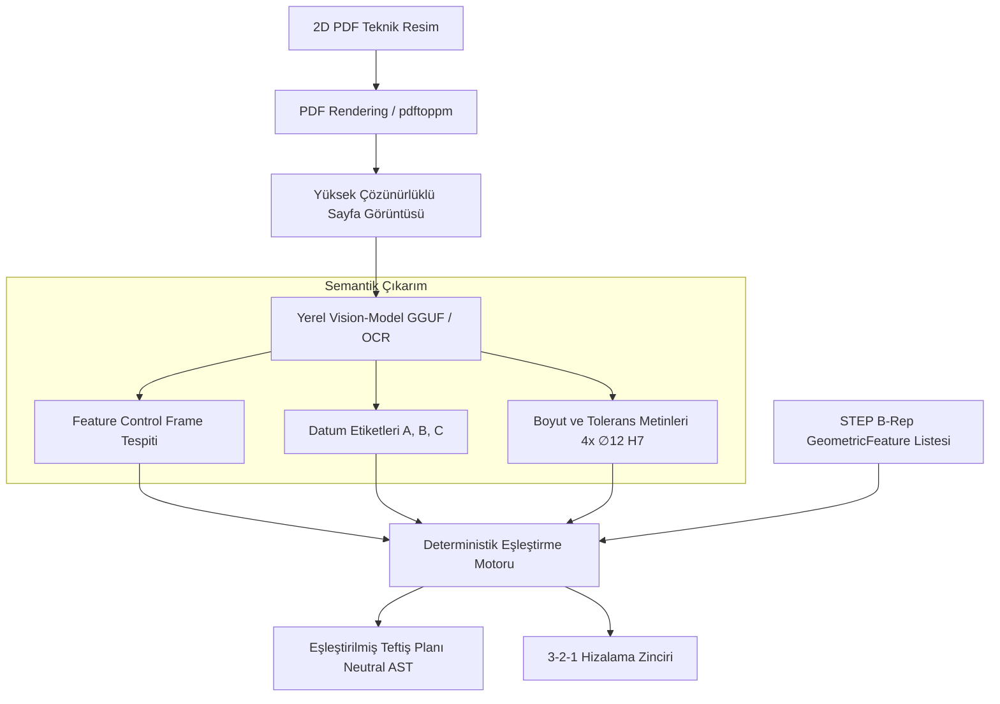

# 📐 03. 2D PDF GD&T ve Datum Eşleme Motoru (Semantik Katman)

> **"Tasarım ofisinden gelen 2D PDF teknik resimdeki tolerans kutularını (Feature Control Frame) yerel Vision-AI ile okuyup; STEP dosyasındaki 3D geometrik unsurlarla eşleştiren ve 3-2-1 hizalama sırasını deterministik olarak kuran semantik motor."**

---

## 📌 1. Semantik Darboğaz ve Hibrit Çıkarım Hattı

3D CAD modellerinin %90'ında gömülü tolerans (PMI/MBD) bulunmaz. Ölçüm kriterleri, çizim üzerindeki semboller, oklar ve tolerans tablolarıyla 2D PDF dosyasında verilir.

Nuper Ortho, gizlilik ve savunma regülasyonları gereği internete bağlanmadan (**air-gapped**), yerel donanımda (CPU veya yerel GPU) çalışan hafif bir **Vision-LLM / OCR (GGUF formatında)** hattı kullanır:



---

## 🔍 2. ASME Y14.5 ve ISO 1101 Tolerans Çerçevesi (Feature Control Frame) Ayrıştırma

Yerel model, teknik resimdeki standart tolerans kutularını şu bileşenlere ayırır:

```
┌──────┬──────────────┬─────────┬─────────┬─────────┐
│  ⨁   │ ∅0.05 Ⓜ      │    A    │    B    │    C    │
└──────┴──────────────┴─────────┴─────────┴─────────┘
  (1)         (2)         (3)       (4)       (5)
```
1. **Geometrik Sembol:**
   - Konum ( $\bigoplus$ ), Diklik ( $\perp$ ), Paralellik ( $//$ ), Düzlemsellik ( $\square$ ), Silindiriklik ( $\char"232D$ ), Salgı ( $\nearrow$ ), Toplam Salgı ( $\char"2316$ ).
2. **Tolerans Değeri ve Malzeme Modifikatörü:**
   - $\varnothing 0.05$ değeri, MMC (Maximum Material Condition - $\text{M}$), LMC (Least Material Condition - $\text{L}$) veya RFS (Regardless of Feature Size).
3. **Primer Datum (A):** Birincil referans yüzeyi.
4. **Sekonder Datum (B):** İkincil referans ekseni/düzlemi.
5. **Tersiyer Datum (C):** Üçüncül referans noktası/düzlemi.

---

## 🔗 3. Çap, Sayı ve Koordinat Eşleştirme Motoru

Metin çıkarımı ile 3D geometri arasındaki eşleştirme kesin kurallarla yapılır:
- **Örnek Çağrı:** *"4x $\varnothing 12\text{ H7}$ Delik, A datumuna göre $\bigoplus 0.02$"*
- **Geometri Araması:**
  1. `GeometricFeature` listesinde `feature_type == InternalCylinder` olan elemanlar filtrelenir.
  2. Nominal çapı $12.0\text{ mm} \pm 0.2\text{ mm}$ olan silindirler bulunur.
  3. Aynı desende (pattern) ve aynı düzlem üzerinde bulunan delik grubunun adedi sayılır ($N = 4$).
  4. Eşleşme kesinleştiğinde tolerans kimliği bu 4 deliğin özelliklerine (`tolerances`) bağlanır.

---

## 📐 4. Deterministik 3-2-1 Hizalama Stratejisi (Datum Alignment)

CMM'in parçayı uzayda konumlandırabilmesi için 6 serbestlik derecesinin (3 öteleme, 3 dönme) sırasıyla kilitlenmesi gerekir. Sistem tolerans zincirindeki datum sırasına göre şu hiyerarşiyi zorunlu kılar:

```
[ PRIMER DATUM (A) ] ──► Düzlem ────► 3 Temas Noktası (Z Öteleme, X/Y Dönme Kilitlendi)
         │
         ▼
[ SEKONDER DATUM (B) ] ──► Eksen/Çizgi ──► 2 Temas Noktası (Y Öteleme, Z Dönme Kilitlendi)
         │
         ▼
[ TERSİYER DATUM (C) ] ──► Nokta/Kenar ──► 1 Temas Noktası (X Öteleme Kilitlendi - 6 DOF Kilitli)
```

1. **Primer Datum (Plane):** Minimum 3 nokta (genellikle stabilite için Gauss/Chebyshev ile 4 nokta alınır).
2. **Sekonder Datum (Cylinder Axis / Edge):** Minimum 2 nokta veya silindir merkez ekseni.
3. **Tertiary Datum (Point / Face):** Kalan son serbestlik derecesini kilitleyen 1 temas noktası.

---

## 📊 5. Standartlara Göre Örnekleme Dağılımı (ISO 10360 & ASME Y14.5)

Yüzey veya delik tiplerine göre atılacak asgari nokta sayıları ve geometrik dağılımları:

| Unsur Tipi | Minimum Nokta Sayısı | Dağılım Geometrisi | Standart Kuralı |
|---|:---:|---|---|
| **Düzlem (Plane)** | **4 – 8 Nokta** | Köşelerden içeri doğru Chebyshev veya Gauss ızgarası. | Düzlemsellik ve açı ölçümü için en az 4 nokta. |
| **Delik / Mil (Cylinder)** | **8 Nokta (2 Seviye x 4)** | $Z_1$ derinliğinde $90^\circ$ açıyla 4 nokta, $Z_2$ derinliğinde $90^\circ$ açıyla 4 nokta. | Dairesellik, çap ve eksen eğikliği doğrulaması. |
| **Konik / Havşa (Cone)** | **6 – 8 Nokta** | Farklı 2 çap seviyesinde 3'er veya 4'er nokta. | Tepe açısı ve konik merkez ekseni tespiti. |
| **Küre (Sphere)** | **5 – 9 Nokta** | Ekvatorda 4 nokta, kutupta 1 nokta veya spiral dağılım. | Merkez koordinatı ve küresellik hesabı. |

Bu kural tabanlı semantik motor sayesinde, hiçbir kullanıcı müdahalesi olmadan teknik resimdeki tolerans gereksinimleri doğrudan 3D ölçüm noktası koordinatlarına ve yaklaşma vektörlerine dönüştürülür.
