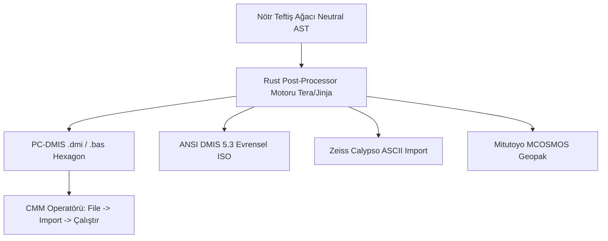

# 💻 07. Post-Processor ve DMIS Derleme Motoru

> **"Nötr ara yol haritasını (Neutral AST) PC-DMIS, ANSI DMIS 5.3 ve Calypso lehçelerine derleyen; manuel ön-hizalama, termal genleşme telafisi ve palet döngülerini koda ekleyen Rust şablon motoru."**

---

## 📌 1. Nötr Teftiş Ağacından (Neutral AST) Hedef Koda

Nuper Ortho, ölçüm yolunu doğrudan tek bir yazılıma bağımlı üretmez. Önce bellek içinde üretici-bağımsız bir **Nötr Teftiş Ağacı (Neutral Inspection AST)** kurar. Bu ağaç daha sonra Rust tabanlı bir şablon motoru (**Tera / Jinja**) ile hedef CMM kontrol ünitesine derlenir:



---

## 🕹️ 2. Manuel Ön-Hizalama Bloğu (Manual Pre-Alignment)

CMM granit tablasına konan bir parçanın uzaydaki tam sıfır noktası ve duruş açısı makine tarafından başlangıçta bilinemez. Otonom (DCC) döngü doğrudan başlatılırsa prob parçaya körleme dalar.

### İki Aşamalı Çalışma Mantığı:
Her Nuper Ortho programı zorunlu olarak iki aşamadan oluşur:
1. **Adım 1: Manuel Ön-Hizalama (`MODE/MAN`):**
   - Ekranda operatöre görsel bir rehber penceresi açılır: *"Lütfen joystick ile parçanın üst yüzeyine 1 dokunuş, ön yüzüne 1 dokunuş, yan yüzüne 1 dokunuş yapın."*
   - Parçanın kaba koordinat sistemi ve oryantasyonu hafızaya alınır.
2. **Adım 2: Otonom Hassas Ölçüm (`MODE/PROG, MAN`):**
   - Tezgah mikron hassasiyetindeki tam otomatik DCC moduna geçer.

---

## 🌡️ 3. Termal Kompanzasyon Entegrasyonu (Thermal Expansion)

Talaşlı imalattan yeni çıkmış bir parça $28^\circ\text{C}-35^\circ\text{C}$ sıcaklıkta olabilir veya CMM odasının kliması yetersiz kalabilir.

### Termal Hata Hesabı:
$$500\text{ mm Alüminyum (7075) parça},\quad \Delta T = +5^\circ\text{C} \quad (\alpha = 23.4 \times 10^{-6}/\text{K})$$
$$\Delta L = L_0 \cdot \alpha \cdot \Delta T = 500 \cdot (23.4 \times 10^{-6}) \cdot 5 \approx 0.058\text{ mm } (58\ \mu\text{m})$$

$58\ \mu\text{m}$ genleşme, mikron toleranslı havacılık parçalarında parçanın doğrudan **haksız yere hurdaya çıkmasına** yol açar.

### Nuper Ortho Çözümü:
Kullanıcı parça malzemesini seçer (Çelik 4140, Alüminyum 7075, Titanyum Gr5). Kodun başına sıcaklık kompanzasyon direktifi gömülür:
```plaintext
TEMPR/PART, 24.5, MATL, 23.4  $$ 24.5°C parça ısısı, 23.4 ppm Al genleşme katsayısı
```

---

## 📜 4. Tam DMIS 5.3 / PC-DMIS Kod Örneği

Nuper Ortho tarafından derlenen, sahada doğrudan çalıştırılabilir eksiksiz bir DMIS program kütüğü:

```plaintext
FILNAM/'NUPER_VALF_GOVDESI_OP20', 5.3
DVPOFT/0
UNITS/MM, ANGDEC
DECPL/ALL, 4

$$ ==============================================================
$$ --- 1. AYARLAR, TERMAL KOMPANZASYON VE EMNİYET PARAMETRELERİ ---
$$ ==============================================================
TEMPR/PART, 23.8, MATL, 23.4000
SNSET/APPRCH, 4.0000
SNSET/RETRCT, 4.0000
SNSET/SEARCH, 8.0000
SNSET/CLRSRF, 50.0000

$$ ==============================================================
$$ --- 2. MANUEL KABA ÖN-HİZALAMA (OPERATÖR REHBERLİĞİ) ---------
$$ ==============================================================
MODE/MAN
TEXT/OPER, 'JOYSTICK ILE PRIMER DATUM A YUZEYINE 1 TEMAS ALINIZ'
F(ROUGH_A) = FEAT/PLANE,CART, 0.0, 0.0, 100.0, 0.0, 0.0, 1.0
MEAS/PLANE, F(ROUGH_A), 1
  PTMEAS/CART, 0.0, 0.0, 100.0, 0.0, 0.0, 1.0
ENDMES

TEXT/OPER, 'JOYSTICK ILE ON YUZE 1 TEMAS, YAN YUZE 1 TEMAS ALINIZ'
F(ROUGH_B) = FEAT/POINT,CART, 0.0, -50.0, 80.0, 0.0, 1.0, 0.0
MEAS/POINT, F(ROUGH_B), 1
  PTMEAS/CART, 0.0, -50.0, 80.0, 0.0, 1.0, 0.0
ENDMES

$$ ==============================================================
$$ --- 3. OTONOM DCC MODA GECIS VE HASSAS DATUM OLCUMU ----------
$$ ==============================================================
MODE/PROG, MAN
SNSLCT/SA(A0.0B0.0)

$$ --- PRIMER DATUM A DUZLEMI (4 NOKTA GAUSS/CHEBYSHEV) ---
F(DATUM_A) = FEAT/PLANE,CART, 0.0000, 0.0000, 100.0000, 0.0000, 0.0000, 1.0000
MEAS/PLANE, F(DATUM_A), 4
  PTMEAS/CART,  35.0000,  35.0000, 100.0000, 0.0000, 0.0000, 1.0000
  PTMEAS/CART, -35.0000,  35.0000, 100.0000, 0.0000, 0.0000, 1.0000
  PTMEAS/CART, -35.0000, -35.0000, 100.0000, 0.0000, 0.0000, 1.0000
  PTMEAS/CART,  35.0000, -35.0000, 100.0000, 0.0000, 0.0000, 1.0000
ENDMES
DATDEF/FA(DATUM_A), DAT(A)

$$ ==============================================================
$$ --- 4. EMNİYET DÜZLEMİNE ÇIKIŞ VE MOTORİZE KAFA DÖNÜŞÜ -------
$$ ==============================================================
GOTO/CART, 0.0000, 0.0000, 150.0000  $$ Z_clearance (+50mm)
SNSLCT/SA(A90.0B0.0)                 $$ Yan Delik İçin Motorize Dönüş

$$ --- H7 YAN DELİK ÖLÇÜMÜ (2 SEVİYE X 4 NOKTA = 8 NOKTA) ---
F(DELIK_1) = FEAT/CYLNDR,IN,CART, 60.0000, 0.0000, 50.0000, 1.0000, 0.0000, 0.0000, 20.0000, 25.0000
MEAS/CYLNDR, F(DELIK_1), 8
  $$ Seviye 1 (X = 68.0 mm)
  PTMEAS/CART, 68.0000,  10.0000, 50.0000, 0.0000, -1.0000, 0.0000
  PTMEAS/CART, 68.0000, -10.0000, 50.0000, 0.0000,  1.0000, 0.0000
  PTMEAS/CART, 68.0000,  0.0000, 60.0000, 0.0000, 0.0000, -1.0000
  PTMEAS/CART, 68.0000,  0.0000, 40.0000, 0.0000, 0.0000,  1.0000
  $$ Seviye 2 (X = 80.0 mm)
  PTMEAS/CART, 80.0000,  10.0000, 50.0000, 0.0000, -1.0000, 0.0000
  PTMEAS/CART, 80.0000, -10.0000, 50.0000, 0.0000,  1.0000, 0.0000
  PTMEAS/CART, 80.0000,  0.0000, 60.0000, 0.0000, 0.0000, -1.0000
  PTMEAS/CART, 80.0000,  0.0000, 40.0000, 0.0000, 0.0000,  1.0000
ENDMES

$$ --- CHEBYSHEV INSCRIBED FIT VE GD&T TOLERANS RAPORU ---
T(TOL_POS) = TOL/POS, 2D, 0.0250, MMC, DAT(A), MMC
EVAL/FA(DELIK_1), TA(TOL_POS), ALGOR/MINSC
OUTPUT/FA(DELIK_1), TA(TOL_POS)

GOTO/CART, 0.0000, 0.0000, 150.0000  $$ Emniyet Düzlemine Dönüş
ENDFIL
```

---

## 🔁 5. Palet ve Dizi Mantığı (Pattern / Loop Automation)

Atölyelerde CMM tablasına tek bir parça değil, fikstür pleytine dizilmiş 4, 8 veya 16 adet parça aynı anda bağlanır. Nuper Ortho tek tuşla dizi döngüsü üretir:

```plaintext
DO/V1, 1, 8, 1  $$ 8 parçalık seri üretim döngüsü
  RECALL/ALIGN, 'PALET_GOZ_' + STR(V1)
  $$ [Parçanın Otonom Ölçüm Blokları]
ENDDO
```
Operatör 8 ayrı program yazmak veya koordinatları elle kopyalamak zorunda kalmaz.
