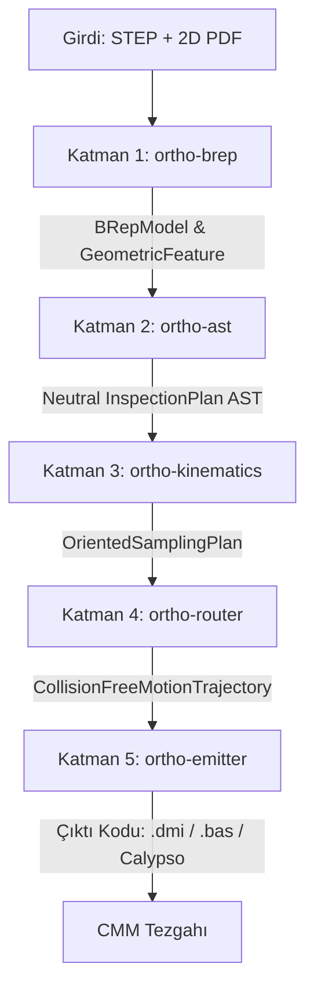

# 🏗️ Nuper Ortho Kodlama Planlaması: Derleyici Mimarisi (Compiler Architecture)

> **"Nuper Ortho bir basit script veya görsel araç değil; ham CAD ve teknik resim girdisini ara temsile (IR / AST) çeviren, üzerinde kinematik ve emniyet optimizasyonları yapan ve hedef tezgahın assembly'sine (DMIS/PC-DMIS) derleyen endüstriyel bir derleyicidir."**

---

## 📌 1. Derleyici Perspektifi (Compiler Analogy)

Geleneksel bir yazılım derleyicisi (örneğin `rustc` veya `clang`) ile Nuper Ortho'nun çalışma prensibi birebir örtüşür:

```
GELENEKSEL DERLEYİCİ:
[ Kaynak Kod (.rs / .cpp) ] ──► [ Lexer / AST ] ──► [ LLVM IR & Optimizasyon ] ──► [ Makine Kodu / Assembly ]

Nuper Ortho DERLEYİCİSİ:
[ STEP (CAD) + 2D PDF ]    ──► [ B-Rep Parser ] ──► [ Metroloji Nötr AST (IR) ] ──► [ DMIS / PC-DMIS Kodu ]
                                                            │
                                         ┌──────────────────┴──────────────────┐
                                         ▼                                     ▼
                              [ Kinematik & Örnekleme ]            [ Emniyet & Çarpışma Rotası ]
```

---

## 🧭 2. 5 Temel Kodlama Katmanı ve Veri Sözleşmeleri (Data Contracts)

Her katman bir sonrakine kesin olarak tanımlanmış, tip güvenli (type-safe) bir Rust veri yapısı aktarır:



### Katmanlar ve Sorumluluk Matrisi:
1. **Katman 1 (`ortho-brep`):** STEP dosyasını ayrıştırır, analitik yüzey tiplerini (`Plane`, `Cylinder`, `Cone`) ve yüzey normal vektörlerini ($I, J, K$) çıkarır.
2. **Katman 2 (`ortho-ast`):** Donanımdan ve CMM markalarından bağımsız, saf **Nötr Metroloji Ara Temsili (Inspection AST / IR)** kurar. Toleransları ve 3-2-1 Datum hiyerarşisini standardize eder.
3. **Katman 3 (`ortho-kinematics`):** AST üzerindeki geometrik hedefleri; prob kafasının $A/B$ diskret açılarına (PH10 için 720 açı, MH20i için k-means kümeleri) ve standartlara uygun ayrık temas noktalarına (Gauss/Chebyshev) dönüştürür.
4. **Katman 4 (`ortho-router`):** $+50\text{ mm}$ emniyet kutusu (Clearance Box), pabuç/fikstür yasaklı alanları (Keep-Out Zones) ve prob şaftı sürtünme kontrolleriyle çarpışmasız hareket graflarını oluşturur.
5. **Katman 5 (`ortho-emitter`):** Eldeki nihai hareket ve ölçüm grafını hedef tezgahın lehçesine (PC-DMIS, ANSI DMIS 5.3, Zeiss) derleyen şablon motorudur.

---

## 📂 3. Planlama Modülleri Dizini

Bu klasördeki planlama notları, kod tabanının (Rust Crate Workspace) mimarisini adım adım belirler:

| Belge | Kapsam | İlgili Rust Modülü |
|---|---|---|
| [[01_Katman_1_Ingestion_ve_BRep_Plani\|01. Katman 1: Ingestion & B-Rep]] | STEP okuma, OpenCASCADE FFI, analitik yüzey tespiti. | `ortho-brep` |
| [[02_Katman_2_Metrology_AST_Ara_Temsil_Plani\|02. Katman 2: Metrology AST]] | Nötr ara temsil (IR), Datum zinciri, tolerans düğümleri. | `ortho-ast` |
| [[03_Katman_3_Kinematics_ve_Sampling_Plani\|03. Katman 3: Kinematics & Sampling]] | PH10 $A/B$ çözücü, MH20i kümeleme, Gauss/Chebyshev nokta üretici. | `ortho-kinematics` |
| [[04_Katman_4_Collision_ve_Routing_Plani\|04. Katman 4: Collision & Routing]] | Clearance Box, pabuç kaçınma, şaft/gövde çarpışma kontrolü. | `ortho-router` |
| [[05_Katman_5_Post_Processor_Emitter_Plani\|05. Katman 5: Post-Processor Emitter]] | Tera/Jinja şablonları, DMIS 5.3, PC-DMIS, `MODE/MAN` enjeksiyonu. | `ortho-emitter` |
| [[06_Gelistirme_Ortami_ve_Crate_Mimarisi\|06. Geliştirme Ortamı ve Crate Mimarisi]] | Cargo workspace hiyerarşisi, bağımlılıklar, PTB test koşucusu. | `Cargo.toml (Workspace)` |
| [[07_Uctan_Uca_Insa_ve_Dogrulama_Plani\|07. Uçtan Uca İnşa ve Doğrulama Planı]] | Sıfır hata felsefesi, 6 aşamalı deterministik inşa sırası, kalite kapıları ve hata matrisi. | `Pipeline & QA / FAT` |
| [[08_Kritik_Alt_Sistemler_ve_Cozum_Mimarisi\|08. Kritik Alt Sistemler ve Çözüm Mimarisi]] | UV parametrizasyonu, Kinematik ağaç, TSP yol maliyeti, MCS/FCS/PCS, Zero-Copy IPC, Failsafe. | `Low-Level Algoritmalar` |
| [[09_Metroloji_Standartlari_ve_Belirsizlik_Butcesi\|09. Metroloji Standartları ve Belirsizlik Bütçesi]] | ISO 15530-3 (Virtual CMM), GUM, ISO 16610 Gauss filtresi, ISO 5459 6-DoF, ISO 14253 Guard-Banding. | `Metroloji & GUM Standartları` |
| [[10_Kritik_Teknik_Darbgazlar_ve_Cozumleri\|10. Kritik Teknik Darboğazlar ve Çözümleri]] | 2D/3D Bipartite eşleme, 5-DoF RRT*, OCCT CXX bellek izolasyonu, Hammersley, Tera diyalektleri. | `Algoritmik Çözümler` |
| [[11_Saha_Operasyonlari_Setup_Sheet_ve_Hibrit_Metroloji\|11. Setup Sheet, Hibrit Metroloji ve Sürümleme]] | 1 sayfalık PDF Kurulum Föyü, Optik/Lazer AST genişlemesi, açık standart terminolojisi (v0.1.0). | `Saha & Operasyon` |
| [[12_Otonom_Hizalama_ve_Sifirlama_Oneri_Motoru\|12. Otonom Hizalama ve Sıfırlama Öneri Motoru]] | Kararlılık puanlama motoru, Prizmatik/Silindirik/2-Delik şablonları, 3D renkli rehberlik (3-2-1). | `Otonom Sıfırlama / UX` |
| [[13_Gercek_Atolye_Sartlari_ve_Ileri_Saha_Guvenligi\|13. Gerçek Atölye Şartları ve İleri Saha Güvenliği]] | Döküm payı arama mesafesi, Alüminyum sıvanması (Si3N4), Multi-Body filtreleme, Z-First park, SHA-256. | `Saha Fiziği & Güvenlik` |
| [[14_Yerel_Yapay_Zeka_Ajanlari_ve_Deterministik_Gardiyan\|14. Yerel Yapay Zeka Ajanları ve Deterministik Gardiyan]] | 5 stratejik AI rolü, GBNF katı JSON şeması, B-Rep çapraz denetim, 5 aşamalı gardiyan mimarisi. | `Local AI & Guardrails` |
| [[15_3D_Simulasyon_ve_GJK_Carpisma_Motoru\|15. 3D Simülasyon ve GJK Çarpışma Motoru]] | Süpürülmüş kapsül modeli, GJK/EPA dalma derinliği, geçerli temas kuralları, Lift-and-Hop rotalama. | `Çarpışma Fiziği & Simülasyon` |
| [[16_UI_UX_Tasarim_Sistemi_ve_Performans_Mimarisi\|16. UI/UX Tasarım Sistemi ve Performans Rehberi]] | Bambu Studio/Fusion 360 sadeliği, Solid Slate Light teması, 3 bölmeli ekran, 80-150MB RAM. | `UI/UX & Performans` |
| [[17_Disli_Delikler_ve_Karmasik_Unsur_Yonetimi\|17. Dişli Delikler ve Karmaşık Unsurlar]] | Matkap vs nominal çap, vida dişi baypası, yakut bilye koruması, mastar listesi. | `ortho-ast / features` |
| [[18_CMM_Tezgah_Profili_Prob_ID_ve_Donanim_Lehceleri\|18. CMM Tezgah HAL & Prob ID Eşleme]] | Strok limitleri, PC-DMIS .prb eşleme, native magazin makroları, Zeiss Calypso ASCII. | `ortho-emitter / hal` |
| [[19_Kademeli_AI_Mimarisi_ve_Cok_Sayfali_Kesit_Esleme\|19. Kademeli AI ve Kesit Görünüş Eşleme]] | 4 seviyeli AI boru hattı (Tier 0-3), çok sayfalı PDF, kesit A-A hizalama, kaşe temizleme. | `ortho-ai / tiered` |
| [[20_Serbest_Yuzey_Profili_ve_Bilesik_Toleranslar\|20. Serbest Yüzey Profili ve İleri GD&T]] | Yüzey Profili (Profile of a Surface), ASME Y14.5 PLTZF/FRTZF, eğrilik uyarlamalı örnekleme. | `ortho-kinematics` |

---

## 🎯 4. Temel Tasarım İlkesi: "Decoupled Pipelines" (Ayrık Hatlar)

Bu derleyici mimarisinin en büyük avantajı **tam izolasyondur**:
- OpenCASCADE kütüphanesi güncellendiğinde veya başka bir CAD çekirdeğine geçildiğinde prob kinematiği bundan **etkilenmez**.
- Portföye yeni bir CMM markası (örneğin Wenzel veya Mitutoyo) eklendiğinde sistemin geometri veya emniyet motoruna dokunulmaz; **sadece Katman 5'e yeni bir metin şablonu (Emitter Template)** eklenir.
