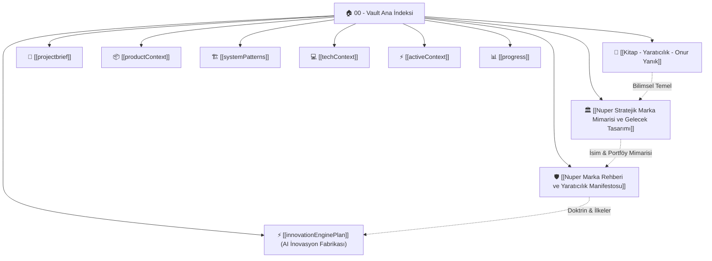

# 🧠 Nuper Industries — İkinci Beyin (Second Brain) & Vault İndeksi

Nuper Industries'in stratejik aklı, mühendislik prensipleri, Ar-Ge inovasyon motoru ve kurumsal hafızası bu Obsidian Vault içerisinde birbiriyle çift yönlü bağlantılı olarak yapılandırılmıştır.

---

## 📚 1. Felsefe, Marka & Yaratıcılık Kütüphanesi
- 🎨 **[[Nuper Anti-Slop Marka ve Tasarım Sistemi]]:** `anti-slop` kuralları doğrultusunda inşa edilen logo mimarisi, renk disiplini, tipografi ve görsel kimlik kılavuzu.
- 🏛️ **[[Nuper Stratejik Marka Mimarisi ve Gelecek Tasarımı]]:** Kitabın ışığında isim analizi (*Nuper* etimolojisi, *Innovation* yerine *Industries* dönüşümü), YC savunma stratejisi, "Modüler Cephanelik" SaaS modeli ve 10 yıllık büyük vizyon.
- 🛡️ **[[Nuper Marka Rehberi ve Yaratıcılık Manifestosu]]:** Savunma sanayii ve derin teknoloji doktrini, tasarım sistemi, 9 Kutu Kalkanı ve 17 yasaklı düş katili söz.
- 📖 **[[Kitap - Yaratıcılık - Onur Yanık]]:** Yaratıcılığın tanımı, zihinsel süreçler, sağ/sol beyin dinamikleri, 9 kurumsal kutu, 12 pratik zihin egzersizi ve bilimsel yaratıcı düşünce tekniklerinin eksiksiz metni.

---

## ⚙️ 2. Ar-Ge & İnovasyon Motoru (Innovation Engine)
- ⚡ **[[innovationEnginePlan]]:** Vercel & Supabase üzerinde çalışan sıfır maliyetli RSS tarayıcı, talep üzerine (on-demand) çalışan Llama 3 / OpenRouter analiz istasyonu, insan denetimli (Human-in-the-Loop) altın veri seti ve pgvector RAG yol haritası.

---

## 🏢 3. Nuper Portal Sistem Mimarisi & Kod Hafızası
- 🎯 **[[projectbrief]]:** Nuper Industries İnovasyon Portalı'nın hedefleri, gizlilik ve vitrin kapsamı.
- 📦 **[[productContext]]:** Kullanıcı deneyimi, kurucu paneli, vitrin projeleri ve IP koruma kurgusu.
- 🏗️ **[[systemPatterns]]:** Next.js App Router, Server Actions, Prisma ORM ve PostgreSQL veri modelleri.
- 💻 **[[techContext]]:** Kullanılan kütüphaneler, Vercel, Supabase ve OpenRouter API konfigürasyonları.
- ⚡ **[[activeContext]]:** Şu anda üzerinde çalışılan aktif görevler ve güncel sistem durumu.
- 📊 **[[progress]]:** Tamamlanan özellikler, sırada bekleyen fazlar ve bilinen konular.

---

## 🌐 4. Nuper Ortho — Otonom CMM ve Metroloji Motoru (Physical AI)
- 🎯 **[[00_Nuper_Ortho_Master_MOC|Nuper Ortho Master MOC]]:** Otonom CMM yol planlama, DMIS/PC-DMIS derleyicisi, 5 katmanlı derleyici mimarisi ve sıfır-hata kalite kapıları.
- 🛠️ **[[00_Derleyici_Mimarisi_Master_Plani|Derleyici Mimarisi Planı]]:** OpenCASCADE (`ortho-brep`), Nötr AST (`ortho-ast`), Kinematik (`ortho-kinematics`), Rotalama (`ortho-router`) ve DMIS Post-Processor (`ortho-emitter`).

---

> [!tip] Obsidian İpucu
> Bu klasör artık doğrudan bir **Obsidian Vault** olarak açılabilir. `Ctrl + O` (hızlı açılış) ve `Ctrl + G` (Graph View / Grafik Görünümü) kullanarak kavramlar arasındaki köprüleri görsel olarak keşfedebilirsiniz.
