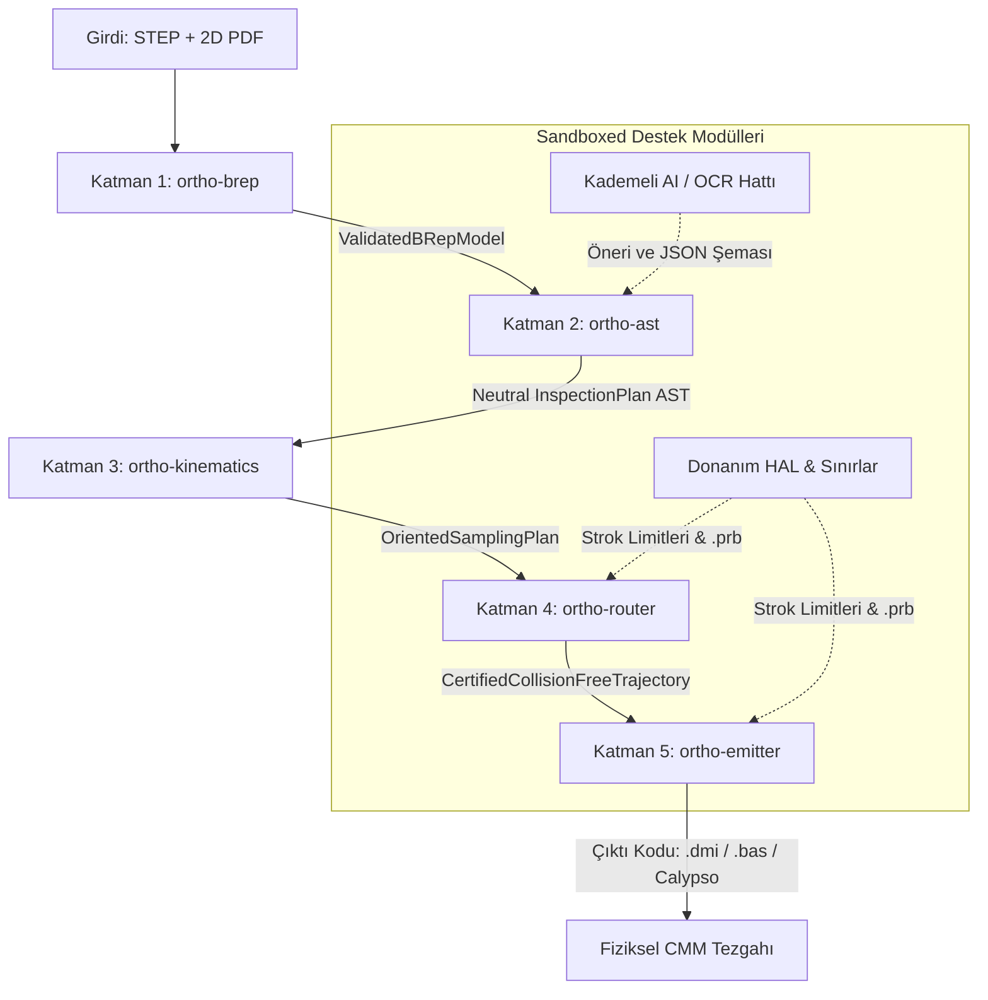

# Nuper Ortho — Sistem Mimarisi ve Tasarım Kalıpları (System Patterns)

## 1. 5 Katmanlı Derleyici Boru Hattı (Compiler Architecture)

Nuper Ortho, basit bir görselleştirici veya script aracı değil; CAD geometrisini ve tolerans girdilerini makine seviyesinde CMM koduna derleyen katı bir **Endüstriyel Derleyicidir**.



---

## 2. Katmanlar Arası Veri Sözleşmeleri ve Sorumluluk Matrisi

| Katman | Rust Sandığı (Crate) | Girdi Sözleşmesi | Çıktı Sözleşmesi | Temel Mimari Sorumluluk |
|---|---|---|---|---|
| **Katman 1** | `ortho-brep` | Ham STEP Dosya Yolu | `ValidatedBRepModel` | OpenCASCADE C++ FFI (`cxx`), analitik yüzey sınıflandırması (`Plane`, `Cylinder`, `Cone`, `BSpline`), dışa bakan birim normaller, sınır telleri ve et kalınlığı analizi ($<2.5\text{ mm}$). |
| **Katman 2** | `ortho-ast` | `ValidatedBRepModel` + Toleranslar | `InspectionPlan` (IR) | Donanım-bağımsız Nötr Teftiş AST'si (IR). ISO 1101 / ASME Y14.5 3-2-1 Datum zinciri, 6-DoF rank denetimi, kademeli cep ağacı, vida dişi tespiti ve baypas bayrakları. |
| **Katman 3** | `ortho-kinematics` | `InspectionPlan` | `OrientedSamplingPlan` | İleri kinematik prob montaj ağacı, Renishaw PH10 720 diskret açı LUT optimizasyonu ($\theta \to \min$), MH20i K-means kümelemesi, Gauss ve Chebyshev temas noktası örnekleyicileri. |
| **Katman 4** | `ortho-router` | `OrientedSamplingPlan` + Keep-Out | `CertifiedTrajectory` | $+50\text{ mm}$ Emniyet Kutusu (Clearance Box), $5\text{ mm}$ normal geri çekilme, pabuç yasaklı alanları, 2-Opt TSP rota optimizasyonu, BVH geniş fazı ve `parry3d` GJK/EPA dar faz çarpışma fiziği. |
| **Katman 5** | `ortho-emitter` | `CertifiedTrajectory` + HAL Profili | Makine Kodu (`.dmi`, `.bas`) | Bildirimsel Tera/Jinja şablonlama motoru. `MODE/MAN` operatör kaba sıfırlaması, `TEMPR/PART` termal kompanzasyon, Z-First güvenli park el sıkışması, yerel magazin makroları ve SHA-256 dijital imzası. |

---

## 3. Temel Mimari Prensipler ve Sistem Değişmezleri (Invariants)

### A. Tip Seviyesinde Emniyet (Typestate Pattern)
Rust derleyicisi seviyesinde doğrulanmamış hiçbir hareket yolunun kod derleyicisine (`ortho-emitter`) geçmesine izin verilmez:
```rust
// Ham, henüz çarpışma kontrolünden geçmemiş hareket yolu
pub struct UncheckedTrajectory { /* ... */ }

// Yalnızca ortho-router tarafından onaylanmış emniyetli yol tipi
pub struct CertifiedCollisionFreeTrajectory {
    trajectory: UncheckedTrajectory,
    verification_hash: [u8; 32],
}

impl Emitter {
    // Derleyici kuralı: UncheckedTrajectory verilirse derleme hatası verir
    pub fn emit_pcdmis(&self, plan: &CertifiedCollisionFreeTrajectory) -> Result<String, EmissionError>;
}
```

### B. C++ FFI Sınır İzolasyonu (`cxx`)
OpenCASCADE (OCCT) kütüphanesi kendi referans sayımını (`Handle(Standard_Transient)`) işletir. Bellek sızıntısı veya geçersiz işaretçi çökmesini önlemek için:
- C++ nesneleri wrapper katmanında oluşturulur, verisi çıkarılır ve bellekten silinir.
- Rust tarafına yalnızca saf veri taşıyan düz yapılar (POD struct'lar, `[f64; 3]` dizileri ve güvenli enum'lar) geçirilir.
- Sıfır ham işaretçi (raw pointer) sızıntısı güvence altına alınır.

### C. Süpürülmüş Hacim Kapsül Modeli ve GJK/EPA Çarpışma Fiziği
Prob bir noktadan diğerine intikal ederken 3 boyutlu bir kapsül hacmi tarar:
- **Yakut Bilye:** $R_{\text{ball}}$ yarıçapında süpürülen küre.
- **Şaft ve Modül:** $R_{\text{stem}}$ ($1.5\text{ mm}$) ve $R_{\text{holder}}$ ($12.5\text{ mm}$) silindirik kapsülleri.
- **`parry3d` Dar Fazı:** Minkowski farkı $A \ominus B$ üzerinden GJK algoritmasıyla temas testi yapılır; temas varsa EPA algoritmasıyla dalma derinliği (penetration depth) hesaplanarak `Lift-and-Hop` rotası devreye sokulur.

### D. Sandboxed Yerel AI ve 5 Aşamalı Gardiyan
Yapay zekâya asla tezgaha doğrudan kod yazma yetkisi verilmez:
1. **GBNF Gramer Kısıtı:** `llama.cpp` çıktısı önceden belirlenmiş katı JSON şemasına zorlanır.
2. **B-Rep Zemin Gerçekliği (Ground-Truth Check):** AI bir delik okuduğunda STEP B-Rep sorgulanır; delik modelde yoksa halüsinasyon olarak anında silinir.
3. **Kinematik Aralık Doğrulaması:** $A135^\circ$ gibi imkansız açılar doğrudan reddedilir.
4. **Güven Skoru Eşiği:** Güven skoru $\%70$'in altındaysa operatöre sorulur.
5. **Sanal CMM Kuru Çalıştırma:** Tek bir mikronluk sürtünme tespit edilirse derleme butonu kilitlenir.

### E. Yerel Prob Magazini (MCR20) Makro Kuralı
Nuper Ortho, magazin yuvalarına **asla ham $(X, Y, Z)$ fiziksel koordinat basmaz**. Yalnızca tezgahın mastarlanmış yerel makrosunu çağırır (`LOADPROBE/TIP_NAME`). Fiziksel yuva yaklaşma rotası makinenin kendi firmware'ine delege edilir.

### F. Z-First Mutlak İntikal Protokolü (Safe Park Handshake)
Başlangıç ve bitiş hareketlerinde çapraz iniş kazalarını önlemek için:
1. İlk hareket: Bulunulan noktadan bağımsız olarak $Z$ ekseninde makine tavan emniyet düzlemine çıkış.
2. İkinci hareket: Parça merkezine yatay ($X/Y$) güvenli intikal.
3. Üçüncü hareket: Parçanın $+50\text{ mm}$ Clearance Box kutusuna dikey ($Z$) iniş.

### G. Dişli Delik Koruması ve Kurulum Föyü Entegrasyonu
Vida dişli deliklere ($\text{M-Thread}$) yakut bilye daldırılmaz; kaza riski elenir ve Setup Sheet üzerine otomatik geçer/geçmez tampon diş mastarı talimatı basılır.
