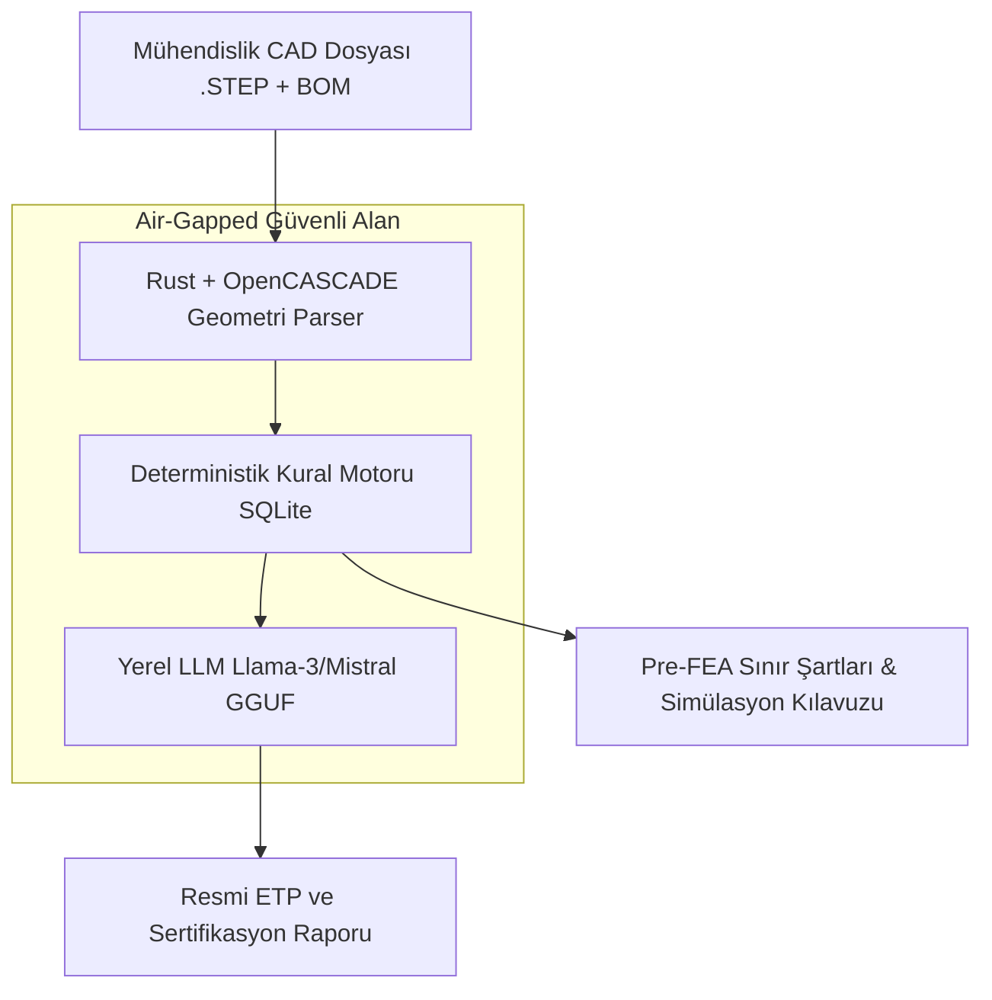

# 🛡️ 01. Otonom Savunma ve Donanım Regülasyon Motoru (AI-Native Defense Compliance)

> **YC 2026 RFS Eşleşmesi:** *The Future of American Defense* & *AI-Native Compliance Infrastructure*

---

## 📌 Problem Tanımı
Savunma sanayiinde ve ileri donanım mühendisliğinde bir sistemin veya alt parçanın sahaya çıkabilmesi için yüzlerce askeri ve sivil standarttan (**MIL-STD-810H, DO-160G, NATO STANAG 4370, CMMC, ITAR**) geçmesi zorunludur.
- Mühendislik ekipleri aylar boyunca binlerce sayfalık standartları manuel olarak tarar.
- Çevresel Test Prosedürü (ETP), titreşim matrisleri, şok spektrumları ve sınır şartları dokümanları Excel ve Word dosyalarında elle hazırlanır; insan hatası riski çok yüksektir.
- Bir testin başarısız olması durumunda prototipin revize edilip tekrar test merkezine girmesi aylar ve yüz binlerce dolar kaybettirir.
- **En kritik kısıt:** Savunma verileri buluta (OpenAI, AWS public cloud) gönderilemez. Sistemin kesinlikle **air-gapped (çevrimdışı/yerel)** çalışması şarttır.

---

## 💡 Çözüm ve Ürün Vizyonu
Savunma sanayii ve kritik donanım üreticileri için **tamamen yerel (air-gapped) çalışan, CAD ve malzeme listesini (BOM) okuyup standartlara göre deterministik olarak denetleyen ve resmi kalifikasyon dokümantasyonunu otonom üreten yapay zekâ destekli regülasyon motoru.**

### Çekirdek Yetenekler:
1. **STEP/CAD Analizi:** 3D CAD modelinin kütle merkezi, cidar kalınlıkları, montaj noktaları ve malzeme bilgisi OpenCASCADE ile otomatik taranır.
2. **Deterministik Kural Motoru:** MIL-STD-810H Metot 514 (Titreşim), 516 (Şok), 501/502 (Sıcaklık) tabloları SQLite/kural motoru üzerinden matematiksel kesinlikle işletilir (halüsinasyonsuz).
3. **Pre-FEA Sınır Şartı Üretimi:** ANSYS, NASTRAN veya Abaqus için mesh ve sınır şartı yükleme komutlarını otonom hazırlar.
4. **Resmi ETP Doküman Üretimi:** İlgili askeri birimlerin ve test merkezlerinin formatında eksiksiz Çevresel Test Prosedürü (ETP) ve Uyumluluk Raporu oluşturur.

---

## 🏗️ Mimari ve Teknoloji Yığını

- **İstemci & Çekirdek:** Rust + Tauri (Hafif, ultra güvenli, yerel binary).
- **Geometri Çekirdeği:** OpenCASCADE C++ bağlayıcıları (cxx/bindgen).
- **Yapay Zekâ:** llama.cpp / Candle üzerinden yerel quantize modeller (Llama 3.3 8B, Mistral Nemo).
- **Arayüz:** Next.js / React, Tailwind, Lucide ikonlar, interaktif 3D Three.js/WebGPU CAD görüntüleyici.

---

## 🚀 Haksız Avantaj (Unfair Advantage) ve Moat
- **Mevcut Nuper Citadel Altyapısı:** Sıfırdan başlanmıyor; `nuper_citadel` projesinde tasarlanan hafıza bankası, SQLite kural şemaları ve mimari doğrudan buraya aktarılabilir.
- **Air-Gapped Güvenlik:** OpenAI API kullanan rakipler savunma firmalarının kapısından içeri giremez. Yerel çalışan deterministik yapı en büyük satıştır.
- **Halüsinasyonsuz Hibrit Mimari:** Standart parametreleri LLM'e tahmin ettirilmez; SQLite kuralları kesin değerleri verir, LLM sadece rapor yazımı ve bağlamsal yorumlamayı üstlenir.

---

## 📅 4 Haftalık MVP Planı
- **Hafta 1:** STEP dosyası yükleme ve kütle/malzeme çıkarma (Rust + OpenCASCADE).
- **Hafta 2:** MIL-STD-810H Metot 514.8 (Titreşim) kural tablolarının SQLite'a entegrasyonu.
- **Hafta 3:** Yerel LLM ile otomatik ETP (Test Prosedürü) PDF raporu oluşturma modülü.
- **Hafta 4:** Savunma/donanım mühendisleriyle demo görüşmeleri ve YC başvuru videosu.

---

## ✍️ Kişisel Notlarım ve Planlarım
- [ ] Türkiye ve küresel savunma sanayiinden kimlerle konuşabilirim?
- [ ] NATO STANAG modülleri eklenebilir mi?
- [ ] Notlar:
