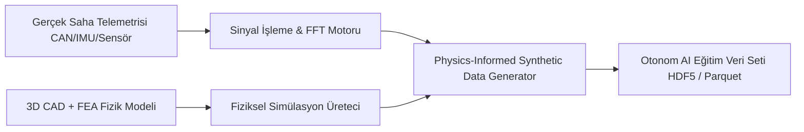

# 📡 02. Fiziksel Dünya Telemetri ve Sentetik Simülasyon Veri Fabrikası

> **YC 2026 RFS Eşleşmesi:** *Data for the Real World* & *The Future of American Defense*

---

## 📌 Problem Tanımı
Yapay zekâ modelleri metin ve kod için insanüstü seviyelere geldi çünkü internette trilyonlarca token metin vardı. Ancak **fiziksel dünya (robotik, İHA, otonom askeri araçlar, zırhlı platformlar)** için durum çok farklı:
- Sensör verisi (ivmeölçer, IMU, lidar, termal kameralar, gerinim pulları) pahalıdır, toplanması tehlikelidir ve az bulunur.
- Otonom sistemlerin ve droneların zorlu koşullarda (kar fırtınası, çöl tozu, GPS karartması, motor arızası titreşimi) nasıl davranacağını test etmek için sahada kaza yaptırmak gerekir.
- Sentetik veri üreten oyun motorları (Unreal/Unity) ise gerçek fiziksel sınırları (FEA gerilmeleri, yorulma, termal genleşme) yansıtmaz.

---

## 💡 Çözüm ve Ürün Vizyonu
Gerçek dünya telemetri verisini (HIL - Hardware-in-the-Loop ve saha sensörleri) yüksek hassasiyetli mühendislik simülasyonlarıyla (FEA, aerodinamik, termal) birleştirerek otonom sistemleri eğitmek için **fiziksel olarak doğrulanmış sentetik antrenman ve test verisi üreten bir veri fabrikası.**

### Çekirdek Yetenekler:
1. **Sensör & Telemetri İçe Aktarımı:** İHA uçuş kayıtları, araç CAN-bus verileri, titreşim test masası (shaker table) FFT spektrumları sisteme yüklenir.
2. **Fizik Temelli Genişletme (Physics-Informed Augmentation):** Gerçek sensör verisinin üzerine FEA modellerinden türetilen arıza modları (örneğin gövde çatlaması, pervane balanssızlığı) matematiksel olarak enjekte edilir.
3. **Uç Uca Veri Seti Çıktısı:** Otonom sürüş/uçuş yapan AI modelleri için binlerce saatlik "köşe vaka (edge-case)" antrenman verisi üretilir.

---

## 🏗️ Mimari ve Teknoloji Yığını

- **Veri İşleme:** Rust + Polars / Arrow (Devasa sensör zaman serisi verisini ultra hızlı işleme).
- **Fizik Simülasyonu:** Pre-FEA sınır şartları + deterministik modal analiz matrisleri.
- **Biçim:** Robotik ve otonom sistem standartlarına uyumlu HDF5, Parquet, ROS2 bag dosyaları.

---

## 🚀 Haksız Avantaj (Unfair Advantage) ve Moat
- YC 2026'nın en çok vurguladığı konu: *"AI needs physical grounding data"*.
- Oyun motorlarıyla üretilen "görsel" sentetik verinin aksine, burada mühendislik standartlarına (MIL-STD, STANAG) dayalı gerçekçi fiziksel ivme/titreşim/gerilme verisi üretilir.

---

## 📅 4 Haftalık MVP Planı
- **Hafta 1:** CSV/JSON formatındaki titreşim ve IMU telemetri verilerini okuyan Rust tabanlı parser.
- **Hafta 2:** Belirli bir frekans ve genlik bozulmasını simüle eden matematiksel gürültü/arıza enjektörü.
- **Hafta 3:** Simüle edilen sensör verisini 3D model üzerinde renk haritası (stress heat-map) olarak gösteren görsel arayüz.
- **Hafta 4:** Otonom sistem geliştiren 3 robotik/savunma girişimiyle demo.

---

## ✍️ Kişisel Notlarım ve Planlarım
- [ ] Robotik ve İHA takımlarının veri ihtiyaçları neler?
- [ ] Hangi sensör tiplerine odaklanmalıyız (IMU, Strain gauge, Termal)?
- [ ] Notlar:
