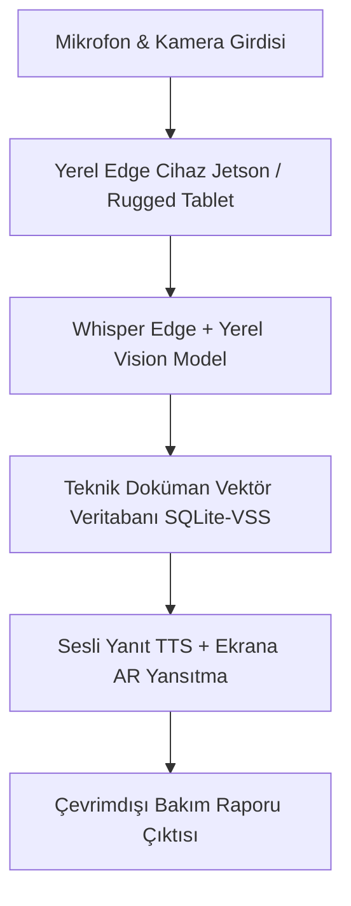

# 🛠️ 03. Sahadaki Mühendis ve Teknisyenler için "Hands-Free" Edge OS

> **YC 2026 RFS Eşleşmesi:** *New Operating Systems for the Physical World*

---

## 📌 Problem Tanımı
- Dünya iş gücünün **%80'i masa başında oturmaz**. Savunma hangarlarında, gemi tersanelerinde, rüzgar türbinlerinde veya inşaat sahalarında ellerinde koruyucu eldiven ve alet çantasıyla çalışırlar.
- Bu personelin karmaşık bakım kılavuzlarını (IETM - Interactive Electronic Technical Manual), kablo şemalarını ve tork değerlerini kontrol etmek için ellerindeki işi bırakıp dizüstü bilgisayara gitmesi verimsizlik ve hata yaratır.
- Çoğu zaman bu sahalarda internet bağlantısı (WiFi / 4G) yoktur veya güvenlik gereği radyo frekansı yayını yasaktır (EMCON koşulları).

---

## 💡 Çözüm ve Ürün Vizyonu
Saha mühendisleri ve teknisyenleri için akıllı kulaklık, rugged tablet veya akıllı gözlükler üzerinde **tamamen çevrimdışı (offline)** çalışan, sesli komut ve kamera görüntüsüyle yönlendirilen bir **Fiziksel Saha İşletim Sistemi**.

### Çekirdek Yetenekler:
1. **Hands-Free Sesli Diyalog:** Teknisyen "Şu vidadan sonra hangi adımı yapmalıyım?" veya "Bu hidrolik valfin tork toleransı nedir?" dediğinde yerel ses tanıma (Whisper Edge) ile anında net yanıt verir.
2. **Kamera ile Parça & Hata Doğrulama:** Teknisyenin kamerayı parçaya tutmasıyla parçanın doğru takılıp takılmadığını veya çatlak/yıpranma olup olmadığını yerel Vision modeli ile doğrular.
3. **Otomatik Dijital Bakım Günlüğü:** Teknisyen işi bitirdiğinde yapılan tüm adımları konuşmalardan derleyerek standart askeri/havacılık bakım kayıt formuna dönüştürür.

---

## 🏗️ Mimari ve Teknoloji Yığını

- **Çalışma Ortamı:** Yerel Edge donanımları (NVIDIA Jetson, Apple Silicon veya yerel Windows/Linux tabletler).
- **Yerel AI Motorları:** Whisper.cpp (Ses tanıma), Piper TTS (Hafif ses sentezi), Moondream / Florence-2 (Hafif yerel görüntü analizi).
- **Uygulama İskeleti:** Rust + Tauri (Masaüstü ve mobil derleme desteği).

---

## 🚀 Haksız Avantaj (Unfair Advantage) ve Moat
- YC'nin "Physical World OS" çağrısında belirttiği gibi, 20 yıldır değişmeyen eski ERP/bakım yazılımlarının yerine sahaya özel ilk yapay zekâ tabanlı yerel deneyimi sunar.
- Sıfır internet bağımlılığı sayesinde savunma, nükleer santraller ve açık deniz petrol platformları gibi internete kapalı tesislerde tek alternatif haline gelir.

---

## 📅 4 Haftalık MVP Planı
- **Hafta 1:** Standart bir teknik bakım kılavuzunu (PDF/Markdown) yerel embedding ve SQLite ile indeksleme.
- **Hafta 2:** Whisper.cpp ile sesli soru alıp yerel LLM üzerinden saniyeden kısa sürede sesli yanıt veren prototip.
- **Hafta 3:** Kamera görüntüsünden cıvata/bağlantı parçasını tespit eden basit vizyon testi.
- **Hafta 4:** Saha teknisyenleri veya atölye ustaları ile test videosu çekimi.

---

## ✍️ Kişisel Notlarım ve Planlarım
- [ ] İlk pilot çalışma hangi sektörde yapılabilir (Otomotiv servisi, havacılık bakımı, İHA hangarı)?
- [ ] Donanım olarak standart bir iPad/Android tablet mi yoksa rugged laptop mu hedeflenmeli?
- [ ] Notlar:
