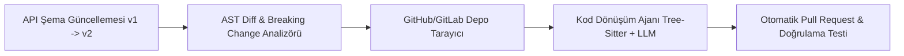

# ⚙️ 01. Kendi Kendini Onaran API ve Entegrasyon Ağ Geçidi (Self-Maintaining APIs)

> **YC 2026 RFS Eşleşmesi:** *Self-Maintaining APIs*

---

## 📌 Problem Tanımı
- Y Combinator'ın bizzat paylaştığı verilere göre: AWS ve büyük bulut sağlayıcılarında yaşanan **servis kesintilerinin %30'undan fazlası harici API değişikliklerinden** ve uyumsuzluklardan kaynaklanmaktadır.
- B2B API şirketleri (Stripe, Twilio, Plaid vb.) yeni özellikler eklediğinde veya `breaking change` yayınladığında, changelog'lar okunmaz, entegrasyonlar sessizce patlar veya geliştiriciler haftalarca refactor yapmak zorunda kalır.
- API sağlayıcıları ile API tüketicileri arasındaki iletişim köprüsü 30 yıldır değişmedi: Statik dokümantasyon sayfaları ve umut etmek.

---

## 💡 Çözüm ve Ürün Vizyonu
API sağlayıcıları ve tüketici ekipler için çalışan; API şeması (OpenAPI / GraphQL / gRPC) değiştiğinde, API'yi kullanan tüm müşterilerin kod depolarını (GitHub / GitLab) tarayıp **uyumlu kod değişikliklerini otomatik Pull Request (PR) olarak açan otonom ajan.**

### Çekirdek Yetenekler:
1. **Şema & Semantik Fark Tespiti (Diff Engine):** Yeni versiyon ile eski versiyon arasındaki parametre, tip veya URL değişikliklerini AST (Abstract Syntax Tree) düzeyinde analiz eder.
2. **Otonom Kod Adaptörü:** Müşterinin deposundaki (TypeScript, Python, Go, Rust) eski API çağrılarını tespit eder ve yeni şemaya göre otomatik dönüştürür.
3. **Sentetik Test Çalıştırma:** Açılan Pull Request'in çalışıp çalışmadığını müşteri adına CI/CD boru hattında test eder ve yeşil test sonuçlarıyla PR'ı geliştiricinin önüne sunar.

---

## 🏗️ Mimari ve Teknoloji Yığını

- **Ayrıştırma (Parsing):** Tree-sitter (Çoklu dil AST ayrıştırma için Rust tabanlı ultra hızlı motor).
- **Kod Modifikasyonu:** LLM destekli semantik refactoring ve deterministik regex/AST dönüşümleri.
- **Entegrasyon:** GitHub App / GitLab Webhooks / Bitbucket API.

---

## 🚀 Haksız Avantaj (Unfair Advantage) ve Moat
- API şirketleri için muazzam bir müşteri memnuniyeti aracı: "Bizim API'mizi kullanırsanız, güncellemeler kodunuza otomatik PR olarak gelir."
- YC'nin doğrudan RFS listesinde yer alan en somut SaaS ve DevTools fırsatlarından biridir.

---

## 📅 4 Haftalık MVP Planı
- **Hafta 1:** OpenAPI 3.0 şemaları arasındaki breaking change'leri bulan CLI aracı.
- **Hafta 2:** TypeScript/JavaScript projelerinde eski fonksiyon çağrılarını bulup güncelleyen Tree-sitter scripti.
- **Hafta 3:** GitHub API ile otomatik dal (branch) açıp Pull Request gönderen bot mimarisi.
- **Hafta 4:** Açık kaynaklı popüler bir kütüphanenin versiyon geçişi üzerinde canlı demo ve Hacker News lansmanı.

---

## ✍️ Kişisel Notlarım ve Planlarım
- [ ] İlk olarak hangi programlama dillerine odaklanılmalı (TypeScript, Python)?
- [ ] Gelir modeli: API sağlayıcısından mı yoksa yazılım ekibinden mi ücret alınmalı?
- [ ] Notlar:
