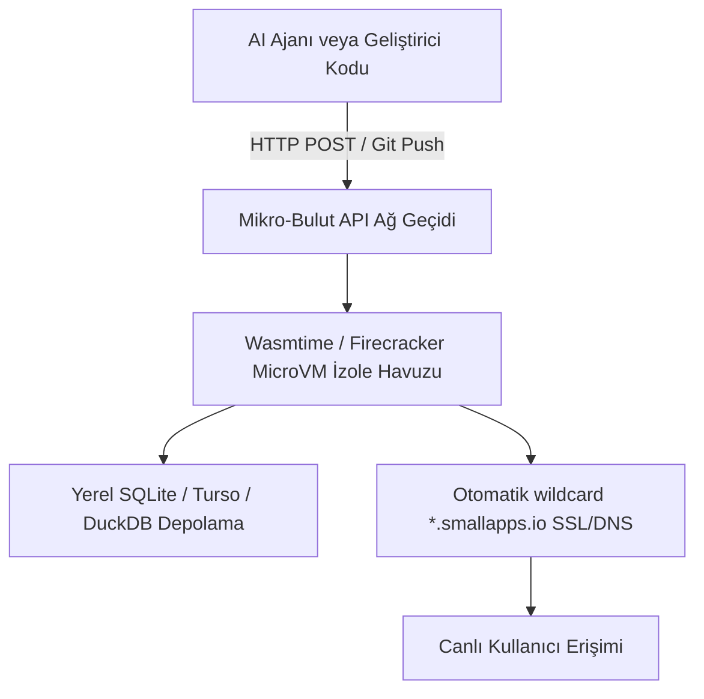

# ☁️ 02. "Small Software" için Sıfır Yapılandırmalı Mikro-Bulut (A Cloud for Small Software)

> **YC 2026 RFS Eşleşmesi:** *A Cloud for Small Software*

---

## 📌 Problem Tanımı
- Geliştiriciler ve şirket içi ekipler artık Claude, Cursor veya açık kaynak ajanlarla **"Small Software (Küçük Yazılımlar)"** üretiyor: Sadece 1 kişinin veya 3 kişilik bir departmanın kullanacağı mini dashboard'lar, veri kazıyıcılar (scrapers), fatura eşleştirme panelleri, Slack botları.
- Ancak bu küçük yazılımları canlıya almak geleneksel bulutta (AWS ECS, Kubernetes, hatta Vercel/Fly.io) gereksiz karmaşıktır:
  - DNS, SSL, environment variables, veritabanı bağlama, Dockerfile hazırlama saatler alır.
  - Maliyetler: Ayda 10 kez çalışacak bir script için sunucu kiralamak israftır.
- Sonuç: Milyonlarca faydalı mini yazılım sadece `localhost`ta kalıyor veya sunucu yönetimi yükü yüzünden terk ediliyor.

---

## 💡 Çözüm ve Ürün Vizyonu
AI ajanları ve bireysel geliştiriciler tarafından anlık üretilen mikro uygulamalar için; tek bir komutla (`git push` veya doğrudan LLM çıktısından) saniyeler içinde **WebAssembly (Wasm) veya Mikro-VM (Firecracker)** üzerinde ayağa kalkan, sıfır yapılandırmalı mikro-bulut.

### Çekirdek Yetenekler:
1. **Milisaniyelik Soğuk Başlatma (Sub-millisecond Cold Start):** Rust tabanlı Wasm çalıştırma ortamı (Wasmtime) sayesinde talep geldiğinde anında uyanır, iş bitince sıfır kaynak tüketir.
2. **Dahili Ephemeral / Embedded Veritabanı:** Her mikro uygulamanın içine otomatik olarak iliştirilen yerel SQLite veya DuckDB veritabanı (otomatik S3 yedeklemeli).
3. **Ajan Dostu API:** Yapay zekâ ajanı kodu ürettiği an tek bir HTTP POST isteğiyle URL, SSL ve veritabanı tahsis edilmiş çalışan bir canlı bağlantı alır.

---

## 🏗️ Mimari ve Teknoloji Yığını

- **Çalıştırma Motoru:** Rust + Wasmtime veya Firecracker MicroVM.
- **Trafik Yönlendirme:** Rust tabanlı Pingora / Cloudflare Workers benzeri ultra hafif reverse proxy.
- **Veri Katmanı:** SQLite LiteFS / Litestream ile nesne depolama (S3/R2) replikasyonu.

---

## 🚀 Haksız Avantaj (Unfair Advantage) ve Moat
- YC'nin Fall 2026 RFS metninde doğrudan işaret ettiği pazar boşluğu.
- Ajanlar için "Varsayılan Dağıtım Katmanı (Default Deployment Layer for AI Agents)" olmak: Cursor veya Claude bir uygulama yazdığında "Deploy to Nuper Cloud" butonu sunmak.

---

## 📅 4 Haftalık MVP Planı
- **Hafta 1:** Rust + Wasmtime kullanarak izole bir Wasm fonksiyonunu HTTP isteğiyle çalıştırıp yanıt dönen çekirdek daemon.
- **Hafta 2:** Otomatik alt alan adı (subdomain) ve SQLite veritabanı bağlayan yönetim API'si.
- **Hafta 3:** Cursor veya Claude API entegrasyonu (Ajanın yazdığı tek sayfalık HTML/JS/Wasm aracını anında yayına alma).
- **Hafta 4:** Indie hacker topluluklarına ve Twitter/X'e açık beta lansmanı.

---

## ✍️ Kişisel Notlarım ve Planlarım
- [ ] Fiyatlandırma modeli: "Kullanım başına öde" veya aylık cüzi bir abonelik (örn. $5/ay 50 mikro uygulama)?
- [ ] Next.js / Python desteği Wasm ile nasıl çözülür?
- [ ] Notlar:
