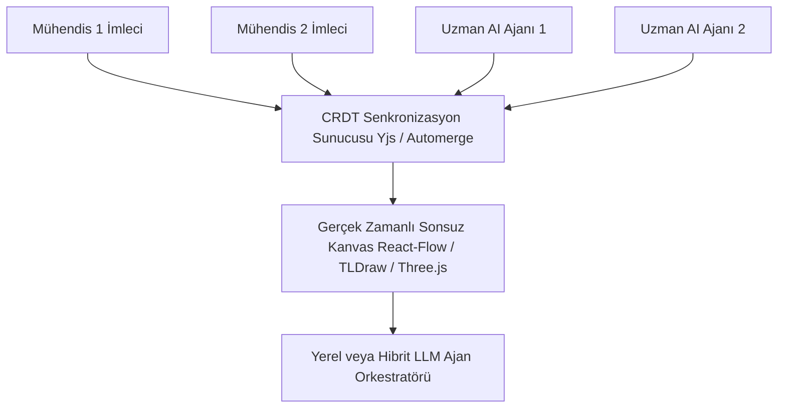

# 🎨 03. Donanım ve Mühendislik Ekipleri için Çok Oyunculu AI Kanvası (Multiplayer AI)

> **YC 2026 RFS Eşleşmesi:** *Multiplayer AI*

---

## 📌 Problem Tanımı
- Son yirmi yılda yazılım dünyasını değiştiren en büyük devrim "çok oyuncululuk (multiplayer)" oldu: Google Docs Word'ü yendi, Figma Photoshop'u yıktı.
- Ancak bugünün yapay zekâ araçları (ChatGPT, Cursor, Claude) tamamen **tek kişilik (single player)** kutularda çalışıyor. Bir mühendis ajana bir şey soruyor, cevabı kopyalayıp Slack'e veya e-postaya yapıştırıyor.
- Özellikle karmaşık donanım, savunma ve sistem mühendisliğinde tek bir kişi karar veremez: Mekanik mühendisi, elektrik mühendisi, regülasyon uzmanı ve satın almacı aynı problem üzerinde aynı anda çalışmak zorundadır.

---

## 💡 Çözüm ve Ürün Vizyonu
Mühendislik ekiplerinin ve uzmanlaşmış AI ajanlarının aynı paylaşımlı kanvasta (sonsuz beyaz tahta / 3D CAD görünümü) gerçek zamanlı birlikte çalıştığı bir **Çok Oyunculu Mühendislik Zekâ Alanı**.

### Çekirdek Yetenekler:
1. **İnsan-Ajan Eş Zamanlılığı (Multiplayer CRDT):** Figma gibi birden çok insan imlecinin yanı sıra, otonom çalışan AI ajanlarının da kanvasta kutular açtığı, hesaplamalar yaptığı ve parça yerleştirdiği gerçek zamanlı ortam.
2. **Rol Tabanlı Uzman Ajanlar:**
   - *Ajan A (Termal/FEA):* "Bu soğutma bloğu 80°C'yi aşar, kanatçık sayısını 4 artıralım."
   - *Ajan B (Maliyet/Tedarik):* "O alüminyum alaşımı yerine 6061 kullanırsak parça başı $12 tasarruf ederiz."
   - *Ajan C (Regülasyon):* "MIL-STD-810H Titreşim tablosuna göre bu montaj vidası 4g yük altında gevşeyebilir."
3. **Canlı 3D & Şematik Entegrasyonu:** Kanvas üzerinde sadece metin değil, 3D STEP modelleri ve şematik diyagramlar üzerinde doğrudan işaretleme ve yorumlama.

---

## 🏗️ Mimari ve Teknoloji Yığını

- **Senkronizasyon:** Yjs veya Automerge (CRDT tabanlı çakışmasız eş zamanlı veri yapıları) + WebSocket.
- **Kanvas Motoru:** Tldraw veya React Flow özelleştirmesi + Three.js 3D viewport.
- **Ajan Altyapısı:** LangGraph / Rust tabanlı asenkron ajan yöneticisi.

---

## 🚀 Haksız Avantaj (Unfair Advantage) ve Moat
- YC'nin Fall 2026 manifestosundaki doğrudan tez: *"AI hasn't had its multiplayer moment yet. The best work happens when teams and agents collaborate concurrently."*
- Sıradan sohbet pencerelerinden bıkan mühendislik ve tasarım ekipleri için görsel, bağlamsal ve ortak karar alma platformu.

---

## 📅 4 Haftalık MVP Planı
- **Hafta 1:** Tldraw veya basit bir kanvas üzerine Yjs ile çoklu kullanıcı imleçlerini ve kutu çizimlerini bağlama.
- **Hafta 2:** Kanvasa bir "AI Ajanı" ekleyip, kanvastaki bir nesneye yorum yapmasını ve yeni bir hesaplama kutusu çizmesini sağlama.
- **Hafta 3:** Bir STEP dosyasının 3D önizlemesini kanvas nesnesi olarak yerleştirme.
- **Hafta 4:** Çok disiplinli bir mühendislik ekibiyle test videosu çekip YC'ye başvuru.

---

## ✍️ Kişisel Notlarım ve Planlarım
- [ ] İlk dikey donanım tasarımı mı yoksa genel sistem mühendisliği mi olmalı?
- [ ] Nuper Citadel'in analiz sonuçları bu kanvasa canlı kart olarak aktarılabilir mi?
- [ ] Notlar:
