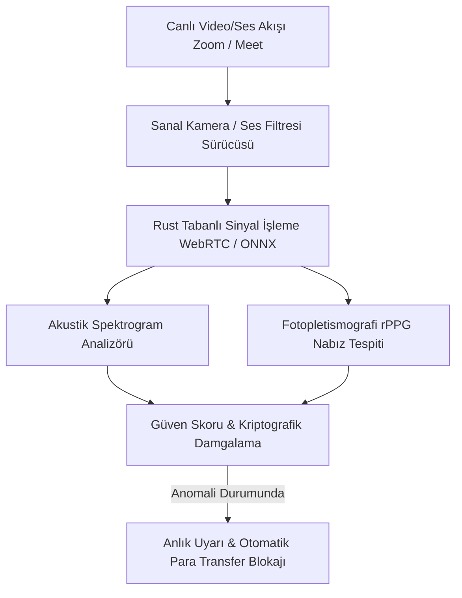

# 🛡️ 01. Gerçek Zamanlı Derin Sahtecilik Kalkanı ve İnsan Doğrulaması (Proving You're Human)

> **YC 2026 RFS Eşleşmesi:** *Proving You're Human*

---

## 📌 Problem Tanımı
- Y Combinator'ın Fall 2026 RFS metninde verdiği gerçek olay: Çok uluslu bir şirketin finans çalışanı, CEO'su ve yönetim kurulu üyelerinin katıldığı bir video konferansa katıldı ve **25 milyon dolar** transfer etti. Görüşmedeki herkes aslında birer yapay zekâ üretimi **deepfake** idi!
- Ses klonlama ve gerçek zamanlı video yüz değiştirme (real-time deepfake) teknolojisi artık açık kaynaklı modellerle saniyeler içinde yapılabiliyor.
- Geleneksel güvenlik önlemleri (2FA SMS, şifre) canlı video ve ses görüşmelerindeki bu saldırılara karşı tamamen çaresizdir.

---

## 💡 Çözüm ve Ürün Vizyonu
Kurumsal video görüşmeleri (Zoom, Google Meet, Teams) ve kritik finansal sesli onay hatları için çalışan; mikro-biyometrik analiz ve sıfır bilgi ispatlı (Zero-Knowledge Proof) meydan okuma protokolüyle **canlıda görüşülen kişinin gerçek bir insan olduğunu kriptografik olarak kanıtlayan güvenlik kalkanı.**

### Çekirdek Yetenekler:
1. **Gerçek Zamanlı Akustik & Spektral Analiz:** Klonlanmış seslerin yapay zekâ vokoder (vocoder) izlerini, sentetik nefes alma anomalilerini ve mikrosaniyelik frekans kaymalarını arka planda analiz eder.
2. **Biyometrik Mikro-Göz Kırpma & Işık Yansıması Analizi:** Kameradaki kişinin ortam ışığıyla yüzündeki foton yansıması tutarlılığını ve göz bebeği mikro-titreşimlerini doğrular.
3. **Kriptografik Meydan Okuma (Cryptographic Challenge-Response):** Şüpheli bir durum olduğunda sistem konuşmacıya milisaniyeler içinde ekranda özel bir mikro-jest veya tonlama testi sunarak yapay zekâ modelini gecikme (latency) ve render hatasına zorlar.

---

## 🏗️ Mimari ve Teknoloji Yığını

- **Sürücü & Sinyal:** Rust + WebRTC C++ bağlayıcıları (Sıfır gecikmeli video/ses tamponu işleme).
- **Yapay Zekâ Çıkarımı:** ONNX Runtime / TensorRT ile yerel GPU üzerinde mikrosaniyelik sınıflandırıcılar.
- **Entegrasyon:** Zoom App SDK, Chrome Extension (Google Meet), Windows/macOS sanal ses/kamera sürücüsü.

---

## 🚀 Haksız Avantaj (Unfair Advantage) ve Moat
- YC'nin en acil tehlike olarak nitelediği ve Fortune 500 şirketlerinin bütçe ayırmak için sıraya girdiği siber güvenlik alanı.
- Sadece "post-mortem" (olay bittikten sonra) video inceleyen değil, **görüşme esnasında gerçek zamanlı müdahale eden ilk kalkan**.

---

## 📅 4 Haftalık MVP Planı
- **Hafta 1:** Açık kaynaklı ses klonlama (ElevenLabs, Coqui) çıktılarının spektral anomalilerini %95 doğrulukla yakalayan Python/Rust prototipi.
- **Hafta 2:** Zoom/Meet için bir sanal mikrofon sürücüsü üzerinden canlı konuşmayı dinleyip ekranda "Human / Synthetic Voice" göstergesi sunma.
- **Hafta 3:** Finans departmanları için sahte onay aramasını simüle eden bir test senaryosu ve demo arayüzü.
- **Hafta 4:** B2B siber güvenlik yöneticilerine (CISO) demo sunumu.

---

## ✍️ Kişisel Notlarım ve Planlarım
- [ ] İlk hedef kitle kim olmalı (Özel bankacılık, kripto hazine yöneticileri, kurumsal finans)?
- [ ] Kameralı rPPG (yüzden nabız tespiti) deepfake tespitinde güvenilir mi?
- [ ] Notlar:
