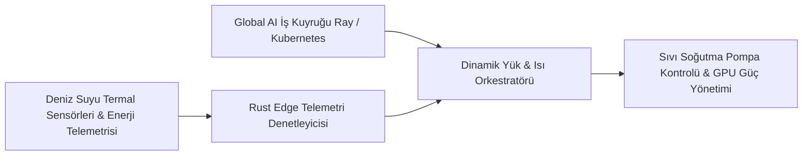

# 🌊 02. Otonom Deniz Üstü Veri Merkezleri için Dinamik Isı ve İş Orkestrasyonu (Compute at Sea)

> **YC 2026 RFS Eşleşmesi:** *Compute at Sea*

---

## 📌 Problem Tanımı
- Yapay zekânın büyümesi devasa bir işlem gücü ve enerji krizine yol açtı. Karadaki veri merkezleri şehirlerin elektrik şebekelerini tüketiyor, su kaynaklarını kurutuyor ve yerel yönetimlerin engelleriyle (imar izinleri, çevre davaları) karşılaşıyor.
- Y Combinator'ın Fall 2026 tezine göre: *"Karada yer ve enerji biterken, okyanuslar açık ve sınırsız soğutma sunuyor."*
- Ancak deniz üstünde veya su altında kurulan yüzen/modüler veri merkezlerinde insan çalışamaz. Donanım arızaları, dalga enerjisi dalgalanmaları ve deniz suyu sıcaklık değişimleri karşısında **tamamen otonom, insansız bir yazılımla yönetilmeleri gerekir.**

---

## 💡 Çözüm ve Ürün Vizyonu
Deniz üstü (barge/platform) veya su altı modüler veri merkezleri için; dalga hareketini, okyanus suyu termal katmanlarını ve yenilenebilir enerji üretimini tahmin ederek GPU yüklerini dinamik olarak kaydıran **Otonom Deniz Üstü Bilgi İşlem İşletim Sistemi**.

### Çekirdek Yetenekler:
1. **Okyanus Isı Katmanı & Soğutma Optimizasyonu:** Deniz suyu derinlik sıcaklığına göre soğutma pompalarını ve GPU frekanslarını (thermal throttling) optimize eder.
2. **Yenilenebilir Enerjiye Duyarlı İş Yükü Dağıtımı:** Rüzgar veya dalga enerjisinin zirve yaptığı anlarda ağır LLM eğitim işlerini başlatır, enerji düştüğünde iş yükünü duraklatır veya düşük güç moduna geçer.
3. **Öngörücü Donanım Arıza İzolasyonu (Predictive Failure Isolation):** Nem veya tuz korozyonundan etkilenme riski olan sunucu kızaklarını telemetriyle önceden tespit edip trafiği diğer podlara yönlendirir.

---

## 🏗️ Mimari ve Teknoloji Yığını

- **Kontrol Katmanı:** Rust tabanlı gömülü telemetri motoru + Modbus/CAN endüstriyel sensör arayüzleri.
- **Orkestrasyon:** Kubernetes (K8s) özel Scheduler eklentisi + Ray / Slurm iş yükü yönetimi.
- **Simülasyon:** Termal akışkanlar mekaniği (CFD) modelleri ile GPU sıcaklık tahmini.

---

## 🚀 Haksız Avantaj (Unfair Advantage) ve Moat
- Donanım üretmek zorunda kalmadan, hızla büyüyen "Offshore Datacenter" (yüzen veri merkezi) sektörünün **varsayılan işletim sistemi ve yazılım lisansörü** olmak.
- Donanım mühendisliği ve simülasyon tecrübesini doğrudan veri merkezi verimliliğine uygulama fırsatı.

---

## 📅 4 Haftalık MVP Planı
- **Hafta 1:** Değişken enerji ve soğutma kaynağı girdisine göre GPU iş yüklerini duraklatan/devam ettiren Kubernetes scheduler prototipi.
- **Hafta 2:** Sentetik deniz suyu sıcaklık döngülerini simüle eden termal model entegrasyonu.
- **Hafta 3:** PUE (Güç Kullanım Verimliliği) kazancını gösteren gerçek zamanlı telemetri dashboard'u.
- **Hafta 4:** Yüzen veri merkezi veya yeşil enerji odaklı altyapı fonlarına sunum.

---

## ✍️ Kişisel Notlarım ve Planlarım
- [ ] Bu alanda donanım geliştiren şirketlerle (Subsea Cloud vb.) yazılım ortaklığı kurulabilir mi?
- [ ] Notlar:
