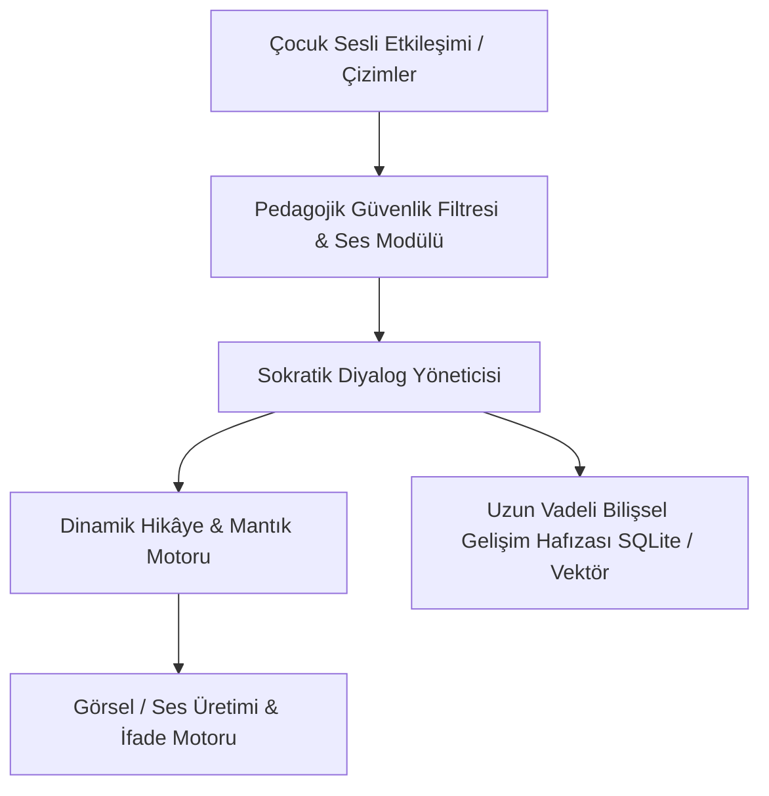

# 📖 01. "The Primer" – Büyüyen ve Sokratik Düşündüren Kişisel AI Eğitmeni

> **YC 2026 RFS Eşleşmesi:** *The Primer*

---

## 📌 Problem Tanımı
- Tarih boyunca en kaliteli eğitim daima birebir mentörlükten gelmiştir: Aristo İskender'i eğitmiştir. Ancak bu ayrıcalık her zaman sadece elitlerin elinde olmuştur.
- Neal Stephenson'ın ünlü bilim kurgu romanı *The Diamond Age*'de geçen "A Young Lady's Illustrated Primer", çocuğun hayatına göre şekillenen, sadece okuma-yazma değil; düşünmeyi, akıl yürütmeyi, karakteri ve ahlakı öğreten yaşayan bir kitaptır.
- Günümüz eğitim uygulamaları (Duolingo, Khan Academy) statik soru-cevap testlerinden ve ezberden öteye geçememektedir. YC Fall 2026 RFS'sinde Andrew Miklas bu fikri ilk kez gerçek dünyada inşa etmeye çağırıyor.

---

## 💡 Çözüm ve Ürün Vizyonu
4–12 yaş arası çocuklar için tasarlanmış; doğrudan cevabı vermek yerine **Sokratik sorular sorarak düşündüren**, çocuğun ilgi alanlarına göre hikâyeler kurgulayan ve çocuk büyüdükçe onun zihinsel seviyesine göre evrilen bir **İnteraktif Zekâ ve Karakter Arkadaşı**.

### Çekirdek Yetenekler:
1. **Sokratik Öğrenme Döngüsü:** Çocuk "Gök neden mavi?" dediğinde ansiklopedik cevap vermez; "Sence gökyüzü güneş batarken neden turuncu oluyor?" diyerek adım adım çocuğun sonuca kendi mantığıyla ulaşmasını sağlar.
2. **Kişiselleştirilmiş Yaşayan Hikâyeler:** Çocuğun o gün okulda yaşadığı bir çekingenliği veya merak ettiği dinozorları temel alan, çocuğun kararlarıyla ilerleyen sesli/görsel masallar üretir.
3. **Ebeveyn Zihinsel Gelişim Analizi:** Çocuğun problem çözme tarzı, kelime dağarcığı ve mantıksal gelişimini ebeveyne psikolojik ve pedagojik özetlerle raporlar (ekran bağımlılığı yaratmadan).

---

## 🏗️ Mimari ve Teknoloji Yığını

- **Arayüz & Etkileşim:** iPad / Tablet odaklı yerel React Native / Tauri veya Flutter arayüzü.
- **Ses & İfade:** Düşük gecikmeli yerel/bulut ses modelleri (çocuk ses tonuna ve duygusal dalgalanmalarına duyarlı).
- **Hafıza (Episodic Memory):** Çocuğun aylar önceki bir sorusunu veya endişesini hatırlayıp yeni konularla bağdaştıran derin bağlam hafızası.

---

## 🚀 Haksız Avantaj (Unfair Advantage) ve Moat
- Ebeveynlerin çocuklarına "yapay zekâ oyuncağı" değil, "Aristo benzeri bir mentör" hediye etme arzusu.
- Bir kez çocuğun gelişimine eşlik etmeye başlayan bir Primer'ın başka bir uygulamayla değiştirilmesi (churn) imkânsıza yakındır.

---

## 📅 4 Haftalık MVP Planı
- **Hafta 1:** Sokratik sorgulama yapabilen, doğrudan cevap vermeyi reddeden bir diyalog ajanı tasarımı.
- **Hafta 2:** Çocukların sesini temiz tanıyan ve samimi bir masal anlatıcısı ses tonu sunan prototip.
- **Hafta 3:** Ebeveyn paneli: Günün konuşulan konuları ve mantık yürütme skoru.
- **Hafta 4:** 10 aile ile beta testi ve çocukların tepkilerini içeren YC başvuru videosu.

---

## ✍️ Kişisel Notlarım ve Planlarım
- [ ] Çocuk güvenliği ve COPPA regülasyonları nasıl sağlanır?
- [ ] Ekran süresini sınırlayan sadece ses odaklı bir akıllı cihaz (akıllı oyuncak) haline getirilebilir mi?
- [ ] Notlar:
