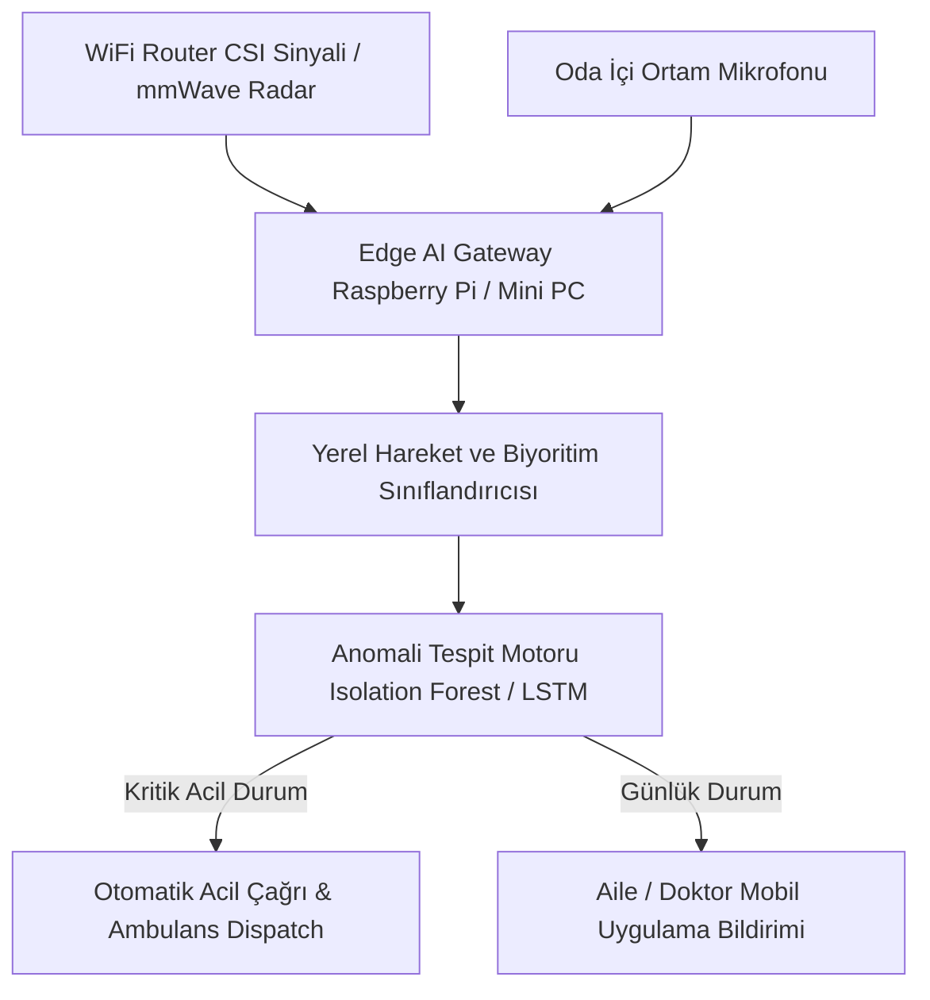

# 👵 02. Yaşlı Nüfus için Görünmez Sensörsüz Bakım ve Anomali Tespit Ajanı (AI for the Aging Population)

> **YC 2026 RFS Eşleşmesi:** *AI for the Aging Population*

---

## 📌 Problem Tanımı
- 2030 yılına kadar ABD'de her 5 kişiden biri 65 yaşın üzerinde olacak ve milyonlarca bakıcı açığı oluşacak. Milyonlarca aile üyesi yaşlı yakınlarına ücretsiz ve tükenmişlik içinde bakmaya çalışıyor.
- Mevcut teknolojiler yaşlılar için tasarlanmamıştır: Akıllı saat takmayı unuturlar, acil durum kolyelerini sevmezler, karmaşık dokunmatik ekranları kullanamazlar.
- En büyük tehlikeler (banyoda düşme, gece susuz kalıp bayılma, ilaçların unutulması, erken demans belirtileri) fark edilemeden felakete dönüşür.

---

## 💡 Çözüm ve Ürün Vizyonu
Kişinin üzerine hiçbir cihaz takmasını gerektirmeyen; evdeki ortam sensörleri (WiFi sinyal bozulması / radar / mikrofon) üzerinden çalışan ve yaşlının günlük biyoritmini izleyen **Görünmez Ortam Zekâsı (Ambient Intelligence) Bakım Ajanı**.

### Çekirdek Yetenekler:
1. **WiFi / Radar Algılama ile Düşme Tespiti:** Kamera mahremiyeti endişesi olmadan, standart WiFi dalgalarının veya 60GHz mmWave radarın odadaki hareket yansımalarından düşmeyi 2 saniyede tespit eder.
2. **Akustik Solunum ve Öksürük Analizi:** Gece uyku kalitesini, nefes darlığını veya kronik öksürük artışını oda içi akustik yapay zekâ ile takip eder.
3. **Erken Demans & Rutin Sapması Alarmı:** Örneğin yaşlı birey gece 03:00'te buzdolabını 4 kez açmışsa veya normalde her sabah 08:00'de kalkarken 10:30'a kadar hareket etmemişse aileye/doktora otomatik SMS ve çağrı uyarısı gönderir.

---

## 🏗️ Mimari ve Teknoloji Yığını

- **Sinyal İşleme:** WiFi Channel State Information (CSI) veya mmWave radar sinyal işleme kütüphaneleri (C++ / Rust).
- **Yapay Zekâ:** Çok hafif yerel zaman serisi anomali tespiti (cihaz üzerinde edge-computing).
- **Arayüz:** Çocuklar/bakıcılar için Next.js / React Native takip panosu.

---

## 🚀 Haksız Avantaj (Unfair Advantage) ve Moat
- YC 2026'nın en büyük demografik kriz olarak tanımladığı "Aging Population" pazarı.
- "Kamera yok, bileklik yok" felsefesi ile mahremiyeti %100 koruması ve yaşlıların direnç göstermemesi.

---

## 📅 4 Haftalık MVP Planı
- **Hafta 1:** Düşük maliyetli bir mmWave sensör modülü (örn. Seeed Studio radar) ile düşme tespiti yapan Rust scripti.
- **Hafta 2:** Anomali tespit algoritması (rutin dışı saatlerde hareket veya uzun süreli hareketsizlik).
- **Hafta 3:** Telegram/WhatsApp botu üzerinden aileye anlık acil bildirim gönderme.
- **Hafta 4:** Yaşlı yakını olan 5 kullanıcıyla ev testi ve YC başvuru videosu.

---

## ✍️ Kişisel Notlarım ve Planlarım
- [ ] Sağlık sigortası şirketleri (B2B2C) bu cihazın bedelini karşılar mı?
- [ ] FDA veya medikal cihaz izinleri gerekir mi?
- [ ] Notlar:
