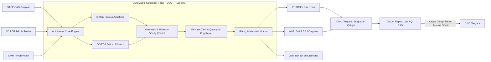

# 🌐 AutoMetrol: Otonom CMM ve Metroloji Motoru (Master MOC)

> **"Tasarım dosyasını (STEP) ve teknik resmi alıp; prob kafası kinematiğini, temas noktalarını ve çarpışmasız hareket yollarını hesaplayarak doğrudan tezgaha yüklenebilir DMIS/PC-DMIS teftiş kodu basan yerel masaüstü yazılımı."**
> 
> *YC 2026 RFS Kategori:* **Physical AI / New Industrial Software / AI-Native CAM-to-Inspection**

---

## 📌 Giriş ve Yönetici Özeti

İmalat sanayiinde CNC tarafında CAM yazılımları (Mastercam, Siemens NX, PowerMill) parçanın takım yolunu dakikalar içinde otonom üretirken; parça Koordinat Ölçüm Cihazı (CMM) laboratuvarına geldiğinde süreç 25 yıl önceki manuel tıklama ve el yordamıyla kafa çevirme yöntemlerine mahkûmdur.

**AutoMetrol**, bu darboğazı kökten çözmek için tasarlanmış; tamamen fabrikadaki yerel bilgisayarda, internet bağlantısı olmadan (**air-gapped**) çalışan, deterministik geometri ayrıştırma ile yerel semantik tolerans okumayı birleştiren **yeni nesil endüstriyel CMM CAM motorudur**.

4 ila 8 saat süren manuel CMM programlama ve prob öğretme rutinini **30 saniyeye** indirir; prob çarpma riskini ($2.000 - $6.000 hasar) ve hatalı sıfırlamadan doğan hurda maliyetini sıfırlar.

---

## 🧭 Vault Modül Haritası (Index of Documents)

Aşağıdaki belgeler, AutoMetrol'ün kavramsal mimarisinden matematiksel çekirdeğine, fiziksel saha kurallarından post-processor derleyicisine kadar her detayını eksiksiz olarak içerir:

| Belge | Kapsam ve Başlık | Odak Noktaları |
|---|---|---|
| [[01_Problem_Tanimi_ve_Pazar_Dinamikleri\|01. Problem Tanımı ve Pazar Dinamikleri]] | CAM-CMM Uçurumu ve Pazar Boşluğu | 2-8 saatten 30 saniyeye, $2K-$6K kaza maliyeti, Hexagon/Zeiss kısıtları, Node-locked lisanslama. |
| [[02_Geometri_Motoru_ve_BRep_Ayristirma\|02. Geometri Motoru ve B-Rep Ayrıştırma]] | STEP AP214/AP242 & OpenCASCADE | TopoDS_Shape hiyerarşisi, analitik yüzey tipleri, normal vektörler, cidar kalınlığı analizi, Rust FFI. |
| [[03_2D_PDF_GDT_ve_Datum_Esleme_Motoru\|03. 2D PDF GD&T ve Datum Eşleme]] | Semantik Katman ve 3-2-1 Hizalama | Yerel Vision OCR (GGUF), Feature Control Frame, çap/sayı eşleştirme, ISO 10360 & ASME Y14.5 örnekleme. |
| [[04_Prob_Kinematigi_ve_Aci_Optimizasyonu\|04. Prob Kinematiği ve Açı Optimizasyonu]] | PH10 & MH20i Kafa Hesaplamaları | 720 diskret açı projeksiyonu, k-means manuel kafa kümeleme, kalibre edilmiş açı önceliği, dönüş hacmi. |
| [[05_Carpisma_Onleme_Emniyet_Zarfi_ve_Yol_Planlama\|05. Çarpışma Önleme ve Emniyet Zarfı]] | Güvenli Rota & Şaft Çarpışma Koruması | +50mm Clearance Box, pabuç/fikstür Keep-Out alanları, prob şaftı & modül kaçıklığı, çapak marj ofseti. |
| [[06_Metroloji_Matematigi_Fitting_ve_Standartlar\|06. Metroloji Matematiği ve Standartlar]] | Fitting Algoritmaları & Prob Fiziği | Gauss vs Chebyshev (H7 delik), dokunmatik vs analog tarama, prob esnemesi (pre-travel), PTB/NIST akreditasyonu. |
| [[07_Post_Processor_ve_DMIS_Derleyici\|07. Post-Processor ve DMIS Derleyici]] | Nötr AST'den Çıktı Koduna | PC-DMIS, DMIS 5.3, Calypso şablonları; Manuel ön-hizalama bloğu, termal kompanzasyon, palet döngüleri. |
| [[08_Saha_Operasyonlari_Fiksturleme_ve_Kapali_Dongu\|08. Saha Operasyonları ve Kapalı Döngü]] | Fikstürleme, Rack & Closed-Loop | Setup 1/2 çevirme ayrıştırması, MCR20 prob değiştirici magazin yönetimi, M2/M3 kütüphanesi, CNC aşınma geri beslemesi. |
| [[09_Yazilim_Mimarisi_ve_Teknoloji_Yigini\|09. Yazilim Mimarisi ve Teknoloji Yığını]] | Masaüstü Mühendisliği | Tauri + Rust + React + Three.js/WebGPU, zero-overhead IPC, air-gapped yerel LLM entegrasyonu. |
| [[10_MVP_Uygulama_Plani_ve_Girisim_Stratejisi\|10. MVP Uygulama Planı ve Girişim Stratejisi]] | 6 Haftalık Sprint & YC Pitch | PTB test doğrulama paketi, pilot fabrika kurulumu, fiyatlandırma, haksız avantaj ve savunma sinerjisi. |

---

## ⚡ Temel Karşılaştırma Matrisi

| Kriter | Geleneksel CMM Programlama | Hexagon / Zeiss Otomasyonu | AutoMetrol Çözümü |
|---|---|---|---|
| **Programlama Süresi** | 2 – 8 saat | 1 – 2 saat (varsa) | **30 saniye** |
| **Girdi Gereksinimi** | Operatör tecrübesi + Manuel Tıklama | Kusursuz 3D PMI / MBD (Gömülü CAD) | **Çıplak STEP + 2D PDF Teknik Resim** |
| **Çalışma Ortamı** | Tezgah başı veya CAD istasyonu | Ağır lisanslı iş istasyonu | **Yerel Masaüstü (Air-gapped, hafif)** |
| **Prob Açısı Seçimi** | Operatör el yordamıyla | Kısıtlı otomatik | **Matematiksel Projeksiyon & Minimum Dönüş Kümelemesi** |
| **Pabuç / Engel Tanıma** | Yok (Manuel çarpışma kontrolü) | Kısmi CAD fikstür zorunluluğu | **Hızlı 3D Bounding Box Keep-Out Alanı** |
| **Saha Güvenliği** | Operatör refleksine bağlı | Standart emniyet | **Ön-Hizalama + Şaft Koruma + Çapak Marjı** |
| **Lisans Maliyeti** | Makineye dahil temel yazılım | 20.000$ – 40.000$ modül lisansı | **4.000$ – 7.500$ / yıl (Makine başı)** |

---

## 🎯 Projenin Nuper Ekosistemindeki Yeri

AutoMetrol, Nuper vizyonunun **Physical AI (Fiziksel Yapay Zekâ)** ve **Savunma/İleri İmalat Derin Teknolojisi** dikeyindeki en somut, nakit akışı yaratma potansiyeli en yüksek amiral gemisidir.
- `nuper_citadel` bünyesindeki C++ OpenCASCADE köprüsü, geometri hafızası ve yerel kural motorları bu ürünün çekirdeğini oluşturur.
- Çözülen problem sadece bir yazılım verimsizliği değil; savunma ve havacılık talaşlı imalatının en büyük darboğazı olan **Kalite Kontrol Kapısıdır**.
